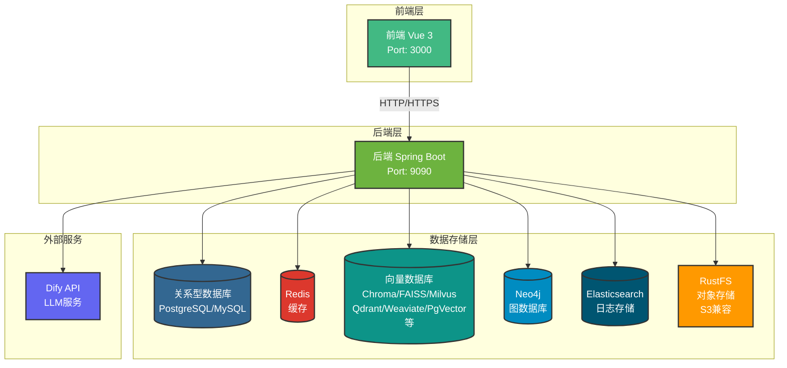
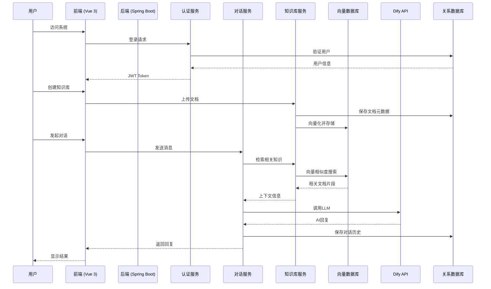
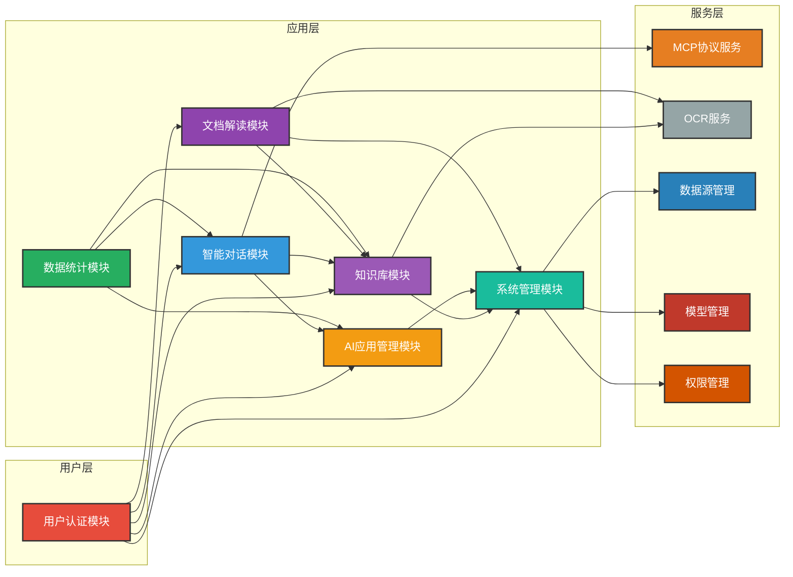

# DifyApp 系统文档

## 项目概述

DifyApp 是一个基于 Spring Boot 和 Vue 3 构建的企业级 AI 应用平台，提供完整的 AI 应用生命周期管理、知识库管理、智能问答、AI 绘图等功能。系统采用前后端分离架构，支持多种向量数据库和 LLM 集成，实现了现代化的 RAG（检索增强生成）架构。

### 项目特点

- **企业级架构**：采用 Spring Boot 3.x 和 Vue 3，遵循最佳实践，代码结构清晰
- **多租户支持**：支持多用户、多租户场景，细粒度权限控制
- **RAG 技术**：基于 LangChain4j 实现检索增强生成，支持多种向量数据库
- **流式响应**：支持流式和非流式两种响应模式，提供更好的用户体验
- **多模态支持**：支持文本、图片等多种输入方式；图片由视觉模型处理，文档处理集成 OCR 服务
- **可扩展性**：模块化设计，易于扩展新功能
- **跨平台**：支持 Web 应用，可在各种浏览器中运行
- **丰富的集成**：支持 MCP 协议、多种向量数据库、多种 LLM 模型
- **实体架构优化**：统一的 BaseEntity 设计，移除中间层实体，简化继承结构
- **完善的填充逻辑**：所有实体类自动填充 BaseEntity 字段，确保数据完整性
- **记忆管理增强**：用户端和管理端记忆管理界面优化，清空功能细化
  - **UI优化**：用户端和管理端记忆管理界面新增"清空查询条件"和"清空记忆"双按钮设计
  - **功能细化**：区分清空搜索条件与清空记忆数据，避免操作混淆

### 核心功能

- **用户认证与授权**
  - JWT 令牌认证机制，安全可靠
  - 用户注册、登录、登出功能
  - 密码修改、重置、找回功能
  - 多租户支持，细粒度权限控制
  - 用户与应用/数据源/知识库的可见性管理
  - 管理员审核机制

- **智能对话**
  - 支持 Chat Flow 和 Workflow 两种应用模式
  - 集成多种大语言模型（通过 Dify API）
  - 流式和非流式响应模式
  - 实时对话交互，支持上下文理解
  - 对话历史完整记录和管理
  - 支持多轮对话和会话管理
-  - 支持视觉模型（图片输入、图片理解、图中文字理解）
  - 支持浏览器检索（实时信息获取，检索策略优化）

- **知识库管理**
  - 知识库创建、编辑、删除、查询
  - 支持多种文档格式（PDF、Word、Excel、TXT、Markdown、图片等）
  - 自动文档解析和智能分块处理
  - **智能分块策略**：根据文件类型和内容特征自动选择合适的分块方式
    - 代码文件 → 代码分块
    - 表格文件 → 表格分块
    - Markdown文件 → 标题/段落分块（自动检测表格和代码）
    - Word/PDF文档 → 段落分块（自动检测表格）
    - 混合内容支持（表格+文本+代码）
  - OCR 服务集成（图片和PDF文字识别）
  - 文档向量化和语义索引
  - 支持多种向量数据库（Chroma、FAISS、Milvus、Qdrant、Weaviate、PgVector、Elasticsearch）
  - 文档版本管理和更新机制
  - 批量文档上传和处理

- **RAG 问答（检索增强生成）**
  - 基于知识库的智能问答
  - 向量相似度搜索和语义检索
  - 上下文增强的 AI 回答生成
  - 支持引用来源和可追溯性
  - 可配置的检索参数（Top K、相似度阈值等）
  - 多知识库联合检索

- **AI 应用管理**
  - AI 应用的创建、编辑、删除、查看
  - 应用配置管理（模型选择、参数设置等）
  - 应用可见性控制（公开/私有）
  - 应用使用统计和分析
  - 应用模板和快速创建

- **AI 绘图功能**
  - 基于 Mermaid 的图表生成
  - 支持流程图、时序图、类图、架构图、思维导图等多种图表类型
  - 自然语言描述生成图表代码
  - 图表修改和编辑功能
  - 图表预览和导出
  - 图表保存和管理

- **文档解读功能**
  - 文档上传和解析
  - 文档问答（基于文档内容的智能问答）
  - 文档翻译（支持分页翻译、强制重译、状态提示）
  - 文档思维导图生成
  - 文档笔记管理
  - 文档导读生成
  - 文档向量化和检索

- **数据统计功能**
  - 对话历史统计
  - 应用使用统计
  - 知识库使用统计
  - 用户活跃度统计
  - 用户行为日志采集与分析（Elasticsearch）
  - 数据可视化展示

- **数据分析模块**
  - Neo4j 图数据库集成
  - 数据同步到 Neo4j（用户、应用、知识库、对话等实体和关系）
  - 定时同步任务（可配置同步间隔）
  - 图数据可视化（节点和关系展示）
  - 数据源配置（通过数据源管理配置 Neo4j 连接）
  - 同步状态监控（最近同步时间、状态、指标等）

- **系统管理**
  - 系统配置管理（全局参数设置）
  - 数据源管理（数据库连接配置、表结构管理）
    - 支持 PostgreSQL、MySQL、Oracle、MongoDB、Neo4j、Elasticsearch 等多种数据源
    - 连接池管理和连接状态监控
    - 表结构自动发现和缓存
  - 模型管理（LLM 模型配置、嵌入模型配置）
  - 向量数据库配置管理
  - Prompt 模板管理（可复用的提示词模板）
  - 用户管理（管理员功能，用户审核、禁用等）
  - 权限管理（用户与应用/数据源/知识库的可见性控制）
  - 系统监控和日志管理（统一超时策略）
  - 用户行为日志管理（基于 Elasticsearch，支持多维度查询和分析）

- **MCP 协议支持**
  - 浏览器搜索服务（实时网络搜索）
  - 地理位置服务（获取位置信息）
  - 时间服务（获取当前时间、时区等）
  - 实时信息检测和更新
  - 可扩展的 MCP 服务集成

- **数据源管理**
  - 数据库连接配置（PostgreSQL、MySQL、Oracle、Elasticsearch 等）
  - 连接测试和验证
  - 表结构自动发现和缓存
  - 数据源可见性管理
  - 支持多种数据库方言

- **OCR 服务集成**
  - 图片文字识别（EasyOCR）
  - PDF 文档文字识别
  - Word 文档图片识别
  - 支持多种图片格式（PNG、JPEG、GIF、BMP等）
  - 批量图片处理
  - 识别结果结构化输出
  - 自动回退机制（OCR失败时使用文本解析）

## 系统架构



## 技术栈

### 后端技术栈

- **核心框架**: Spring Boot 3.5.8
- **编程语言**: Java 17
- **构建工具**: Maven 3.6+
- **ORM 框架**: Spring Data JPA / Hibernate
- **数据库**: PostgreSQL / MySQL / Oracle / MongoDB / Neo4j
- **向量数据库**: Chroma / FAISS / Milvus / PgVector / Qdrant / Weaviate / Elasticsearch
- **图数据库**: Neo4j (用于数据分析和关系可视化)
- **日志存储**: Elasticsearch (用于用户行为日志)
- **存储与缓存**: RustFS (对象存储，S3兼容) / Redis (缓存)
- **AI 框架**: LangChain4j 0.34.0
- **文档解析**: Apache Tika, Apache POI
- **安全**: JWT (JSON Web Token)
- **API 文档**: SpringDoc OpenAPI 2.3.0

### 前端技术栈

- **核心框架**: Vue 3.3.4
- **构建工具**: Vite 5.0.8
- **状态管理**: Pinia 2.1.7
- **路由**: Vue Router 4.2.5
- **UI 框架**: Element Plus 2.4.2
- **HTTP 客户端**: Axios 1.6.2
- **Markdown 渲染**: marked, highlight.js, katex, mermaid

## 项目结构

```
DifyApp/
├── backend/                    # 后端项目
│   ├── src/                    # 源代码
│   │   ├── main/java/          # Java 源代码
│   │   └── main/resources/     # 配置文件
│   ├── doc/                    # 设计文档
│   ├── data/                   # 数据目录（向量数据库等）
│   ├── logs/                   # 日志文件
│   ├── pom.xml                 # Maven 配置
│   └── README-backend.md       # 后端详细文档
│
├── frontend/                   # 前端项目
│   ├── src/                    # 源代码
│   │   ├── api/                # API 接口定义
│   │   ├── components/         # 组件
│   │   ├── views/              # 页面
│   │   ├── stores/             # 状态管理
│   │   └── utils/              # 工具函数
│   ├── dist/                   # 构建产物
│   ├── package.json            # npm 配置
│   └── README-frontend.md      # 前端详细文档
│
├── easy_ocr/                   # OCR 服务（可选）
│   ├── app.py                  # Python 应用
│   ├── docker-compose.yml      # Docker 配置
│   └── requirements.txt        # Python 依赖
│
├── rustfs/                     # Rust 文件服务（可选）
│   ├── docker-compose.yml      # Docker 配置
│   └── README.md               # 服务文档
│
└── README.md                   # 本文件（系统总览）
```

## 快速开始

### 环境要求

#### 后端环境
- **JDK**: 17 或更高版本
- **Maven**: 3.6+
- **数据库**: PostgreSQL 12+ / MySQL 5.7+ / Oracle 12+
- **Redis**: 6.0+ (可选，用于缓存)
- **对象存储**: RustFS (S3兼容，用于文档存储)
- **向量数据库**: 根据需求选择安装（Qdrant/Milvus/FAISS/Chroma/Weaviate/PgVector/Elasticsearch）
- **图数据库**: Neo4j 4.0+ (可选，用于数据分析和关系可视化)
- **日志存储**: Elasticsearch 7.0+ (可选，用于用户行为日志)
- **OCR服务**: EasyOCR (可选，用于图片和PDF文字识别)

#### 前端环境
- **Node.js**: 16 或更高版本
- **包管理器**: npm 8+ 或 yarn 1.22+
- **Git**: 最新版本

### 1. 克隆项目

```bash
git clone https://github.com/Yarao-Liu/DifyApp.git
cd DifyApp
```

### 2. 后端启动

#### 2.1 配置数据库

编辑 `backend/src/main/resources/application.yml`，配置数据库连接信息：

```yaml
spring:
  datasource:
    driver-class-name: org.postgresql.Driver
    url: jdbc:postgresql://localhost:15432/difyapp
    username: postgres
    password: your_password
```

#### 2.2 配置其他服务

**Redis 配置（可选）**
```yaml
spring:
  data:
    redis:
      host: localhost
      port: 6379
      password: # 可选
```

**RustFS 配置**（RustFS 100% 兼容 MinIO 配置）
```yaml
minio:
  endpoint: http://localhost:9000
  access-key: rustfsadmin
  secret-key: rustfsadmin
  bucket-name: knowledge-base
```

**向量数据库配置**
根据使用的向量数据库，配置相应的连接信息（Qdrant、Milvus、Chroma 等）。

#### 2.3 初始化数据库

执行 `backend/src/main/resources/sql/init_database_complete.sql` 脚本创建数据库表。

#### 2.4 构建并运行

```bash
cd backend
mvn clean install
mvn spring-boot:run
```

后端服务默认运行在 `http://localhost:9090`

### 3. 前端启动

#### 3.1 安装依赖

```bash
cd frontend
npm install
# 或者
yarn install
```

#### 3.2 配置 API 地址

默认 API 地址为 `http://localhost:9090`，如需修改，请编辑 `frontend/src/config/api.js` 文件。

#### 3.3 启动开发服务器

```bash
npm run dev
# 或者
yarn dev
```

前端开发服务器默认运行在 `http://localhost:3000`

### 4. 访问系统

- **前端应用**: http://localhost:3000
- **后端 API**: http://localhost:9090
- **API 文档**: http://localhost:9090/swagger-ui.html

## 系统数据流



## 功能模块关系



## 功能模块

系统采用模块化设计，主要包含以下14个核心模块：

1. **auth** - 认证模块（登录、注册、JWT）
2. **permission** - 权限管理模块（可见性控制）
3. **chat** - AI应用与对话模块
4. **knowledgebase** - 知识库模块
5. **documentreader** - 文档解读模块
6. **system** - 系统配置模块
7. **statistics** - 数据统计模块
8. **analysis** - 数据分析模块（Neo4j 图数据库集成）
9. **userlog** - 用户行为日志模块（Elasticsearch 日志存储）
10. **memory** - 记忆管理模块（用户长期记忆和实体记忆）
11. **mcp** - MCP服务集成模块（浏览器搜索、时间服务等）
12. **model** - 模型配置模块（问答模型、向量化模型配置管理）
13. **datasource** - 数据源管理模块（数据源配置、连接管理、表结构管理）
14. **common** - 公共组件模块（工具类、异常、响应格式）

### 1. 用户认证模块 (auth)

**后端功能：**
- 用户注册、登录、登出
- JWT 令牌生成、验证、刷新
- 密码加密存储（Spring Security Crypto）
- 密码修改、重置、找回
- 用户状态管理（待审核、已激活、已禁用）
- 用户权限控制（普通用户、管理员）
- 用户与应用/数据源/知识库的可见性关联管理
- 管理员审核用户注册

**前端功能：**
- 登录、注册页面
- 密码修改对话框
- 密码重置对话框
- 用户信息展示和管理
- JWT 令牌自动管理（存储、刷新）

### 2. 权限管理模块 (permission)

**后端功能：**
- 用户与应用/数据源/知识库的可见性关联管理
- 基于关联关系的权限验证
- 权限查询接口
- 关联关系创建和删除
- 批量关联操作

**前端功能：**
- 权限设置界面
- 可见性管理界面
- 关联关系可视化

### 3. 智能对话模块 (chat)

**后端功能：**
- AI 应用创建、编辑、删除、查询
- 聊天对话接口（支持 Chat Flow 和 Workflow 模式）
- 流式和非流式响应处理
- 对话历史管理（会话、消息的增删改查）
- Dify API 集成和调用
- MCP (Model Context Protocol) 协议服务：
  - 浏览器搜索服务（实时网络搜索）
  - 地理位置服务（获取位置信息）
  - 时间服务（获取当前时间、时区）
  - 实时信息检测和更新
- OCR 服务集成（图片文字识别）
- 对话上下文管理

**前端功能：**
- 实时聊天界面（支持流式显示）
- AI 应用选择和管理界面
- 对话历史列表和查看
- 支持 Chat 和 Workflow 两种模式切换
- Markdown 渲染（支持代码高亮、数学公式、Mermaid 图表）
- 消息发送、接收、重试功能
- 对话会话管理（新建、切换、删除）

### 4. 知识库模块 (knowledgebase)

**后端功能：**
- 知识库创建、编辑、删除、查询
- 文档上传接口（支持多种格式）
- 文档解析（Apache Tika、Apache POI）
- 文档分块处理（可配置分块大小、重叠大小）
- 文档向量化（使用嵌入模型）
- 向量数据库管理（支持多种向量数据库）
- 知识库问答（RAG）：
  - 向量相似度搜索
  - 上下文检索
  - 检索结果排序和过滤
- 嵌入模型管理（配置、测试）
- QA 模型管理（配置、测试）
- 文档版本管理
- 批量文档处理

**前端功能：**
- 知识库创建和编辑界面
- 文档上传界面（拖拽上传、批量上传）
- 文档列表和管理（查看、删除、重新处理）
- 向量数据库配置界面
- 知识库问答界面（输入问题、显示答案、引用来源）
- 文档处理状态显示（处理中、已完成、失败）
- 知识库统计信息展示

### 5. AI 应用管理模块 (chat)

**后端功能：**
- AI 应用创建、编辑、删除、查询
- 应用配置管理（模型选择、参数设置、提示词配置等）
- 应用可见性管理（公开/私有）
- 应用使用统计
- 应用模板管理

**前端功能：**
- AI 应用列表和搜索
- 应用创建和编辑表单
- 应用配置界面
- 应用可见性设置
- 应用详情查看
- 应用使用统计图表

### 6. 系统管理模块 (system)

**后端功能：**
- 系统配置管理（全局参数设置）
- 数据源管理（数据库连接配置、测试连接）
- 模型管理（LLM 模型配置、测试）
- 向量数据库配置管理
- Prompt 模板管理（创建、编辑、删除、使用）
- 用户管理（管理员功能）：
  - 用户列表查询
  - 用户审核（激活、禁用）
  - 用户信息编辑
  - 用户权限管理

**前端功能：**
- 系统配置管理界面（管理员）
- 数据源管理界面（添加、编辑、删除、测试）
- 模型管理界面（配置、测试）
- 向量数据库配置界面
- Prompt 模板管理界面
- 用户管理界面（管理员，用户列表、审核、编辑）

### 7. 文档解读模块 (documentreader)

**后端功能：**
- 文档上传和存储
- 文档解析和向量化
- 文档问答服务（基于 RAG 技术）
- 文档翻译服务（多语言支持）
- 文档思维导图生成
- 文档笔记管理
- 文档导读生成
- 文档检索和相似度搜索

**前端功能：**
- 文档上传界面
- 文档查看器（支持 PDF、Word 等格式）
- 文档问答界面
- 文档翻译界面
- 思维导图可视化（基于 jsMind）
- 笔记编辑和管理
- 导读展示

### 8. 数据统计模块 (statistics)

**后端功能：**
- 对话历史统计（按时间、应用等维度）
- 应用使用统计
- 知识库使用统计
- 用户活跃度统计
- 统计数据聚合和计算

**前端功能：**
- 统计图表展示（基于 ECharts）
- 数据可视化
- 统计报表导出
- 实时数据更新

### 8.1 数据分析模块 (analysis)

**后端功能：**
- Neo4j 图数据库集成
- 数据同步到 Neo4j（用户、应用、知识库、对话、消息等实体和关系）
- 定时同步任务（可配置同步间隔，默认60分钟）
- 立即同步功能
- 同步状态监控（最近同步时间、状态、指标等）
- 图数据查询和可视化（节点和关系展示）
- 数据源配置（通过数据源管理配置 Neo4j 连接）

**前端功能：**
- 数据分析页面（图数据可视化）
- 同步设置界面（配置 Neo4j 数据源、同步间隔、启用/禁用）
- 同步状态展示（同步时间、状态、指标等）
- 立即同步按钮
- 图数据交互式展示（基于 ECharts Graph）

### 8.2 用户行为日志模块 (userlog)

**后端功能：**
- 用户行为日志采集（基于 AOP 切面）
- Elasticsearch 日志存储
- 日志查询和检索（多维度查询：用户、模块、操作类型、时间范围等）
- 日志聚合分析（操作类型统计、模块统计等）
- 数据源配置（通过数据源管理配置 Elasticsearch 连接）
- 动态索引管理（自动创建索引和映射）

**前端功能：**
- 用户行为日志查询界面（管理员）
- 多维度筛选（用户、模块、操作类型、时间范围等）
- 日志列表展示
- 日志详情查看
- 操作类型和模块统计

### 8.3 记忆管理模块 (memory)

**后端功能：**
- 自动记忆抽取：从用户问题和助手回答中自动抽取长期可复用的信息
- 记忆类型支持：
  - 长期记忆（long_term）：面向事实/偏好/背景的一句话记忆
  - 实体记忆（entity）：面向实体-属性的结构化记忆（JSON格式）
- 记忆上下文注入：在后续问答中自动注入相关记忆片段
- 记忆去重更新：基于唯一键自动去重和更新
- 容量控制：每类记忆最多保留200条，超出自动软删除最旧记录
- 作用域隔离：支持按智能问答/知识库/应用进行记忆隔离
- 管理端接口：管理员可查看和清空用户记忆

**前端功能：**
- 用户端记忆管理界面（查看、搜索、清空个人记忆）
- 管理端记忆管理界面（查看、搜索、清空任意用户记忆）
- 记忆类型筛选（长期记忆/实体记忆）
- 作用域筛选（智能问答/知识库/应用）
- 清空功能细化（区分清空查询条件和清空记忆数据）

**详细文档：** `backend/doc/15.记忆模块功能设计文档.md`

### 9. MCP服务集成模块 (mcp)

**后端功能：**
- 浏览器搜索服务（实时网络搜索）
- 地理位置服务（获取位置信息）
- 时间服务（获取当前时间、时区等）
- 实时信息检测和更新
- MCP服务配置管理

**前端功能：**
- MCP服务状态显示
- 实时信息展示

### 10. 记忆管理模块 (memory)

**后端功能：**
- 自动记忆抽取：从用户问题和助手回答中自动抽取长期可复用的信息
- 记忆类型支持：
  - 长期记忆（long_term）：面向事实/偏好/背景的一句话记忆
  - 实体记忆（entity）：面向实体-属性的结构化记忆（JSON格式）
- 记忆上下文注入：在后续问答中自动注入相关记忆片段
- 记忆去重更新：基于唯一键自动去重和更新
- 容量控制：每类记忆最多保留200条，超出自动软删除最旧记录
- 作用域隔离：支持按智能问答/知识库/应用进行记忆隔离
- 管理端接口：管理员可查看和清空用户记忆

**前端功能：**
- 用户端记忆管理界面（查看、搜索、清空个人记忆）
- 管理端记忆管理界面（查看、搜索、清空任意用户记忆）
- 记忆类型筛选（长期记忆/实体记忆）
- 作用域筛选（智能问答/知识库/应用）
- 清空功能细化（区分清空查询条件和清空记忆数据）

**详细文档：** `backend/doc/15.记忆模块功能设计文档.md`

### 11. 模型配置模块 (model)

**后端功能：**
- 问答模型配置管理（模型名称、API 地址、密钥等）
- 向量化模型配置管理
- 模型测试功能
- 模型增删改查
- 模型切换支持

**前端功能：**
- 模型配置界面
- 模型测试界面
- 模型列表管理

### 12. 数据源管理模块 (datasource)

**后端功能：**
- 数据源配置（数据库连接配置、连接参数管理）
- 连接测试功能
- 连接池管理
- 连接状态监控
- 表结构自动发现和缓存
- 表结构更新机制
- 数据源可见性控制

**前端功能：**
- 数据源管理界面（添加、编辑、删除、测试）
- 表结构查看界面
- 连接状态监控

### 13. 公共组件模块 (common)

**后端功能：**
- 统一异常处理（GlobalExceptionHandler）
- 统一 API 响应格式（ApiResponse）
- 基础控制器（BaseController）
- 工具类（日期时间、字符串、文件、加密等）
- SSE 响应工具（流式响应封装）

**前端功能：**
- 公共组件库
- 工具函数
- 统一错误处理

### 13. 其他功能

**前端功能：**
- **主题切换**：支持深色/浅色主题切换，VS Code 风格深色主题
- **Markdown 渲染**：
  - 标准 Markdown 语法支持
  - 代码高亮（highlight.js，支持多种编程语言）
  - 数学公式渲染（KaTeX）
  - 流程图和图表（Mermaid）
  - 自定义样式主题
- **PDF 预览**：支持 PDF 文档在线预览（pdfjs-dist）
- **Word 文档解析**：支持 Word 文档内容提取和显示（mammoth）
- **帮助文档**：内置帮助对话框，提供使用指南
- **响应式布局**：适配不同屏幕尺寸，支持移动端访问
- **API 缓存**：智能缓存机制，提升性能
- **错误处理**：统一的错误提示和处理机制
- **国际化支持**：预留多语言支持接口

## 部署说明

### 后端部署

#### 打包应用

```bash
cd backend
mvn clean package
```

#### 运行 JAR 文件

```bash
java -jar target/backend-0.0.1-SNAPSHOT.jar
```

#### 生产环境建议

- 修改 JWT 密钥为更安全的随机字符串
- 配置 HTTPS
- 配置数据库连接池参数
- 配置日志级别和输出
- 配置监控和告警

### 前端部署

#### 构建生产版本

```bash
cd frontend
npm run build
# 或者
yarn build
```

构建产物将输出到 `frontend/dist/` 目录。

#### 部署到 Web 服务器

将 `dist/` 目录的内容部署到 Nginx、Apache 或其他 Web 服务器。

### Docker 部署（可选）

项目包含一些可选服务的 Docker 配置：

- **OCR 服务**: `easy_ocr/docker-compose.yml`
- **对象存储**: `rustfs/docker-compose.yml` (RustFS，S3兼容)
- **外部依赖**: `docker-compose.dependencies.yml` (包含所有外部依赖服务)

## 开发规范

### 后端开发规范

- 遵循 Spring Boot 最佳实践
- 使用 MVC 架构模式（Controller-Service-Repository）
- 统一异常处理机制（GlobalExceptionHandler）
- 统一 API 响应格式（ApiResponse）
- 详细的日志记录
- 使用 JPA 进行数据持久化
- 使用 DTO 进行数据传输

### 前端开发规范

- 遵循 Vue 3 Composition API 最佳实践
- 使用组合式函数（Composables）封装可复用逻辑
- 组件化开发，保持组件单一职责
- 统一的代码风格和规范
- 使用 Element Plus 组件库保持 UI 一致性
- API 调用统一通过 `src/api/` 目录下的文件
- 工具函数统一放在 `src/utils/` 目录

## 文档说明

### 设计文档

详细的设计文档位于 `backend/doc/` 目录：

- 系统概要设计报告
- 详细设计报告目录
- 用户端用户手册
- 管理端用户手册
- 各功能模块设计文档

### API 文档

项目使用 SpringDoc OpenAPI 自动生成 API 文档：

- **Swagger UI**: http://localhost:9090/swagger-ui.html
- **OpenAPI JSON**: http://localhost:9090/v3/api-docs

### 日志文件

- **后端应用日志**: `backend/logs/dify-app.log`
- **后端错误日志**: `backend/logs/dify-app-error.log`
- 日志按天滚动，保留历史日志文件

## 常见问题

### 1. 后端启动失败

- 检查数据库连接配置是否正确
- 检查数据库是否已初始化
- 检查端口 9090 是否被占用
- 查看日志文件获取详细错误信息

### 2. 前端 API 请求失败

- 检查后端服务是否正常运行
- 检查 API 地址配置是否正确（`frontend/src/config/api.js`）
- 检查跨域配置是否正确

### 3. 向量数据库连接失败

- 检查向量数据库服务是否正常运行
- 检查连接配置是否正确
- 查看后端日志获取详细错误信息

### 4. 文件上传失败

- 检查 MinIO 服务是否正常运行
- 检查 MinIO 配置是否正确
- 检查文件大小是否超过限制（默认 100MB）

## 贡献指南

欢迎提交 Issue 和 Pull Request 来帮助我们改进项目。请确保你的代码符合项目规范。

提交代码前请确保：

- 代码通过编译和测试
- 遵循代码风格规范
- 添加必要的注释
- 更新相关文档

## 许可证

本项目采用 MIT 许可证，详情请见 [LICENSE](LICENSE) 文件。

## 联系方式

如有问题，请通过 GitHub Issues 与我们联系。

## 相关链接

- [后端详细文档](backend/README-backend.md)
- [前端详细文档](frontend/README-frontend.md)
- [GitHub 仓库](https://github.com/Yarao-Liu/DifyApp)

