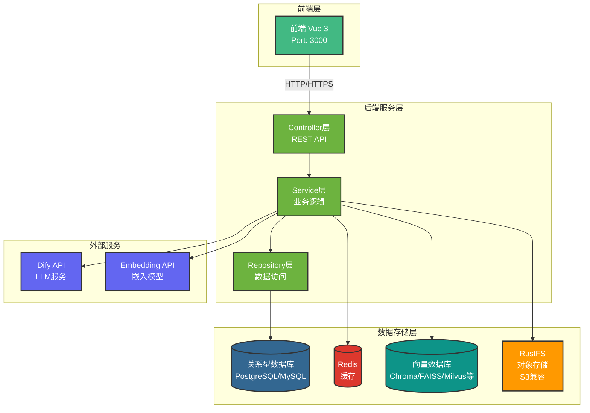
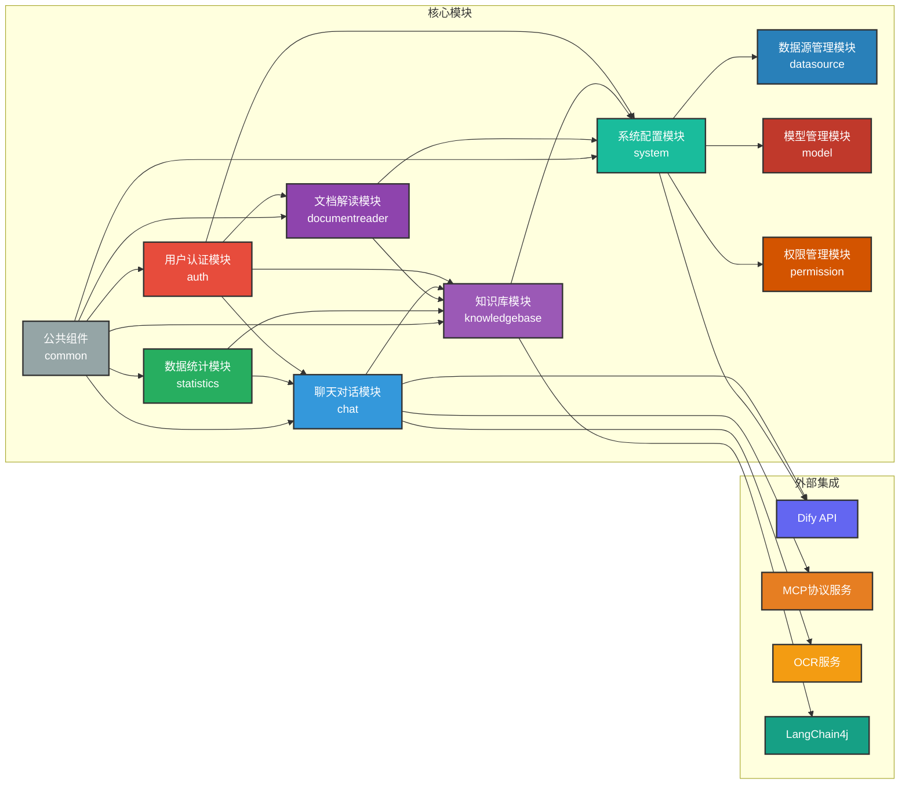

# DifyApp 后端项目

## 项目概述

DifyApp 后端是一个基于 Java 的企业级后端应用，提供用户认证、智能对话、知识库管理、AI 应用管理、AI 绘图等功能。该项目使用 Spring Boot 3.5.8 框架构建，集成了多种 AI 服务和向量数据库，实现了现代化的 RAG（检索增强生成）架构。

### 技术特点

- **现代化技术栈**：Spring Boot 3.5.8、Java 17、Spring Data JPA
- **RAG 框架**：基于 LangChain4j 0.34.0 实现检索增强生成
- **多向量数据库支持**：支持 Chroma、FAISS、Milvus、Qdrant、Weaviate、PgVector、Elasticsearch
- **流式响应**：支持 Server-Sent Events (SSE) 流式输出
- **多协议支持**：支持 MCP 协议、Dify API、OCR 服务等
- **文档处理**：支持多种文档格式解析（PDF、Word、Excel、TXT、Markdown 等）
- **安全认证**：JWT 令牌认证，Spring Security 加密
- **统一规范**：统一异常处理、统一 API 响应格式
- **日志与分析**：集成用户行为日志采集，支持 Elasticsearch 分析
- **上下文优化**：新增上下文压缩服务，提升长对话处理效率

## 技术栈

### 核心框架

- **后端框架**: Spring Boot 3.5.8
- **编程语言**: Java 17
- **构建工具**: Maven 3.6+
- **ORM框架**: Spring Data JPA / Hibernate

### 数据库支持

- **关系型数据库**: PostgreSQL / MySQL / Oracle
- **NoSQL数据库**: MongoDB / Neo4j
- **搜索引擎**: Elasticsearch
- **向量数据库**: 
  - Chroma
  - FAISS (本地文件存储)
  - Milvus
  - PgVector (PostgreSQL扩展)
  - Qdrant
  - Weaviate
  - Elasticsearch (向量搜索)

### 存储与缓存

- **对象存储**: RustFS (S3兼容，MinIO替代品)
- **缓存**: Redis (Spring Data Redis)

### AI与LLM集成

- **LangChain4j**: 0.34.0 (RAG框架)
- **文档解析**: Apache Tika, Apache POI
- **嵌入模型**: 支持多种嵌入模型
- **LLM集成**: 通过Dify API集成多种大语言模型

### 安全与认证

- **认证方式**: JWT (JSON Web Token)
- **密码加密**: Spring Security Crypto

### 其他技术

- **API文档**: SpringDoc OpenAPI 2.3.0
- **HTTP客户端**: Spring WebFlux (Reactive)
- **日志框架**: Logback
- **监控**: Spring Boot Actuator，统一超时策略（30秒）

## 系统架构



## 项目结构

```mermaid
graph TD
    A[src/] --> B[main/]
    B --> C[java/com/github/app/dify/]
    B --> D[resources/]
    
    C --> E[DifyAppApplication.java<br/>主应用入口]
    C --> F[auth/<br/>用户认证模块]
    C --> G[chat/<br/>聊天对话模块]
    C --> H[knowledgebase/<br/>知识库模块]
    C --> I[system/<br/>系统配置模块]
    C --> J[common/<br/>公共组件]
    C --> K[documentreader/<br/>文档解读模块]
    C --> L[statistics/<br/>数据统计模块]
    C --> M[mcp/<br/>MCP协议服务]
    C --> N[model/<br/>模型管理模块]
    C --> O[datasource/<br/>数据源管理模块]
    C --> P[permission/<br/>权限管理模块]
    
    F --> F1[controller/]
    F --> F2[domain/]
    F --> F3[repository/]
    F --> F4[service/]
    F --> F5[interceptor/]
    F --> F6[req/ resp/ util/]
    
    G --> G1[controller/]
    G --> G2[domain/]
    G --> G3[repository/]
    G --> G4[service/]
    G --> G5[mcp/]
    G --> G6[req/ resp/]
    
    H --> H1[controller/]
    H --> H2[domain/]
    H --> H3[repository/]
    H --> H4[service/]
    H --> H5[langchain4j/]
    H --> H6[req/ resp/ util/]
    
    I --> I1[controller/]
    I --> I2[domain/]
    I --> I3[repository/]
    I --> I4[service/]
    I --> I5[config/]
    I --> I6[req/ resp/ util/]
    
    J --> J1[controller/]
    J --> J2[exception/]
    J --> J3[resp/]
    J --> J4[util/]
    
    D --> D1[application.yml]
    D --> D2[logback-spring.xml]
    D --> D3[sql/]
    
    style A fill:#e1f5ff
    style F fill:#fff3cd
    style G fill:#fff3cd
    style H fill:#fff3cd
    style I fill:#fff3cd
    style J fill:#d4edda
```



## 模块关系图



## 模块说明

系统采用模块化设计，主要包含以下11个核心模块（按主应用类中的模块化结构顺序）：

1. **auth** - 认证模块（登录、注册、JWT）
2. **permission** - 权限管理模块（可见性控制）
3. **chat** - AI应用与对话模块
4. **knowledgebase** - 知识库模块
5. **documentreader** - 文档解读模块
6. **system** - 系统配置模块
7. **statistics** - 数据统计模块
8. **mcp** - MCP服务集成模块（浏览器搜索、时间服务等）
9. **model** - 模型配置模块（问答模型、向量化模型配置管理）
10. **datasource** - 数据源管理模块（数据源配置、连接管理、表结构管理）
11. **common** - 公共组件模块（工具类、异常、响应格式）

### 1. 用户认证模块 (auth)

**核心功能：**

- 用户注册：支持邮箱注册，管理员审核机制
- 用户登录：JWT 令牌认证，支持记住登录状态
- 密码管理：密码修改、重置、找回功能
- JWT 令牌管理：令牌生成、验证、刷新机制
- 用户权限控制：基于角色的访问控制（RBAC）
- 可见性管理：用户与应用/数据源/知识库的关联关系管理
- 用户状态管理：待审核、已激活、已禁用状态流转

**技术实现：**

- 使用 Spring Security Crypto 进行密码加密
- JWT 拦截器进行请求认证
- 统一异常处理机制
- 用户实体与业务实体的多对多关联

### 2. 权限管理模块 (permission)

**核心功能：**

- 可见性管理：
  - 用户与应用关联
  - 用户与数据源关联
  - 用户与知识库关联
- 权限控制：
  - 基于关联关系的权限验证
  - 权限查询接口
- 关联关系管理：
  - 关联关系创建和删除
  - 批量关联操作

**技术实现：**

- 使用 JPA 多对多关系映射
- 中间表存储关联关系
- 权限验证拦截器

### 3. 聊天对话模块 (chat)

**核心功能：**

- AI 应用管理：创建、编辑、删除、查询 AI 应用
- 聊天对话：支持 Chat Flow 和 Workflow 两种应用模式
- 流式响应：支持 Server-Sent Events (SSE) 流式输出
- 非流式响应：传统 HTTP 请求-响应模式
- 对话历史管理：
  - 会话（Conversation）管理：创建、查询、删除会话
  - 消息（Message）管理：保存、查询对话消息
  - 支持按时间、应用等条件查询
- Dify API 集成：
  - 应用调用接口封装
  - 流式和非流式响应处理
  - 错误处理和重试机制
- MCP (Model Context Protocol) 协议服务：
  - 浏览器搜索服务：实时网络搜索，获取最新信息
  - 地理位置服务：获取用户位置信息
  - 时间服务：获取当前时间、时区等信息
  - 实时信息检测：检测和更新实时数据
- OCR 服务集成：
  - 调用外部 OCR 服务进行图片文字识别
  - PDF 文档文字识别
  - Word 文档图片识别
  - 自动回退机制
- 视觉模型支持：
  - 支持多模态输入（文本+图片）
  - 图片理解、文字识别、图表分析
  - 自动检测模型视觉能力

**技术实现：**

- Spring WebFlux 实现响应式编程
- 流式响应使用 SSE 技术
- MCP 服务通过 HTTP 客户端调用
- 对话历史使用 JPA 持久化

### 4. 知识库模块 (knowledgebase)

**核心功能：**

- 知识库管理：创建、编辑、删除、查询知识库
- 文档管理：
  - 文档上传（支持 PDF、Word、Excel、TXT、Markdown 等格式）
  - 文档解析（使用 Apache Tika、Apache POI）
  - 文档分块处理（可配置分块大小、重叠大小）
  - 文档删除、重新处理
- 文档向量化：
  - 使用嵌入模型将文档转换为向量
  - 支持多种嵌入模型（OpenAI、本地模型等）
  - 向量存储到向量数据库
- 向量数据库管理：
  - 支持多种向量数据库（Chroma、FAISS、Milvus、Qdrant、Weaviate、PgVector、Elasticsearch）
  - 向量数据库连接配置
  - 向量数据的增删改查
- 知识库问答（RAG）：
  - 向量相似度搜索
  - 检索结果排序和过滤
  - 上下文增强生成
  - 支持引用来源
  - 支持视觉模型（多模态输入）
- OCR 服务集成：
  - 图片和PDF文字识别
  - Word文档图片识别
  - 自动回退机制
- 嵌入模型管理：配置、测试嵌入模型
- QA 模型管理：配置、测试问答模型

**技术实现：**

- LangChain4j 框架实现 RAG 功能
- 文档解析使用 Apache Tika 和 Apache POI
- 向量数据库适配器模式，支持多种向量数据库
- RustFS 存储原始文档文件（S3兼容）

### 5. 文档解读模块 (documentreader)

**核心功能：**

- 文档管理：
  - 文档上传和存储
  - 文档解析（支持多种格式）
  - 文档向量化处理
- 文档问答：
  - 基于 RAG 技术的文档问答
  - 文档内容检索
  - 上下文增强生成
- 文档翻译：
  - 多语言翻译支持
  - 翻译历史记录
- 文档思维导图：
  - 自动生成文档思维导图
  - 思维导图数据存储
- 文档笔记：
  - 笔记创建和管理
  - 笔记与文档关联
- 文档导读：
  - 自动生成文档导读
  - 导读内容管理

**技术实现：**

- 复用知识库的向量化能力
- 使用 LangChain4j 实现文档检索
- 思维导图数据使用 JSON 格式存储

### 6. 系统配置模块 (system)

**核心功能：**

- 系统配置管理：
  - 全局参数设置（RAG 参数、文件上传限制等）
  - 配置的增删改查
- 数据源管理：
  - 数据库连接配置（PostgreSQL、MySQL、Oracle 等）
  - 连接测试功能
  - 数据源增删改查
- 模型管理：
  - LLM 模型配置（模型名称、API 地址、密钥等）
  - 模型测试功能
  - 模型增删改查
- 向量数据库配置管理：
  - 向量数据库连接配置
  - 配置测试功能
  - 配置增删改查
- Prompt 模板管理：
  - 提示词模板创建、编辑、删除
  - 模板变量支持
  - 模板使用统计
- 用户管理（管理员功能）：
  - 用户列表查询（支持分页、搜索）
  - 用户审核（激活、禁用用户）
  - 用户信息编辑
  - 用户权限管理

**技术实现：**

- 配置信息使用 JPA 持久化
- 数据源连接使用 JDBC

### 7. 数据统计模块 (statistics)

**核心功能：**

- 对话历史统计：
  - 按时间维度统计
  - 按应用维度统计
  - 按用户维度统计
- 应用使用统计：
  - 应用调用次数
  - 应用使用趋势
- 知识库使用统计：
  - 知识库访问统计
  - 文档处理统计
- 用户活跃度统计：
  - 用户登录统计
  - 用户操作统计

**技术实现：**

- 基于 JPA 查询聚合统计
- 支持多维度数据统计
- 统计数据缓存机制

### 8. MCP 协议服务模块 (mcp)

**核心功能：**

- MCP 服务配置管理
- 浏览器搜索服务：
  - 实时网络搜索
  - 搜索结果处理
- 地理位置服务：
  - 获取位置信息
  - 位置数据缓存
- 时间服务：
  - 获取当前时间
  - 时区信息处理

**技术实现：**

- HTTP 客户端调用外部服务
- 服务结果缓存机制
- 统一的服务接口封装

### 9. 模型配置模块 (model)

**核心功能：**

- 问答模型管理：
  - 模型配置（名称、API 地址、密钥等）
  - 模型测试功能
  - 模型增删改查
- 嵌入模型管理：
  - 嵌入模型配置
  - 模型测试功能
  - 模型切换支持

**技术实现：**

- 模型配置使用 JPA 持久化
- 模型测试通过 API 调用验证
- 支持多种模型提供商

### 10. 数据源管理模块 (datasource)

**核心功能：**

- 数据源配置：
  - 数据库连接配置（PostgreSQL、MySQL、Oracle 等）
  - 连接参数管理
  - 数据源可见性控制
- 连接管理：
  - 连接测试功能
  - 连接池管理
  - 连接状态监控
- 表结构管理：
  - 自动发现表结构
  - 表结构缓存
  - 表结构更新机制

**技术实现：**

- 使用 JDBC 进行数据库连接
- 动态加载数据库驱动
- 表结构信息缓存到数据库

### 11. 公共组件模块 (common)

**核心功能：**

- 统一异常处理：
  - 全局异常处理器（GlobalExceptionHandler）
  - 自定义异常类型
  - 统一错误响应格式
- 统一 API 响应格式：
  - ApiResponse 统一响应封装
  - 成功和失败响应格式
  - 分页响应格式
- 基础控制器：
  - BaseController 提供通用方法
  - 统一参数验证
- 工具类：
  - 日期时间工具
  - 字符串工具
  - 文件工具
  - 加密工具等
- SSE 响应工具：
  - 流式响应封装
  - SSE 格式处理

**技术实现：**

- 使用 Spring AOP 实现统一异常处理
- 使用 Bean Validation 进行参数验证
- 工具类使用静态方法设计

## 开发环境要求

- **JDK**: 17 或更高版本
- **Maven**: 3.6+
- **数据库**: PostgreSQL 12+ / MySQL 5.7+ / Oracle 12+
- **Redis**: 6.0+ (可选，用于缓存)
- **对象存储**: RustFS (S3兼容，用于文档存储)
- **向量数据库**: 根据需求选择安装（Qdrant/Milvus/FAISS/Chroma/Weaviate/PgVector/Elasticsearch）
- **OCR服务**: EasyOCR (可选，用于图片和PDF文字识别)

## Docker 部署

### Elasticsearch 8.11.0

#### 方式一：使用 Docker 命令

使用 Docker 快速启动 Elasticsearch（单节点模式，禁用安全认证）：

```bash
docker run -d -p 9200:9200 -p 9300:9300 \
  -e "discovery.type=single-node" \
  -e "xpack.security.enabled=false" \
  -e "xpack.security.http.ssl.enabled=false" \
  elasticsearch:8.11.0
```

#### 方式二：使用 Docker Compose

项目提供了 `docker-compose.yml` 文件，可以使用以下命令启动：

```bash
# 启动服务
docker-compose up -d

# 查看服务状态
docker-compose ps

# 查看日志
docker-compose logs -f elasticsearch

# 停止服务
docker-compose down

# 停止服务并删除数据卷
docker-compose down -v
```

**参数说明：**

- `-p 9200:9200`: HTTP REST API 端口
- `-p 9300:9300`: 节点通信端口
- `discovery.type=single-node`: 单节点模式
- `xpack.security.enabled=false`: 禁用 X-Pack 安全功能
- `xpack.security.http.ssl.enabled=false`: 禁用 HTTPS
- `ES_JAVA_OPTS=-Xms512m -Xmx512m`: JVM 内存设置

**注意**: 此配置仅用于开发环境，生产环境建议启用安全认证。

验证 Elasticsearch 是否启动成功：

```bash
curl http://localhost:9200
```

## 快速开始

### 1. 克隆项目

```bash
git clone https://github.com/Yarao-Liu/DifyApp.git
cd DifyApp/backend
```

### 2. 配置数据库

编辑 `src/main/resources/application.yml`，配置数据库连接信息：

```yaml
spring:
  datasource:
    driver-class-name: org.postgresql.Driver
    url: jdbc:postgresql://localhost:15432/difyapp
    username: postgres
    password: your_password
```

### 3. 配置其他服务

#### Redis配置（可选）

```yaml
spring:
  data:
    redis:
      host: localhost
      port: 6379
      password: # 可选
```

#### RustFS配置（RustFS 100% 兼容 MinIO 配置）

```yaml
minio:
  endpoint: http://localhost:9000
  access-key: rustfsadmin
  secret-key: rustfsadmin
  bucket-name: knowledge-base
```

#### 向量数据库配置

根据使用的向量数据库，配置相应的连接信息（Qdrant、Milvus、Chroma等）。

### 4. 初始化数据库

执行 `src/main/resources/sql/init_database_complete.sql` 脚本创建数据库表。

### 5. 构建项目

```bash
mvn clean install
```

### 6. 运行应用

```bash
mvn spring-boot:run
```

或者使用打包后的JAR文件：

```bash
java -jar target/backend-0.0.1-SNAPSHOT.jar
```

应用启动后，默认运行在 `http://localhost:9090`

### 7. 访问API文档

启动应用后，访问 `http://localhost:9090/swagger-ui.html` 查看API文档。

## 配置说明

### 主要配置项

- **服务器端口**: 默认 9090
- **JWT配置**: 密钥和过期时间
- **文件上传**: 最大文件大小 100MB，最大请求大小 200MB
- **RAG配置**: 文档分块大小、重叠大小、相似度阈值等
- **MCP配置**: 浏览器搜索、地理位置、时间服务等

详细配置请参考 `src/main/resources/application.yml` 文件。

## API 文档

项目使用 SpringDoc OpenAPI 自动生成API文档：

- **Swagger UI**: `http://localhost:9090/swagger-ui.html`
- **OpenAPI JSON**: `http://localhost:9090/v3/api-docs`

更多详细的设计文档请参考 `doc/` 目录。

## 日志配置

日志文件位置：

- **应用日志**: `logs/dify-app.log`
- **错误日志**: `logs/dify-app-error.log`

日志按天滚动，保留历史日志文件。

## 开发规范

- 遵循Spring Boot最佳实践
- 使用MVC架构模式（Controller-Service-Repository）
- 统一异常处理机制（GlobalExceptionHandler）
- 统一API响应格式（ApiResponse）
- 详细的日志记录
- 使用JPA进行数据持久化
- 使用DTO进行数据传输

## 部署说明

### 打包应用

```bash
mvn clean package
```

### 运行JAR文件

```bash
java -jar target/backend-0.0.1-SNAPSHOT.jar
```

### 生产环境建议

- 修改JWT密钥为更安全的随机字符串
- 配置HTTPS
- 配置数据库连接池参数
- 配置日志级别和输出
- 配置监控和告警

## 贡献指南

欢迎提交Issue和Pull Request来帮助我们改进项目。请确保你的代码符合项目规范。

提交代码前请确保：

- 代码通过编译
- 遵循代码风格规范
- 添加必要的注释
- 更新相关文档

## 许可证

本项目采用MIT许可证，详情请见 [LICENSE](LICENSE) 文件。

## 联系方式

如有问题，请通过GitHub Issues与我们联系。
