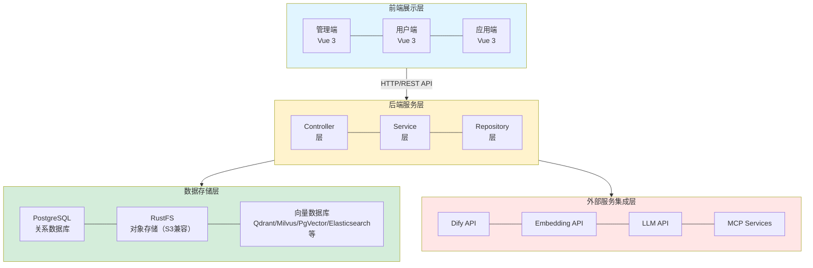

# DifyApp 概要设计报告

## 1. 项目概述

### 1.1 项目背景
DifyApp 是一个基于 Spring Boot 和 Vue 3 的综合性 AI 应用管理平台，旨在提供完整的 AI 应用管理、知识库管理、智能问答、AI 绘图等功能。系统集成了 Dify AI 平台，支持多租户架构，提供细粒度的权限控制，为企业和个人用户提供统一的 AI 应用管理平台。系统采用 RAG（检索增强生成）技术实现知识库问答，支持多种向量数据库和 LLM 模型，提供流式和非流式两种响应模式，具备完整的对话历史管理和系统配置管理能力。

### 1.2 项目目标
- 提供完整的 AI 应用生命周期管理（创建、编辑、删除、查看）
- 支持 Chat Flow 和 Workflow 两种应用类型的调用
- 实现知识库的创建、管理和文档向量化
- 提供基于 RAG（检索增强生成）的智能问答功能
- 提供通用智能问答功能（不使用知识库）
- 支持流式和非流式响应模式
- 实现完整的对话历史管理功能
- 提供 AI 绘图功能（基于 Mermaid）
- 提供系统配置管理功能（模型、向量数据库、数据源、系统配置）
- 提供多租户和权限管理能力

### 1.3 适用范围
- 企业内部 AI 应用管理平台
- 个人 AI 应用集成系统
- 知识库管理和智能问答系统
- 多租户 SaaS 平台
- 数据库查询和分析平台
- 图表和流程图生成平台

## 2. 系统架构设计

### 2.1 总体架构

系统采用前后端分离架构，整体架构如下：



### 2.2 分层架构

系统采用经典的三层架构模式：

#### 2.2.1 表现层（Controller Layer）
- **职责**：处理 HTTP 请求和响应，参数验证，权限校验
- **主要组件**：
  - `AuthController`：用户认证和授权
  - `AiAppController`：AI 应用管理
  - `ChatController`：智能问答（通用）
  - `KnowledgeBaseController`：知识库管理
  - `KnowledgeBaseDocumentController`：知识库文档管理
  - `KnowledgeBaseQAController`：知识库问答
  - `ChatHistoryController`：对话历史管理（用户端）
  - `AdminChatHistoryController`：对话历史管理（管理员端）
  - `DrawIOController`：AI 绘图功能
  - `ModelConfigController`：模型配置管理
  - `VectorDatabaseController`：向量数据库配置管理
  - `DataSourceController`：数据源管理
  - `SystemConfigController`：系统配置管理
  - `PromptController`：提示词管理
  - `GlobalExceptionHandler`：全局异常处理

#### 2.2.2 业务逻辑层（Service Layer）
- **职责**：实现业务逻辑，协调数据访问层和外部服务
- **主要组件**：
  - `AuthService`：用户认证服务
  - `AiAppService`：AI 应用管理服务
  - `ChatService`：智能问答服务（通用）
  - `DifyApiClient`：Dify API 客户端
  - `KnowledgeBaseService`：知识库管理服务
  - `DocumentService`：文档管理服务
  - `DocumentVectorizationService`：文档向量化服务
  - `RagRetrievalService`：RAG 检索服务
  - `KnowledgeBaseQAService`：知识库问答服务
  - `ContextCompressionService`：上下文压缩服务
  - `ChatHistoryService`：对话历史服务
  - `DatabaseSchemaService`：数据库模式服务
  - `DataSourceService`：数据源管理服务
  - `DrawIOService`：AI 绘图服务
  - `ModelConfigService`：模型配置服务
  - `VectorDatabaseService`：向量数据库配置服务
  - `SystemConfigService`：系统配置服务
  - `PromptService`：提示词管理服务
  - `UserAppVisibilityService`：用户应用可见性服务
  - `UserKnowledgeBaseVisibilityService`：用户知识库可见性服务
  - `UserDataSourceVisibilityService`：用户数据源可见性服务

#### 2.2.3 数据访问层（Repository Layer）
- **职责**：数据持久化操作，使用 Spring Data JPA
- **主要组件**：
  - `UserRepository`：用户数据访问
  - `AiAppRepository`：AI 应用数据访问
  - `KnowledgeBaseRepository`：知识库数据访问
  - `KnowledgeBaseDocumentRepository`：知识库文档数据访问
  - `ChatConversationRepository`：对话会话数据访问
  - `ChatMessageRepository`：对话消息数据访问
  - `QAModelRepository`：问答模型数据访问
  - `EmbeddingModelRepository`：向量化模型数据访问
  - `VectorDatabaseRepository`：向量数据库配置数据访问
  - `DataSourceRepository`：数据源数据访问
  - `DrawIODiagramRepository`：绘图图表数据访问
  - `DrawIOHistoryRepository`：绘图历史数据访问
  - `SystemConfigRepository`：系统配置数据访问
  - `PromptRepository`：提示词数据访问
  - `UserAppVisibilityRepository`：用户应用可见性数据访问
  - `UserKnowledgeBaseVisibilityRepository`：用户知识库可见性数据访问
  - `UserDataSourceVisibilityRepository`：用户数据源可见性数据访问

### 2.3 前端架构

前端采用 Vue 3 + Element Plus 技术栈，采用组件化开发模式：

#### 2.3.1 路由结构
- **管理端路由** (`/admin`)：管理员专用功能
  - 应用管理、用户管理、知识库管理、对话历史查看
- **用户端路由** (`/user`)：普通用户功能
  - 应用列表、智能问答、知识库管理、对话历史
- **应用端路由** (`/app`)：应用交互界面
  - Chat Flow 交互、Workflow 交互

#### 2.3.2 组件结构
- **布局组件** (`layouts/`)：AdminLayout、UserLayout、AppLayout
- **页面组件** (`views/`)：各功能模块的页面组件
- **公共组件** (`components/`)：可复用的 UI 组件
- **工具函数** (`utils/`)：HTTP 请求、图标、主题等工具

## 3. 技术架构

### 3.1 后端技术栈

| 技术 | 版本 | 用途 |
|------|------|------|
| Java | JDK 17+ | 开发语言 |
| Spring Boot | 3.5.8+ | 应用框架 |
| Spring Data JPA | 3.5.8+ | 数据持久化 |
| PostgreSQL | 15+ | 关系数据库 |
| Spring WebFlux | 3.5.8+ | 响应式编程（流式响应） |
| JWT | 0.12.3+ | 身份认证 |
| BCrypt | - | 密码加密 |
| RustFS | latest | 对象存储（S3兼容，MinIO替代方案） |
| Qdrant/Milvus/FAISS/Chroma/Weaviate/PgVector/Elasticsearch | - | 向量数据库（多选一） |
| LangChain4j | 0.34.0+ | RAG 框架 |
| Apache Tika | 2.9.1+ | 文档解析 |
| SpringDoc OpenAPI | 2.3.0+ | API 文档 |
| Maven | - | 构建工具 |
| Mermaid | - | 图表生成（AI绘图） |
| JDBC | - | 数据库连接 |

### 3.2 前端技术栈

| 技术 | 版本 | 用途 |
|------|------|------|
| Vue | 3.3+ | 前端框架 |
| Vue Router | 4 | 路由管理 |
| Pinia | 2.1.7 | 状态管理 |
| Element Plus | 2.4+ | UI 组件库 |
| Axios | 1.6.2 | HTTP 客户端 |
| Vite | 5 | 构建工具 |
| marked | 17.0.0 | Markdown 渲染 |
| highlight.js | 11.11.1 | 代码高亮 |
| KaTeX | 0.16.9 | 数学公式渲染 |

### 3.3 外部服务集成

- **Dify API**：AI 应用调用接口
- **Embedding API**：文档向量化服务（支持 OpenAI 兼容 API、Ollama、VLLM）
- **LLM API**：大语言模型服务（支持 OpenAI 兼容 API、Ollama、VLLM）
- **MCP 协议**：Model Context Protocol（浏览器检索、时间、地理位置服务）
- **OCR 服务**：EasyOCR（图片和PDF文字识别，可选但推荐）
- **日志与分析**：Elasticsearch（用户行为日志采集与分析）
- **关系型数据库**：MySQL、PostgreSQL、Oracle、MongoDB

## 4. 功能模块设计

### 4.1 用户认证与授权模块

#### 4.1.1 功能概述
提供用户注册、登录、密码管理、角色管理、资源可见性管理等功能。

#### 4.1.2 核心功能
- **用户注册**：新用户注册，默认状态为待审核
- **用户登录**：JWT Token 认证
- **密码管理**：修改密码、管理员重置密码
- **用户审核**：管理员审核新用户
- **用户管理**：禁用用户、更新用户角色、用户列表查询
- **权限控制**：基于角色的访问控制（RBAC）
- **资源可见性管理**：应用可见性、知识库可见性、数据源可见性

#### 4.1.3 技术实现
- JWT Token 认证机制
- BCrypt 密码加密
- JWT 拦截器进行权限校验
- 角色定义：管理员（role=1）、普通用户（role=2）
- 用户状态：待审核（status=0）、已激活（status=1）、已禁用（status=2）

**详细设计文档**：`5.用户认证与授权功能设计文档.md`

### 4.2 AI 应用管理模块

#### 4.2.1 功能概述
提供 AI 应用的完整生命周期管理，支持 Chat Flow 和 Workflow 两种类型。

#### 4.2.2 核心功能
- **应用创建**：配置应用基本信息、Dify API Key、应用类型等
- **应用编辑**：更新应用配置
- **应用删除**：删除应用及其关联数据
- **应用查询**：支持按租户、类型、状态等条件查询，支持分页
- **应用调用**：
  - Chat Flow：支持流式和非流式调用
  - Workflow：支持流式和非流式调用
- **文件上传**：支持上传文件到 Dify
- **用户可见性管理**：控制用户对应用的访问权限

#### 4.2.3 技术实现
- 使用 `DifyApiClient` 封装 Dify API 调用
- 使用 Spring WebFlux 实现流式响应（SSE）
- 支持多租户隔离
- 缓存机制优化性能

**详细设计文档**：`8.AI应用管理功能设计文档.md`

### 4.3 智能问答模块

#### 4.3.1 功能概述
提供基于大语言模型的通用智能问答功能，不依赖知识库。支持视觉模型，可以处理图片输入。

#### 4.3.2 核心功能
- **非流式问答**：一次性返回完整答案
- **流式问答**：实时返回答案片段（SSE）
- **多轮对话**：支持历史对话上下文
- **MCP 协议支持**：浏览器检索、时间信息、地理位置信息
- **上下文压缩**：优化长对话性能
- **自动保存历史**：自动保存对话记录
- **视觉模型支持**：支持图片输入，实现图片理解、文字识别、图表分析等功能
- **多模态输入**：支持文本+图片的混合输入

#### 4.3.3 技术实现
- LangChain4j 集成
- 支持多种 LLM 提供商（OpenAI、vLLM、Ollama）
- MCP 协议集成
- 上下文压缩策略
- 视觉模型集成（支持多模态输入）
- 图片处理（base64编码、多模态消息格式）

**详细设计文档**：`6.智能问答功能设计文档.md`

### 4.4 知识库管理模块

#### 4.3.1 功能概述
提供知识库的创建、管理和文档管理功能。

#### 4.3.2 核心功能
- **知识库管理**：
  - 创建、编辑、删除知识库
  - 知识库列表查询（支持权限过滤）
- **文档管理**：
  - 文档上传（支持 PDF、Word、TXT、Markdown 等格式）
  - 文档删除
  - 文档列表查询
  - 文档下载
  - 文档重新向量化
- **文档处理流程**：
  1. 文档上传到 MinIO
  2. 使用 Apache Tika 解析文档内容
  3. 文档分块（可配置分块大小和重叠）
  4. 向量化（调用 Embedding API）
  5. 存储到 Qdrant 向量数据库

#### 4.3.3 技术实现
- MinIO 对象存储
- Apache Tika 文档解析
- OCR 服务集成（EasyOCR，支持图片和PDF文字识别）
- Word文档图片提取和OCR识别
- LangChain4j 文档分块
- 多种向量数据库支持（Qdrant、Milvus、FAISS、Chroma、Weaviate、PgVector、Elasticsearch）
- 异步处理文档向量化

**详细设计文档**：`7.知识库功能设计文档.md`

### 4.5 RAG 问答模块（知识库问答）

#### 4.4.1 功能概述
基于检索增强生成（RAG）技术，实现基于知识库的智能问答。

#### 4.4.2 核心功能
- **非流式问答**：一次性返回完整答案
- **流式问答**：实时返回答案片段（SSE）
- **相似度检索**：从向量数据库中检索相关文档片段
- **上下文管理**：支持连续对话，可配置上下文压缩策略
- **答案生成**：基于检索到的文档片段生成答案

#### 4.5.3 技术实现
- LangChain4j RAG 框架
- 多种向量数据库相似度检索
- 可配置的检索参数（top-k、相似度阈值）
- 上下文压缩策略（滑动窗口、总结、混合）

**详细设计文档**：`7.知识库功能设计文档.md`（包含在知识库模块中）

### 4.6 对话历史管理模块

#### 4.5.1 功能概述
提供完整的对话会话和消息历史管理功能。

#### 4.5.2 核心功能
- **会话管理**：
  - 创建新会话
  - 查询会话列表（支持分页、搜索、筛选）
  - 删除会话
  - 继续对话
- **消息管理**：
  - 保存用户消息和助手回复
  - 查询会话消息列表
- **统计功能**：
  - 对话历史统计（总会话数、总消息数、今日统计等）
- **权限控制**：
  - 用户只能查看自己的对话历史
  - 管理员可以查看所有用户的对话历史

#### 4.6.3 技术实现
- 会话和消息分离存储
- 支持会话类型区分（普通聊天、知识库问答）
- 分页查询优化
- 软删除机制
- 自动生成会话标题

**详细设计文档**：`11.对话历史管理功能设计文档.md`

### 4.8 AI 绘图模块

#### 4.8.1 功能概述
提供基于自然语言生成图表和流程图的功能。

#### 4.8.2 核心功能
- **图表生成**：根据自然语言描述生成 Mermaid 图表
- **图表修改**：支持修改已有图表
- **图表保存**：保存图表和历史记录
- **图表管理**：查询、删除图表
- **历史记录**：保存图表生成历史

#### 4.8.3 技术实现
- LLM 生成 Mermaid 代码
- Mermaid 渲染引擎
- 图表存储和管理

**详细设计文档**：`9.AI绘图功能设计文档.md`

### 4.9 系统配置管理模块

#### 4.9.1 功能概述
提供系统各类配置的统一管理平台。

#### 4.9.2 核心功能
- **模型管理**：问答模型和向量化模型的配置管理
- **向量数据库管理**：多种向量数据库的配置管理
- **数据源管理**：关系型数据库连接配置管理
- **系统配置管理**：通用键值对配置管理

#### 4.9.3 技术实现
- 配置的增删改查
- 连接测试功能
- 默认配置管理
- 配置缓存机制

**详细设计文档**：`12.系统配置管理功能设计文档.md`

### 4.10 权限管理模块

#### 4.6.1 功能概述
提供用户对应用和知识库的可见性权限管理。

#### 4.6.2 核心功能
- **应用可见性管理**：
  - 设置用户对应用的可见性
  - 查询用户可见的应用列表
- **知识库可见性管理**：
  - 设置用户对知识库的可见性
  - 查询用户可见的知识库列表

#### 4.10.3 技术实现
- 通过 `UserAppVisibility`、`UserKnowledgeBaseVisibility`、`UserDataSourceVisibility` 表管理权限
- 在查询时自动过滤不可见资源
- 支持批量权限设置

**详细设计文档**：`5.用户认证与授权功能设计文档.md`（包含在认证授权模块中）

## 5. 数据库设计

### 5.1 数据库选型
- **数据库**：PostgreSQL 15
- **ORM 框架**：Spring Data JPA / Hibernate
- **连接池**：HikariCP

### 5.2 核心数据表

#### 5.2.1 用户表 (SYS_USER)
```sql
- id: BIGINT (主键)
- username: VARCHAR (用户名，唯一)
- password: VARCHAR (加密密码)
- email: VARCHAR (邮箱)
- role: INTEGER (角色：0-普通用户，1-管理员)
- status: INTEGER (状态：0-待审核，1-已审核，2-已禁用)
- created_time: TIMESTAMP (创建时间)
- updated_time: TIMESTAMP (更新时间)
```

#### 5.2.2 AI 应用表 (AI_APP)
```sql
- id: BIGINT (主键)
- name: VARCHAR (应用名称)
- description: TEXT (应用描述)
- type: INTEGER (类型：1-ChatFlow，2-Workflow)
- app_id: VARCHAR (Dify 应用ID)
- api_base_url: VARCHAR (API 基础URL)
- api_key: VARCHAR (API Key)
- tenant_id: BIGINT (租户ID)
- stream_enabled: BOOLEAN (是否启用流式)
- file_upload_enabled: BOOLEAN (是否启用文件上传)
- input_enabled: BOOLEAN (是否启用输入)
- theme_color: VARCHAR (主题颜色)
- inputs: TEXT (输入配置，JSON格式)
- status: INTEGER (状态)
- created_time: TIMESTAMP
- updated_time: TIMESTAMP
```

#### 5.2.3 知识库表 (KNOWLEDGE_BASE)
```sql
- id: BIGINT (主键)
- name: VARCHAR (知识库名称)
- description: TEXT (描述)
- tenant_id: BIGINT (租户ID)
- status: INTEGER (状态)
- created_time: TIMESTAMP
- updated_time: TIMESTAMP
```

#### 5.2.4 知识库文档表 (KNOWLEDGE_BASE_DOCUMENT)
```sql
- id: BIGINT (主键)
- knowledge_base_id: BIGINT (知识库ID，外键)
- original_file_name: VARCHAR (原始文件名)
- stored_file_name: VARCHAR (存储文件名)
- file_size: BIGINT (文件大小)
- mime_type: VARCHAR (MIME类型)
- vectorized_status: VARCHAR (向量化状态：pending/processing/completed/failed)
- upload_user: BIGINT (上传用户ID)
- upload_time: TIMESTAMP (上传时间)
```

#### 5.2.5 对话会话表 (CHAT_CONVERSATION)
```sql
- id: BIGINT (主键)
- user_id: BIGINT (用户ID，外键)
- app_id: BIGINT (应用ID，外键，可为空)
- knowledge_base_id: BIGINT (知识库ID，外键，可为空)
- type: INTEGER (类型：1-普通聊天，2-知识库问答)
- title: VARCHAR (会话标题)
- message_count: INTEGER (消息数量)
- last_message_time: TIMESTAMP (最后消息时间)
- created_time: TIMESTAMP
- updated_time: TIMESTAMP
```

#### 5.2.6 对话消息表 (CHAT_MESSAGE)
```sql
- id: BIGINT (主键)
- conversation_id: BIGINT (会话ID，外键)
- role: VARCHAR (角色：user/assistant)
- content: TEXT (消息内容)
- created_time: TIMESTAMP
```

#### 5.2.7 用户应用可见性表 (USER_APP_VISIBILITY)
```sql
- id: BIGINT (主键)
- user_id: BIGINT (用户ID，外键)
- app_id: BIGINT (应用ID，外键)
- visible: BOOLEAN (是否可见)
- created_time: TIMESTAMP
- updated_time: TIMESTAMP
```

#### 5.2.8 用户知识库可见性表 (USER_KNOWLEDGE_BASE_VISIBILITY)
```sql
- id: BIGINT (主键)
- user_id: BIGINT (用户ID，外键)
- knowledge_base_id: BIGINT (知识库ID，外键)
- visible: BOOLEAN (是否可见)
- created_time: TIMESTAMP
- updated_time: TIMESTAMP
```

#### 5.2.9 问答模型表 (QA_MODEL)
```sql
- id: BIGINT (主键)
- name: VARCHAR (模型名称)
- provider: VARCHAR (提供商类型：openai, vllm, ollama)
- api_url: VARCHAR (API 地址)
- api_key: VARCHAR (API Key)
- model: VARCHAR (模型标识)
- use_for: VARCHAR (使用场景：chat, rag, both)
- enabled: BOOLEAN (是否启用)
- is_default: BOOLEAN (是否默认)
- created_time: TIMESTAMP
- updated_time: TIMESTAMP
- deleted: INTEGER (是否删除)
```

#### 5.2.10 向量化模型表 (EMBEDDING_MODEL)
```sql
- id: BIGINT (主键)
- name: VARCHAR (模型名称)
- provider: VARCHAR (提供商类型)
- api_url: VARCHAR (API 地址)
- api_key: VARCHAR (API Key)
- model: VARCHAR (模型标识)
- timeout: INTEGER (超时时间)
- batch_size: INTEGER (批处理大小)
- enabled: BOOLEAN (是否启用)
- is_default: BOOLEAN (是否默认)
- created_time: TIMESTAMP
- updated_time: TIMESTAMP
- deleted: INTEGER (是否删除)
```

#### 5.2.11 向量数据库配置表 (VECTOR_DATABASE)
```sql
- id: BIGINT (主键)
- name: VARCHAR (配置名称)
- type: VARCHAR (数据库类型：qdrant, milvus, faiss, chroma, weaviate, elasticsearch)
- url: VARCHAR (连接地址)
- api_key: VARCHAR (API Key)
- timeout: INTEGER (超时时间)
- extra_config: TEXT (额外配置，JSON格式)
- enabled: BOOLEAN (是否启用)
- is_default: BOOLEAN (是否默认)
- description: VARCHAR (描述)
- created_time: TIMESTAMP
- updated_time: TIMESTAMP
- deleted: INTEGER (是否删除)
```

#### 5.2.12 数据源表 (DATA_SOURCE)
```sql
- id: BIGINT (主键)
- name: VARCHAR (数据源名称)
- type: VARCHAR (数据库类型：mysql, postgresql, oracle, mongodb)
- host: VARCHAR (主机地址)
- port: INTEGER (端口)
- database: VARCHAR (数据库名)
- username: VARCHAR (用户名)
- password: VARCHAR (密码，加密存储)
- status: INTEGER (状态：1-启用，0-禁用)
- tenant_id: INTEGER (租户ID)
- creator: VARCHAR (创建者)
- creator_id: BIGINT (创建者ID)
- is_public: BOOLEAN (是否公开)
- created_time: TIMESTAMP
- updated_time: TIMESTAMP
- deleted: INTEGER (是否删除)
```

#### 5.2.13 绘图图表表 (DRAWIO_DIAGRAM)
```sql
- id: BIGINT (主键)
- user_id: BIGINT (用户ID，外键)
- title: VARCHAR (图表标题)
- description: TEXT (描述)
- mermaid_code: TEXT (Mermaid代码)
- diagram_type: VARCHAR (图表类型)
- created_time: TIMESTAMP
- updated_time: TIMESTAMP
- deleted: INTEGER (是否删除)
```

#### 5.2.14 绘图历史表 (DRAWIO_HISTORY)
```sql
- id: BIGINT (主键)
- diagram_id: BIGINT (图表ID，外键)
- prompt: TEXT (提示词)
- mermaid_code: TEXT (Mermaid代码)
- created_time: TIMESTAMP
```

#### 5.2.16 系统配置表 (SYSTEM_CONFIG)
```sql
- id: BIGINT (主键)
- config_key: VARCHAR (配置键，唯一)
- config_value: TEXT (配置值，JSON格式)
- description: VARCHAR (配置描述)
- config_group: VARCHAR (配置分组)
- config_type: VARCHAR (配置类型：string, number, boolean, json)
- creator: VARCHAR (创建者)
- creator_id: BIGINT (创建者ID)
- created_time: TIMESTAMP
- updated_time: TIMESTAMP
- deleted: INTEGER (是否删除)
```

#### 5.2.16 提示词表 (PROMPT)
```sql
- id: BIGINT (主键)
- title: VARCHAR(200) (提示词标题)
- content: TEXT (提示词正文)
- create_time: TIMESTAMP (创建时间)
- update_time: TIMESTAMP (更新时间)
- deleted: INTEGER (是否删除：0-未删除，1-已删除)
```

#### 5.2.17 用户数据源可见性表 (USER_DATA_SOURCE_VISIBILITY)
```sql
- id: BIGINT (主键)
- user_id: BIGINT (用户ID，外键)
- data_source_id: BIGINT (数据源ID，外键)
- visible: BOOLEAN (是否可见)
- created_time: TIMESTAMP
- updated_time: TIMESTAMP
```

### 5.3 索引设计
- 用户表：`username` 唯一索引，`status`、`role` 索引
- 应用表：`tenant_id`、`type`、`status` 索引
- 知识库表：`tenant_id`、`status`、`vector_store_type`、`vector_database_id` 索引
- 文档表：`knowledge_base_id`、`status`、`vectorized_status` 索引
- 会话表：`user_id`、`app_id`、`knowledge_base_id`、`type`、`deleted`、`create_time`、`update_time` 索引
- 消息表：`conversation_id`、`role`、`sequence`、`create_time` 索引
- 问答模型表：`provider`、`use_for`、`enabled`、`is_default`、`deleted` 索引
- 向量化模型表：`provider`、`enabled`、`is_default`、`deleted` 索引
- 向量数据库表：`type`、`enabled`、`deleted`、`(type, is_default)` 复合索引
- 数据源表：`tenant_id`、`type`、`status`、`deleted`、`creator_id` 索引
- 系统配置表：`config_key` 唯一索引，`config_group`、`deleted` 索引

## 6. 接口设计

### 6.1 RESTful API 设计原则
- 使用标准 HTTP 方法（GET、POST、PUT、DELETE）
- 使用名词表示资源
- 使用复数形式表示资源集合
- 使用 HTTP 状态码表示操作结果
- 统一的响应格式

### 6.2 认证机制
- 使用 JWT Token 进行身份认证
- Token 通过 HTTP Header 传递：`Authorization: Bearer {token}`
- Token 有效期：7天（可配置）

### 6.3 主要 API 接口

#### 6.3.1 认证 API
- `POST /api/auth/register` - 用户注册
- `POST /api/auth/login` - 用户登录
- `POST /api/auth/change-password` - 修改密码
- `POST /api/auth/reset-password/{userId}` - 重置密码（管理员）
- `GET /api/auth/users` - 获取用户列表（管理员）
- `POST /api/auth/approve/{userId}` - 审核用户
- `POST /api/auth/disable/{userId}` - 禁用用户

#### 6.3.2 AI 应用 API
- `POST /api/ai-apps` - 创建应用
- `PUT /api/ai-apps/{id}` - 更新应用
- `GET /api/ai-apps/{id}` - 获取应用详情
- `DELETE /api/ai-apps/{id}` - 删除应用
- `GET /api/ai-apps` - 获取应用列表
- `POST /api/ai-apps/{id}/chat` - Chat Flow 调用（非流式）
- `POST /api/ai-apps/{id}/chat/stream` - Chat Flow 调用（流式）
- `POST /api/ai-apps/{id}/workflow` - Workflow 调用（非流式）
- `POST /api/ai-apps/{id}/workflow/stream` - Workflow 调用（流式）

#### 6.3.3 知识库 API
- `POST /api/knowledge-bases` - 创建知识库
- `PUT /api/knowledge-bases/{id}` - 更新知识库
- `GET /api/knowledge-bases/{id}` - 获取知识库详情
- `DELETE /api/knowledge-bases/{id}` - 删除知识库
- `GET /api/knowledge-bases` - 获取知识库列表
- `POST /api/knowledge-bases/{kbId}/documents/upload` - 上传文档
- `DELETE /api/knowledge-bases/{kbId}/documents/{docId}` - 删除文档
- `GET /api/knowledge-bases/{kbId}/documents` - 获取文档列表
- `POST /api/knowledge-bases/{kbId}/documents/{docId}/reindex` - 重新向量化

#### 6.3.4 知识库问答 API
- `POST /api/knowledge-bases/{kbId}/qa` - 知识库问答（非流式）
- `POST /api/knowledge-bases/{kbId}/qa/stream` - 知识库问答（流式）

#### 6.3.5 智能问答 API
- `POST /api/chat` - 智能问答（非流式）
- `POST /api/chat/stream` - 智能问答（流式）

#### 6.3.6 对话历史 API
- `POST /api/chat/history/conversations` - 创建新会话
- `GET /api/chat/history/conversations` - 获取我的会话列表
- `GET /api/chat/history/conversations/{id}` - 获取会话详情
- `GET /api/chat/history/conversations/{id}/messages` - 获取消息列表
- `PUT /api/chat/history/conversations/{id}/title` - 更新会话标题
- `DELETE /api/chat/history/conversations/{id}` - 删除会话
- `GET /api/chat/history/conversations/{id}/export` - 导出会话
- `GET /api/admin/chat/history/conversations` - 获取所有会话列表（管理员）
- `GET /api/admin/chat/history/statistics` - 获取对话历史统计
- `DELETE /api/admin/chat/history/conversations/batch` - 批量删除会话（管理员）

#### 6.3.7 AI 绘图 API
- `POST /api/drawio/generate` - 生成图表
- `POST /api/drawio/modify` - 修改图表
- `POST /api/drawio/save` - 保存图表
- `GET /api/drawio/list` - 获取图表列表
- `GET /api/drawio/{id}` - 获取图表详情
- `DELETE /api/drawio/{id}` - 删除图表
- `GET /api/drawio/{id}/history` - 获取图表历史
 
#### 6.3.8 模型配置 API
- `GET /api/models/config` - 获取模型配置
- `PUT /api/models/config` - 更新模型配置
- `POST /api/models/test` - 测试模型连接
- `GET /api/models/qa/available` - 获取可用问答模型列表
- `GET /api/models/qa/available/rag` - 获取可用问答模型列表（知识库问答）
 
#### 6.3.9 向量数据库配置 API
- `GET /api/vector-databases` - 获取所有向量数据库配置
- `GET /api/vector-databases/type/{type}` - 根据类型获取配置列表
- `PUT /api/vector-databases` - 更新向量数据库配置
- `POST /api/vector-databases/test` - 测试向量数据库连接

#### 6.3.11 数据源管理 API
- `POST /api/data-sources` - 创建数据源
- `PUT /api/data-sources/{id}` - 更新数据源
- `GET /api/data-sources/{id}` - 根据ID获取数据源
- `DELETE /api/data-sources/{id}` - 删除数据源
- `GET /api/data-sources` - 获取数据源列表
- `POST /api/data-sources/{id}/test` - 测试数据源连接
- `POST /api/data-sources/test-config` - 测试数据源连接配置
- `POST /api/data-sources/{id}/refresh-schema` - 刷新表结构

#### 6.3.12 系统配置 API
- `GET /api/system-config/value/{configKey}` - 根据配置键获取配置值
- `GET /api/system-config/{configKey}` - 根据配置键获取配置
- `GET /api/system-config/group/{configGroup}` - 根据配置分组获取配置列表
- `GET /api/system-config` - 获取所有配置
- `POST /api/system-config` - 设置或更新配置
- `DELETE /api/system-config/{configKey}` - 删除配置

### 6.4 流式响应设计
- 使用 Server-Sent Events (SSE) 协议
- Content-Type: `text/event-stream`
- 数据格式：`data: {json}\n\n`
- 支持断线重连

## 7. 安全设计

### 7.1 身份认证
- **JWT Token 认证**：无状态认证机制
- **密码加密**：使用 BCrypt 算法，自动加盐
- **Token 过期机制**：默认 7 天，可配置

### 7.2 权限控制
- **基于角色的访问控制（RBAC）**：
  - 管理员（role=1）：拥有所有权限
  - 普通用户（role=0）：只能访问自己的资源
- **资源可见性控制**：通过可见性表控制用户对应用和知识库的访问权限
- **JWT 拦截器**：统一进行权限校验

### 7.3 数据安全
- **SQL 注入防护**：使用 JPA 参数化查询
- **XSS 防护**：前端对用户输入进行转义
- **CSRF 防护**：使用 Token 机制
- **敏感信息加密**：API Key 等敏感信息加密存储

### 7.4 API 安全
- **请求限流**：可配置的请求频率限制
- **参数验证**：使用 Bean Validation 进行参数校验
- **异常处理**：统一的异常处理机制，避免泄露敏感信息

## 8. 部署架构

### 8.1 部署环境要求

#### 8.1.1 必需服务
- **PostgreSQL 15+**：关系数据库
- **MinIO**：对象存储服务
- **向量数据库**：Qdrant、Milvus、FAISS、Chroma、Weaviate、PgVector 或 Elasticsearch（至少一种）
- **Java 运行环境**：JDK 17+

#### 8.1.2 可选服务
- **Nginx**：反向代理和负载均衡
- **Redis**：缓存服务（推荐，提升性能，但系统在 Redis 不可用时仍能正常工作）
- **关系型数据库**：MySQL、PostgreSQL、Oracle、MongoDB（MongoDB 支持文档查询）
- **EasyOCR 服务**：OCR 文字识别服务（推荐，支持图片和PDF识别，但系统在OCR不可用时会回退到Tika解析）

### 8.2 部署方式

#### 8.2.1 Docker 部署（推荐）
```bash
# PostgreSQL
docker run -d -p 15432:5432 -e POSTGRES_PASSWORD=123456 -e POSTGRES_DB=postgres --name pgvector ankane/pgvector:latest

# MinIO
docker run -d --name minio -p 9000:9000 -p 9001:9001 -e MINIO_ROOT_USER=minioadmin -e MINIO_ROOT_PASSWORD=minioadmin minio/minio server /data --console-address ":9001"

# Qdrant
docker run -d --name qdrant -p 6333:6333 -p 6334:6334 qdrant/qdrant
```

#### 8.2.2 应用部署
- 打包：`mvn clean package`
- 运行：`java -jar target/DifyApp-0.0.1-SNAPSHOT.jar`
- 前端构建：`cd src/main/resources/static && yarn build`

### 8.3 配置管理
- 使用 `application.yml` 进行配置管理
- 支持多环境配置（开发、测试、生产）
- 敏感信息建议使用环境变量或配置中心

### 8.4 监控与日志
- Spring Boot Actuator 健康检查
- 应用日志输出到文件
- 建议集成日志收集系统（如 ELK）

## 9. 性能设计

### 9.1 数据库优化
- **连接池配置**：HikariCP 连接池，最小 5 个连接，最大 20 个连接
- **索引优化**：在常用查询字段上建立索引
- **查询优化**：使用分页查询，避免全表扫描

### 9.2 缓存策略
- **用户信息缓存**：使用 Redis 缓存用户信息（根据用户ID和用户名）
- **模型配置缓存**：使用 Redis 缓存问答模型和向量化模型配置
- **应用配置缓存**：使用 Redis 缓存常用应用配置（根据应用ID和API Key）
- **表结构缓存**：缓存数据库表结构信息，减少数据库查询
- **缓存过期策略**：默认 1 小时过期时间
- **容错机制**：Redis 不可用时自动降级到无缓存模式，系统仍能正常工作

### 9.3 异步处理
- **文档向量化**：异步处理，避免阻塞主线程
- **流式响应**：使用 Spring WebFlux 实现非阻塞流式响应
- **批量操作**：支持批量向量化，提高处理效率

### 9.4 文件处理优化
- **大文件支持**：支持最大 100MB 文件上传
- **分块上传**：可扩展支持分块上传（未来）
- **文件压缩**：可扩展支持文件压缩（未来）

## 10. 扩展性设计

### 10.1 水平扩展
- **无状态设计**：应用服务器无状态，支持水平扩展
- **数据库扩展**：支持读写分离、分库分表（未来）
- **对象存储扩展**：MinIO 支持分布式部署

### 10.2 功能扩展
- **多租户增强**：支持更细粒度的租户隔离
- **插件机制**：支持自定义 Embedding 和 LLM 提供商
- **工作流引擎**：可扩展支持自定义工作流

### 10.3 集成扩展
- **第三方认证**：支持 OAuth2、LDAP 等（未来）
- **消息队列**：支持异步任务处理（未来）
- **监控告警**：集成 Prometheus、Grafana 等（未来）

## 11. 技术亮点

### 11.1 RAG 技术实现
- 基于 LangChain4j 实现完整的 RAG 流程
- 支持多种文档格式解析（PDF、Word、Excel、TXT、Markdown、图片等）
- OCR 服务集成，支持图片和PDF文字识别
- Word文档图片提取和OCR识别
- 可配置的文档分块和检索参数
- 支持上下文压缩，优化长对话性能
- 支持多种向量数据库（Qdrant、Milvus、FAISS、Chroma、Weaviate、PgVector、Elasticsearch）

### 11.2 流式响应
- 使用 Spring WebFlux 实现非阻塞流式响应
- 支持 SSE 协议，实时返回 AI 生成内容
- 前端实时渲染，提升用户体验
- 支持智能问答、知识库问答、AI 应用调用的流式响应

### 11.3 多租户支持
- 应用和知识库支持多租户隔离
- 细粒度的权限控制
- 灵活的可见性管理（应用、知识库、数据源）

### 11.4 文档处理流程
- 自动文档解析（Apache Tika）
- 智能文档分块
- 异步向量化处理
- 向量相似度检索

### 11.5 MCP 协议集成
- 浏览器检索功能（实时信息获取）
- 时间信息服务
- 地理位置信息服务
- 增强智能问答能力

### 11.8 视觉模型支持
- 支持多模态输入（文本+图片）
- 图片理解、文字识别、图表分析
- 支持 Qwen-VL、GPT-4 Vision、Gemini Pro Vision 等视觉模型
- 自动检测模型视觉能力

### 11.7 AI 绘图技术
- 基于 LLM 生成 Mermaid 图表代码
- 支持多种图表类型（流程图、时序图、类图、架构图、思维导图、组织架构图、网络图等）
- 图表历史记录管理
- 支持图表修改和编辑

## 12. 开发规范

### 12.1 代码规范
- 遵循 Java 编码规范
- 使用 Lombok 简化代码
- 统一的异常处理机制
- 完善的注释和文档

### 12.2 接口规范
- RESTful API 设计规范
- 统一的请求和响应格式
- 完善的 API 文档（SpringDoc OpenAPI）

### 12.3 数据库规范
- 统一的命名规范（表名、字段名）
- 合理的外键约束
- 完善的索引设计

## 13. 测试策略

### 13.1 单元测试
- Service 层单元测试
- Repository 层单元测试
- 工具类单元测试

### 13.2 集成测试
- API 接口集成测试
- 数据库集成测试
- 外部服务集成测试

### 13.3 性能测试
- 并发性能测试
- 响应时间测试
- 负载测试

## 14. 项目总结

### 14.1 技术优势
1. **现代化技术栈**：Spring Boot 3.5.8 + Vue 3，技术先进
2. **完整的功能体系**：覆盖 AI 应用管理、知识库管理、RAG 问答等核心功能
3. **良好的架构设计**：分层清晰，易于维护和扩展
4. **完善的权限控制**：支持多租户和细粒度权限管理
5. **优秀的用户体验**：流式响应、实时渲染、响应式设计

### 14.2 应用场景
- 企业内部 AI 应用管理平台
- 知识库管理和智能问答系统
- 多租户 SaaS 平台
- AI 应用集成和调用平台
- 数据库查询和分析平台
- 图表和流程图生成平台

### 14.3 功能模块文档
系统已为所有主要功能模块创建了详细的设计文档：

1. **用户认证与授权功能设计文档.md** - 用户管理、认证授权、权限控制
2. **智能问答功能设计文档.md** - 通用智能问答、MCP 协议集成
3. **知识库功能设计文档.md** - 知识库管理、文档管理、RAG 问答
4. **AI应用管理功能设计文档.md** - AI 应用生命周期管理、Dify 集成
5. **AI绘图功能设计文档.md** - 图表生成、Mermaid 集成
6. **对话历史管理功能设计文档.md** - 会话管理、消息管理、统计分析
7. **系统配置管理功能设计文档.md** - 模型管理、向量数据库管理、数据源管理、系统配置

### 14.4 未来规划
- 支持更多 AI 模型提供商
- 增强监控和告警功能
- 支持更多文档格式
- 优化性能和扩展性
- 增强安全机制
- 支持更多向量数据库
- 增强 MCP 协议功能
- 支持更多图表类型
