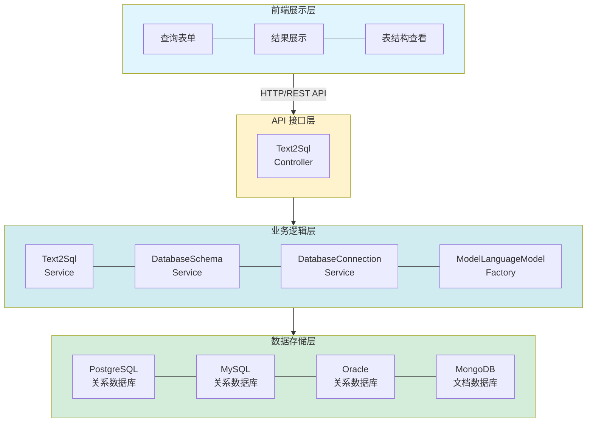
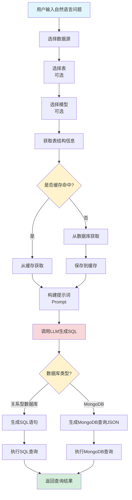
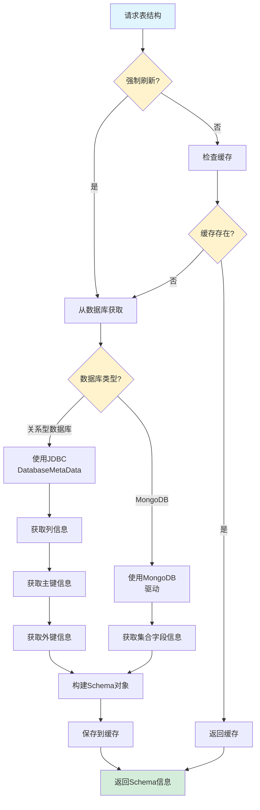
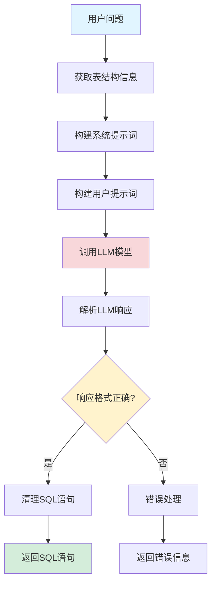

# Text2SQL 功能设计文档

## 1. 概述

### 1.1 功能简介

Text2SQL 功能是 DifyApp 系统的核心模块之一，提供了将自然语言转换为 SQL 查询语句的能力。该功能基于大语言模型（LLM），支持多种关系型数据库和 MongoDB，实现了从自然语言问题到数据库查询结果的完整流程。用户无需掌握 SQL 语法，即可通过自然语言查询数据库，大大降低了数据库查询的门槛。

### 1.2 功能目标

- 提供自然语言到 SQL 的自动转换能力
- 支持多种数据库类型（PostgreSQL、MySQL、Oracle、MongoDB）
- 支持单表和多表关联查询
- 支持复杂查询（聚合、统计、分组等）
- 提供表结构信息查看和管理
- 实现表结构缓存机制，提高查询效率
- 支持自定义 LLM 模型选择

### 1.3 适用范围

- 企业内部数据分析平台
- 业务人员自助查询系统
- 数据库查询辅助工具
- 数据报表生成系统
- 多数据库统一查询平台

## 2. 功能架构

### 2.1 总体架构

Text2SQL 功能采用分层架构设计，包含以下层次：



### 2.2 核心模块

#### 2.2.1 Text2SQL 服务模块

负责自然语言到 SQL 的转换和查询执行。

**主要功能：**
- 解析用户自然语言问题
- 获取数据库表结构信息
- 构建 LLM 提示词（Prompt）
- 调用 LLM 生成 SQL/MongoDB 查询
- 执行生成的查询语句
- 返回查询结果

#### 2.2.2 数据库 Schema 服务模块

负责数据库表结构信息的获取和缓存。

**主要功能：**
- 获取数据库表列表
- 获取表结构信息（列、主键、外键等）
- 表结构信息缓存管理
- 支持强制刷新表结构
- 支持多数据库类型的 Schema 获取

#### 2.2.3 数据库连接服务模块

负责数据库连接的创建和管理。

**主要功能：**
- 数据库连接池管理
- 多数据库类型支持
- 连接参数配置
- 连接健康检查

#### 2.2.4 模型服务模块

负责 LLM 模型的创建和调用。

**主要功能：**
- LLM 模型工厂
- 模型配置管理
- 提示词构建
- 模型响应解析

## 3. 数据库设计

### 3.1 表结构缓存表 (TABLE_SCHEMA_CACHE)

**表结构：**

| 字段名 | 类型 | 说明 | 约束 |
|--------|------|------|------|
| id | BIGINT | 主键 | PRIMARY KEY, AUTO_INCREMENT |
| data_source_id | BIGINT | 数据源ID | NOT NULL, FOREIGN KEY |
| table_name | VARCHAR(255) | 表名 | NOT NULL |
| schema_info | TEXT | 表结构信息（JSON格式） | NOT NULL |
| created_time | TIMESTAMP | 创建时间 | DEFAULT CURRENT_TIMESTAMP |
| updated_time | TIMESTAMP | 更新时间 | DEFAULT CURRENT_TIMESTAMP ON UPDATE CURRENT_TIMESTAMP |

**索引设计：**
- PRIMARY KEY (id)
- UNIQUE KEY uk_data_source_table (data_source_id, table_name)
- INDEX idx_data_source_id (data_source_id)
- INDEX idx_table_name (table_name)
- FOREIGN KEY (data_source_id) REFERENCES DATA_SOURCE(id) ON DELETE CASCADE

## 4. API 接口设计

### 4.1 执行 Text2SQL 查询

**接口路径：** `POST /api/text2sql/query`

**请求参数：**

```json
{
  "dataSourceId": 1,
  "question": "查询所有用户的信息",
  "modelId": 1,
  "tableNames": ["users", "orders"]
}
```

**参数说明：**
- `dataSourceId`：数据源ID（必填）
- `question`：用户自然语言问题（必填）
- `modelId`：LLM 模型ID（可选，不指定则使用默认模型）
- `tableNames`：表名列表（可选，如果指定则只使用这些表的结构）

**响应格式：**

```json
{
  "sql": "SELECT * FROM users",
  "columns": ["id", "name", "email", "created_time"],
  "rows": [
    {
      "id": 1,
      "name": "张三",
      "email": "zhangsan@example.com",
      "created_time": "2024-01-01T00:00:00"
    }
  ],
  "rowCount": 1
}
```

### 4.2 获取表列表

**接口路径：** `GET /api/text2sql/{dataSourceId}/tables`

**响应格式：**

```json
["users", "orders", "products"]
```

### 4.3 获取表结构

**接口路径：** `GET /api/text2sql/{dataSourceId}/tables/{tableName}/schema`

**查询参数：**
- `forceRefresh`：是否强制刷新（可选，默认 false）

**响应格式：**

```json
{
  "tableName": "users",
  "databaseType": "postgresql",
  "columns": [
    {
      "name": "id",
      "type": "BIGINT",
      "size": 20,
      "nullable": false,
      "defaultValue": null,
      "comment": "用户ID"
    },
    {
      "name": "name",
      "type": "VARCHAR",
      "size": 255,
      "nullable": false,
      "defaultValue": null,
      "comment": "用户名"
    }
  ],
  "primaryKeys": [
    {
      "columnName": "id",
      "keySeq": 1,
      "pkName": "pk_users"
    }
  ],
  "foreignKeys": [
    {
      "columnName": "user_id",
      "pkTableName": "users",
      "pkColumnName": "id"
    }
  ]
}
```

## 5. 核心业务流程

### 5.1 Text2SQL 查询流程



**流程说明：**

1. **用户输入**：用户输入自然语言问题，选择数据源、表（可选）、模型（可选）
2. **获取表结构**：根据数据源和选择的表，获取表结构信息
3. **缓存检查**：检查表结构缓存，如果存在且未过期，直接使用缓存
4. **构建提示词**：将表结构信息和用户问题组合成 LLM 提示词
5. **生成查询**：调用 LLM 模型生成 SQL 或 MongoDB 查询
6. **执行查询**：在目标数据库中执行生成的查询语句
7. **返回结果**：返回查询结果（列名、行数据、行数）

### 5.2 表结构获取流程



**流程说明：**

1. **缓存检查**：如果不强制刷新，先检查缓存
2. **数据库查询**：从数据库获取最新的表结构信息
3. **信息提取**：
   - 关系型数据库：使用 JDBC DatabaseMetaData 获取列、主键、外键信息
   - MongoDB：使用 MongoDB 驱动获取集合字段信息
4. **缓存保存**：将获取的表结构信息保存到缓存
5. **返回结果**：返回表结构信息（JSON 格式）

### 5.3 SQL 生成流程



**流程说明：**

1. **提示词构建**：根据表结构信息和用户问题构建 LLM 提示词
2. **LLM 调用**：调用 LLM 模型生成 SQL 语句
3. **响应解析**：解析 LLM 返回的响应，提取 SQL 语句
4. **SQL 清理**：移除可能的代码块标记、注释等
5. **返回结果**：返回清理后的 SQL 语句

## 6. 技术实现

### 6.1 支持的数据库类型

**关系型数据库：**
- **PostgreSQL**：使用 PostgreSQL JDBC 驱动
- **MySQL**：使用 MySQL JDBC 驱动
- **Oracle**：使用 Oracle JDBC 驱动

**文档数据库：**
- **MongoDB**：使用 MongoDB Java 驱动

### 6.2 表结构获取

#### 6.2.1 关系型数据库

**技术选型：** JDBC DatabaseMetaData

**获取信息：**
- 列信息（列名、数据类型、长度、可空性、默认值、注释）
- 主键信息（主键列、主键名称）
- 外键信息（外键列、关联表、关联列）

**实现方式：**

```java
DatabaseMetaData metaData = connection.getMetaData();
ResultSet columns = metaData.getColumns(catalog, schema, tableName, null);
ResultSet primaryKeys = metaData.getPrimaryKeys(catalog, schema, tableName);
ResultSet foreignKeys = metaData.getImportedKeys(catalog, schema, tableName);
```

#### 6.2.2 MongoDB

**技术选型：** MongoDB Java Driver

**获取信息：**
- 集合字段信息（字段名、数据类型）
- 集合索引信息

**实现方式：**

```java
MongoDatabase database = mongoClient.getDatabase(dbName);
MongoCollection<Document> collection = database.getCollection(collectionName);
// 通过采样文档推断字段结构
```

### 6.3 SQL 生成

**技术选型：** LangChain4j + LLM API

**提示词结构：**

1. **系统提示词**：定义 LLM 的角色和任务要求
2. **用户提示词**：包含表结构信息和用户问题

**系统提示词示例：**

```
你是一个专业的SQL生成助手。根据用户的问题和数据库表结构，生成正确的SQL查询语句。
要求：
1. 只生成SELECT查询语句，不要生成INSERT、UPDATE、DELETE、DROP等修改数据的操作
2. 必须返回有效的SQL语句，不要包含其他解释性文字
3. 使用正确的表名和列名（区分大小写）
4. 支持多表关联查询（JOIN）
5. 支持聚合函数（COUNT、SUM、AVG、MAX、MIN）
6. 支持分组查询（GROUP BY）
7. 支持排序（ORDER BY）和限制（LIMIT）
```

**用户提示词示例：**

```
数据库类型：PostgreSQL

表结构信息：
表名：users
列信息：
- id (BIGINT, 主键)
- name (VARCHAR(255), 不可空)
- email (VARCHAR(255), 不可空)
- created_time (TIMESTAMP, 可空)

用户问题：
查询所有用户的信息

请根据以上信息生成SQL查询语句：
```

### 6.4 MongoDB 查询生成

**查询类型：**

1. **Find 查询**：简单查询和过滤
2. **Aggregate 查询**：聚合统计查询
3. **Metadata 查询**：元数据查询（集合列表、集合数量等）

**查询格式：**

```json
{
  "type": "find",
  "collection": "users",
  "filter": {"name": "张三"},
  "projection": {"name": 1, "email": 1},
  "sort": {"created_time": -1},
  "limit": 10
}
```

```json
{
  "type": "aggregate",
  "collection": "orders",
  "pipeline": [
    {"$match": {"status": "completed"}},
    {"$group": {"_id": "$user_id", "count": {"$sum": 1}}},
    {"$sort": {"count": -1}},
    {"$limit": 10}
  ]
}
```

### 6.5 查询执行

#### 6.5.1 关系型数据库

**实现方式：**

```java
try (Connection connection = connectionService.getConnection(dataSource);
     Statement statement = connection.createStatement();
     ResultSet rs = statement.executeQuery(sql)) {
    // 处理查询结果
}
```

#### 6.5.2 MongoDB

**实现方式：**

```java
MongoDatabase database = mongoClient.getDatabase(dbName);
MongoCollection<Document> collection = database.getCollection(collectionName);

// Find 查询
FindIterable<Document> results = collection.find(filter);

// Aggregate 查询
AggregateIterable<Document> results = collection.aggregate(pipeline);
```

### 6.6 表结构缓存

**缓存策略：**
- **缓存键**：`data_source_id + table_name`
- **缓存存储**：PostgreSQL 数据库表
- **缓存更新**：表结构变更时手动刷新
- **缓存失效**：支持强制刷新参数

**实现方式：**

```java
// 检查缓存
Optional<TableSchemaCache> cache = schemaCacheRepository
    .findByDataSourceIdAndTableName(dataSourceId, tableName);

if (cache.isPresent() && !forceRefresh) {
    return cache.get().getSchemaInfo();
}

// 从数据库获取并保存到缓存
Map<String, Object> schemaInfo = getSchemaFromDatabase(dataSource, tableName);
saveSchemaToCache(dataSourceId, tableName, schemaInfo);
```

## 7. 提示词设计

### 7.1 SQL 生成提示词

**系统提示词要点：**
- 明确 LLM 角色（SQL 生成助手）
- 规定只生成 SELECT 查询
- 说明 SQL 语法要求
- 强调使用正确的表名和列名
- 说明多表关联、聚合、分组等复杂查询的支持

**用户提示词结构：**
1. 数据库类型
2. 表结构信息（表名、列信息、主键、外键）
3. 表关联关系（如果有多个表）
4. 用户问题

### 7.2 MongoDB 查询生成提示词

**系统提示词要点：**
- 明确支持三种查询类型（find、aggregate、metadata）
- 说明每种查询类型的格式和用途
- 强调 JSON 格式要求
- 说明操作符的使用方法
- 特别说明聚合查询的格式

**用户提示词结构：**
1. 数据库类型（MongoDB）
2. 集合结构信息（字段名、数据类型）
3. 用户问题

## 8. 配置管理

### 8.1 数据源配置

**配置项：**
- 数据源名称
- 数据库类型（PostgreSQL、MySQL、Oracle、MongoDB）
- 连接地址（host、port）
- 数据库名称
- 用户名和密码
- 连接池配置

### 8.2 模型配置

**配置项：**
- 默认 LLM 模型
- 模型 API 地址
- API Key
- 模型参数（temperature、max_tokens 等）

### 8.3 缓存配置

**配置项：**
- 缓存启用/禁用
- 缓存过期时间（可选）
- 缓存大小限制（可选）

## 9. 错误处理

### 9.1 SQL 生成错误

**错误类型：**
- LLM API 调用失败
- LLM 返回格式不正确
- SQL 语法错误

**处理方式：**
- 记录错误日志
- 返回友好的错误提示
- 支持重试机制

### 9.2 查询执行错误

**错误类型：**
- 数据库连接失败
- SQL 执行错误
- 权限不足

**处理方式：**
- 捕获 SQLException
- 解析错误信息
- 返回用户友好的错误提示

### 9.3 表结构获取错误

**错误类型：**
- 数据库连接失败
- 表不存在
- 权限不足

**处理方式：**
- 记录错误日志
- 返回明确的错误信息
- 支持重试机制

## 10. 安全设计

### 10.1 SQL 注入防护

**安全措施：**
- 只允许生成 SELECT 查询
- 禁止生成 INSERT、UPDATE、DELETE、DROP 等修改操作
- 在系统提示词中明确禁止修改操作
- 对生成的 SQL 进行基本验证

### 10.2 权限控制

**安全措施：**
- 数据源访问权限验证
- 数据库用户权限限制
- 只读数据库用户（推荐）

### 10.3 数据安全

**安全措施：**
- 敏感信息加密存储（数据库密码等）
- 查询结果脱敏（可选）
- 查询日志记录（可选）

## 11. 性能优化

### 11.1 表结构缓存

**优化策略：**
- 缓存表结构信息，减少数据库查询
- 支持缓存刷新机制
- 缓存失效策略

### 11.2 连接池管理

**优化策略：**
- 使用数据库连接池
- 合理配置连接池参数
- 连接复用

### 11.3 LLM 调用优化

**优化策略：**
- 提示词长度优化
- 批量处理（未来扩展）
- 响应缓存（未来扩展）

## 12. 监控和日志

### 12.1 日志记录

**关键操作日志：**
- SQL 生成请求日志
- LLM API 调用日志
- 查询执行日志
- 错误日志

**日志级别：**
- INFO：正常操作日志
- WARN：警告日志
- ERROR：错误日志
- DEBUG：调试日志

### 12.2 性能监控

**监控指标：**
- SQL 生成耗时
- LLM API 调用耗时
- 查询执行耗时
- 缓存命中率

## 13. 扩展性设计

### 13.1 数据库类型扩展

**扩展方式：**
- 实现 `DatabaseDriverManager` 接口
- 添加新的数据库类型枚举
- 实现对应的连接和查询逻辑

### 13.2 LLM 模型扩展

**扩展方式：**
- 实现 `ChatLanguageModel` 接口
- 配置新的 LLM 提供商
- 支持自定义提示词模板

### 13.3 查询类型扩展

**扩展方式：**
- 支持更多 MongoDB 查询类型
- 支持存储过程调用（未来）
- 支持视图查询（未来）

## 14. 测试策略

### 14.1 单元测试

**测试范围：**
- SQL 生成逻辑
- 表结构获取逻辑
- 查询执行逻辑
- 缓存管理逻辑

### 14.2 集成测试

**测试范围：**
- API 接口测试
- 数据库连接测试
- LLM API 调用测试
- 端到端流程测试

### 14.3 性能测试

**测试内容：**
- SQL 生成性能
- 查询执行性能
- 并发性能
- 缓存效果测试

## 15. 使用示例

### 15.1 单表查询

**用户问题：** "查询所有用户的信息"

**生成的 SQL：**
```sql
SELECT * FROM users
```

### 15.2 条件查询

**用户问题：** "查询年龄大于 18 的用户"

**生成的 SQL：**
```sql
SELECT * FROM users WHERE age > 18
```

### 15.3 多表关联查询

**用户问题：** "查询订单及其用户信息"

**生成的 SQL：**
```sql
SELECT o.*, u.name, u.email 
FROM orders o 
JOIN users u ON o.user_id = u.id
```

### 15.4 聚合查询

**用户问题：** "统计每个用户的订单数量"

**生成的 SQL：**
```sql
SELECT u.id, u.name, COUNT(o.id) AS order_count
FROM users u
LEFT JOIN orders o ON u.id = o.user_id
GROUP BY u.id, u.name
```

### 15.5 MongoDB 查询

**用户问题：** "查询所有用户的信息"

**生成的 MongoDB 查询：**
```json
{
  "type": "find",
  "collection": "users",
  "filter": {},
  "projection": {},
  "limit": 100
}
```

## 16. 未来规划

### 16.1 功能增强

- 支持更多数据库类型（SQL Server、SQLite 等）
- 支持存储过程调用
- 支持视图查询
- 支持查询结果导出
- 支持查询历史记录
- 支持查询结果可视化

### 16.2 性能优化

- 实现查询结果缓存
- 优化 LLM 提示词长度
- 支持批量查询
- 实现查询计划优化建议

### 16.3 用户体验

- 支持查询建议和自动补全
- 提供查询结果预览
- 支持查询结果编辑和导出
- 优化错误提示信息