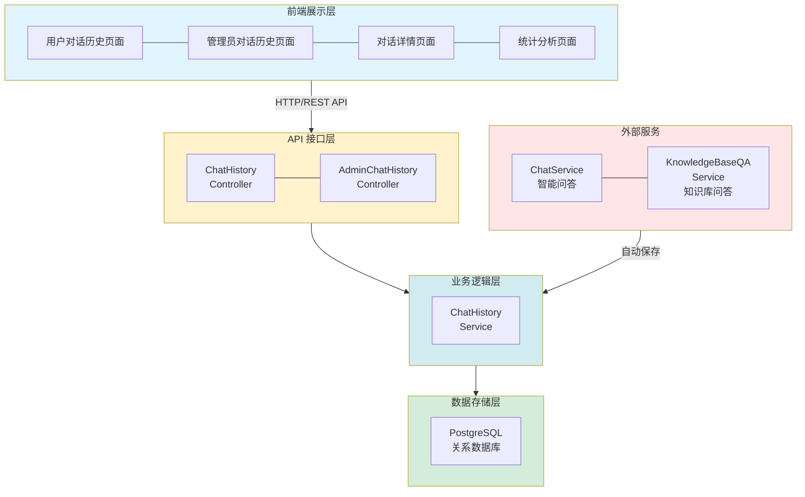
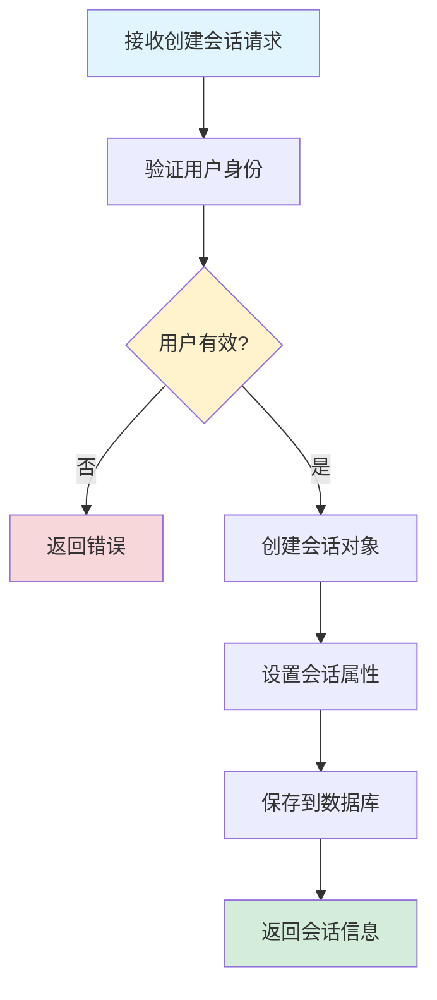
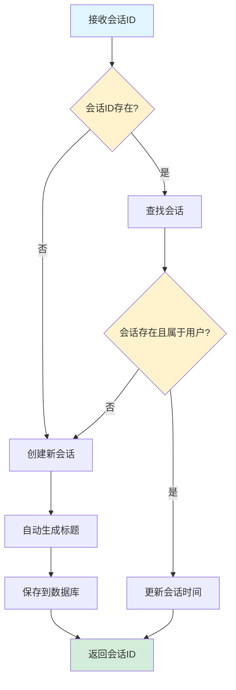
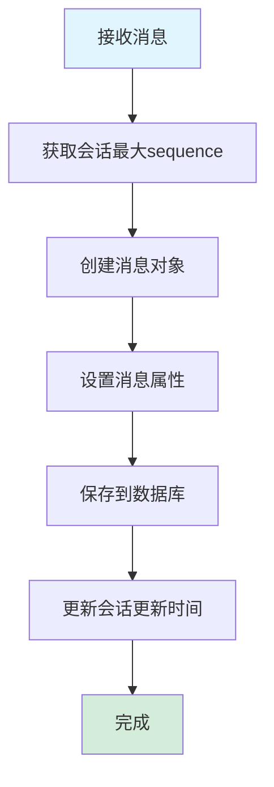
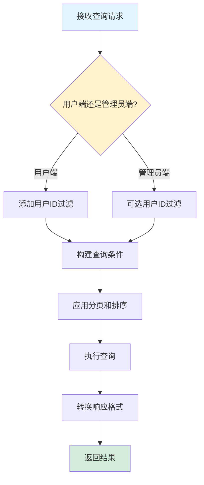
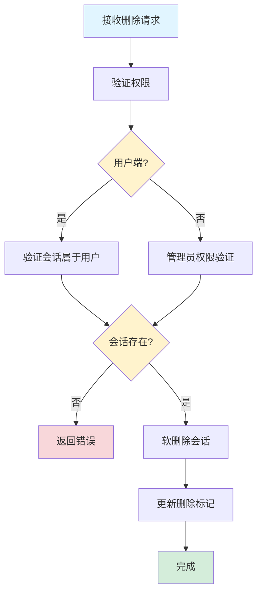

# 对话历史管理功能设计文档

## 文档同步状态（2026-03）

- 已按当前实现全量校准。
- 已对齐非流式/流式会话创建流程与 `ConversationIdUtil.parseConversationId(...)` 统一解析规范。

## 1. 概述

### 1.1 功能简介

对话历史管理功能是 DifyApp 系统的核心模块之一，负责管理用户与 AI 系统的所有对话记录。该功能采用会话（Conversation）和消息（Message）的两级结构，支持智能问答和知识库问答两种类型的对话历史管理。系统提供了用户端和管理员端两套接口，用户端可以管理自己的对话历史，管理员端可以查看所有用户的对话历史并进行统计分析。功能包括会话的创建、查询、更新、删除、导出，以及消息的保存和查询等完整能力。

### 1.2 功能目标

- 提供完整的对话历史管理能力
- 支持会话和消息的两级数据结构
- 支持智能问答和知识库问答两种类型
- 提供用户端和管理员端两套接口
- 支持会话标题的自动生成和手动更新
- 支持会话的软删除机制
- 支持会话导出功能
- 提供统计分析和数据报表功能
- 支持分页查询和条件筛选

### 1.3 适用范围

- 智能问答对话历史管理
- 知识库问答对话历史管理
- 用户对话记录查询和管理
- 管理员对话数据分析和统计
- 对话数据导出和备份

## 2. 功能架构

### 2.1 总体架构

对话历史管理功能采用分层架构设计，包含以下层次：



### 2.2 核心模块

#### 2.2.1 会话管理模块

负责会话的创建、查询、更新、删除等管理功能。

**主要功能：**
- 创建新会话
- 获取或创建会话（自动创建）
- 查询会话列表（用户端和管理员端）
- 获取会话详情
- 更新会话标题
- 删除会话（单个和批量）
- 导出会话

#### 2.2.2 消息管理模块

负责消息的保存和查询功能。

**主要功能：**
- 保存用户消息
- 保存助手消息
- 查询会话消息列表
- 消息顺序管理（sequence）

#### 2.2.3 统计分析模块

负责对话历史的统计分析和数据报表功能。

**主要功能：**
- 总对话数统计
- 总消息数统计
- 用户对话数排行
- 对话类型分布
- 热门问题统计
- 时间趋势分析

#### 2.2.4 权限控制模块

负责用户权限验证和数据隔离。

**主要功能：**
- 用户只能访问自己的对话历史
- 管理员可以访问所有用户的对话历史
- 权限验证和异常处理

## 3. 数据库设计

### 3.1 会话表 (CHAT_CONVERSATION)

**表结构：**

| 字段名 | 类型 | 说明 | 约束 |
|--------|------|------|------|
| id | BIGINT | 主键 | PRIMARY KEY, AUTO_INCREMENT |
| user_id | BIGINT | 用户ID（外键关联SYS_USER） | NOT NULL |
| app_id | BIGINT | 应用ID（可选，关联AI应用） | |
| knowledge_base_id | BIGINT | 知识库ID（可选，关联知识库） | |
| type | INTEGER | 会话类型（1-普通聊天，2-知识库问答） | DEFAULT 1 |
| title | VARCHAR(500) | 会话标题 | |
| create_time | TIMESTAMP | 创建时间 | DEFAULT CURRENT_TIMESTAMP |
| update_time | TIMESTAMP | 更新时间 | DEFAULT CURRENT_TIMESTAMP |
| deleted | INTEGER | 是否删除（0-未删除，1-已删除） | DEFAULT 0 |

**索引设计：**
- PRIMARY KEY (id)
- INDEX idx_user_id (user_id)
- INDEX idx_app_id (app_id)
- INDEX idx_knowledge_base_id (knowledge_base_id)
- INDEX idx_type (type)
- INDEX idx_deleted (deleted)
- INDEX idx_create_time (create_time)
- INDEX idx_update_time (update_time)

**说明：**
- `type=1`：普通聊天（智能问答）
- `type=2`：知识库问答
- 使用软删除机制，`deleted=1` 表示已删除
- 标题可以自动生成（基于第一条问题）或手动设置

### 3.2 消息表 (CHAT_MESSAGE)

**表结构：**

| 字段名 | 类型 | 说明 | 约束 |
|--------|------|------|------|
| id | BIGINT | 主键 | PRIMARY KEY, AUTO_INCREMENT |
| conversation_id | BIGINT | 会话ID（外键关联CHAT_CONVERSATION） | NOT NULL |
| role | VARCHAR(20) | 角色（user/assistant） | NOT NULL |
| content | TEXT | 消息内容 | NOT NULL |
| sequence | INTEGER | 消息顺序 | NOT NULL |
| create_time | TIMESTAMP | 创建时间 | DEFAULT CURRENT_TIMESTAMP |

**索引设计：**
- PRIMARY KEY (id)
- INDEX idx_conversation_id (conversation_id)
- INDEX idx_role (role)
- INDEX idx_sequence (sequence)
- INDEX idx_create_time (create_time)

**说明：**
- `role=user`：用户消息
- `role=assistant`：助手消息
- `sequence`：消息在会话中的顺序，一问一答为一轮对话
- 消息按 `sequence` 升序排列

## 4. API 接口设计

### 4.1 用户端接口

#### 4.1.1 创建新会话

**接口路径：** `POST /api/chat/history/conversations`

**请求头：**
- `Authorization: Bearer {token}`（必填）

**请求参数：**

```json
{
  "title": "新会话",
  "type": 1,
  "appId": 1,
  "knowledgeBaseId": null
}
```

**参数说明：**
- `title`：会话标题（可选，默认"新会话"）
- `type`：会话类型（1-普通聊天，2-知识库问答，可选，默认1）
- `appId`：应用ID（可选）
- `knowledgeBaseId`：知识库ID（可选）

**响应格式：**

```json
{
  "id": 123,
  "userId": 1,
  "username": "testuser",
  "type": 1,
  "title": "新会话",
  "messageCount": 0,
  "createTime": "2024-01-01T00:00:00",
  "updateTime": "2024-01-01T00:00:00"
}
```

#### 4.1.2 获取我的会话列表

**接口路径：** `GET /api/chat/history/conversations`

**请求头：**
- `Authorization: Bearer {token}`（必填）

**查询参数：**
- `page`：页码（可选，默认1）
- `size`：每页大小（可选，默认20）
- `keyword`：搜索关键词（可选，搜索标题）
- `type`：会话类型（可选，1-普通聊天，2-知识库问答）

**响应格式：**

```json
{
  "content": [
    {
      "id": 123,
      "userId": 1,
      "username": "testuser",
      "type": 1,
      "title": "Spring Boot相关问题",
      "messageCount": 5,
      "createTime": "2024-01-01T00:00:00",
      "updateTime": "2024-01-01T01:00:00"
    }
  ],
  "total": 100,
  "page": 1,
  "pageSize": 20
}
```

#### 4.1.3 获取会话详情

**接口路径：** `GET /api/chat/history/conversations/{id}`

**请求头：**
- `Authorization: Bearer {token}`（必填）

**响应格式：**

```json
{
  "id": 123,
  "userId": 1,
  "username": "testuser",
  "appId": 1,
  "appName": "智能客服助手",
  "knowledgeBaseId": null,
  "knowledgeBaseName": null,
  "type": 1,
  "title": "Spring Boot相关问题",
  "messageCount": 5,
  "createTime": "2024-01-01T00:00:00",
  "updateTime": "2024-01-01T01:00:00"
}
```

#### 4.1.4 获取会话消息列表

**接口路径：** `GET /api/chat/history/conversations/{id}/messages`

**请求头：**
- `Authorization: Bearer {token}`（必填）

**响应格式：**

```json
[
  {
    "id": 1,
    "conversationId": 123,
    "role": "user",
    "content": "什么是Spring Boot？",
    "sequence": 1,
    "createTime": "2024-01-01T00:00:00"
  },
  {
    "id": 2,
    "conversationId": 123,
    "role": "assistant",
    "content": "Spring Boot是一个基于Spring框架的快速开发框架...",
    "sequence": 2,
    "createTime": "2024-01-01T00:01:00"
  }
]
```

#### 4.1.5 更新会话标题

**接口路径：** `PUT /api/chat/history/conversations/{id}/title`

**请求头：**
- `Authorization: Bearer {token}`（必填）

**请求参数：**

```json
{
  "title": "新的会话标题"
}
```

**响应格式：** 204 No Content

#### 4.1.6 删除会话

**接口路径：** `DELETE /api/chat/history/conversations/{id}`

**请求头：**
- `Authorization: Bearer {token}`（必填）

**响应格式：** 204 No Content

#### 4.1.7 导出会话

**接口路径：** `GET /api/chat/history/conversations/{id}/export`

**请求头：**
- `Authorization: Bearer {token}`（必填）

**响应格式：**

```json
{
  "conversation": {
    "id": 123,
    "title": "Spring Boot相关问题",
    ...
  },
  "messages": [
    {
      "role": "user",
      "content": "什么是Spring Boot？",
      ...
    },
    {
      "role": "assistant",
      "content": "Spring Boot是一个基于Spring框架的快速开发框架...",
      ...
    }
  ],
  "exportTime": "2024-01-01T02:00:00"
}
```

### 4.2 管理员端接口

#### 4.2.1 获取所有会话列表

**接口路径：** `GET /api/admin/chat/history/conversations`

**请求头：**
- `Authorization: Bearer {token}`（必填，需要管理员权限）

**查询参数：**
- `page`：页码（可选，默认1）
- `size`：每页大小（可选，默认20）
- `keyword`：搜索关键词（可选，搜索标题）
- `type`：会话类型（可选，1-普通聊天，2-知识库问答）
- `userId`：用户ID（可选，筛选特定用户的会话）
- `startTime`：开始时间（可选，ISO 8601格式）
- `endTime`：结束时间（可选，ISO 8601格式）

**响应格式：** 同用户端接口

#### 4.2.2 获取统计信息

**接口路径：** `GET /api/admin/chat/history/statistics`

**请求头：**
- `Authorization: Bearer {token}`（必填，需要管理员权限）

**响应格式：**

```json
{
  "totalConversations": 1000,
  "totalMessages": 5000,
  "userConversationRanks": [
    {
      "userId": 1,
      "username": "testuser",
      "conversationCount": 100
    }
  ],
  "typeDistribution": {
    "普通聊天": 600,
    "知识库问答": 400
  },
  "popularQuestions": [
    {
      "question": "什么是Spring Boot？",
      "count": 50
    }
  ],
  "dailyStatistics": [
    {
      "date": "2024-01-01",
      "conversationCount": 10,
      "messageCount": 50
    }
  ]
}
```

#### 4.2.3 删除会话（管理员）

**接口路径：** `DELETE /api/admin/chat/history/conversations/{id}`

**请求头：**
- `Authorization: Bearer {token}`（必填，需要管理员权限）

**响应格式：** 204 No Content

#### 4.2.4 批量删除会话

**接口路径：** `DELETE /api/admin/chat/history/conversations/batch`

**请求头：**
- `Authorization: Bearer {token}`（必填，需要管理员权限）

**请求参数：**

```json
{
  "ids": [123, 124, 125]
}
```

**响应格式：** 204 No Content

## 5. 核心业务流程

### 5.1 创建会话流程



**流程说明：**

1. **接收请求**：接收创建会话的请求
2. **验证身份**：验证用户身份和权限
3. **创建对象**：创建会话对象，设置用户ID、类型、标题等属性
4. **保存数据**：将会话保存到数据库
5. **返回结果**：返回创建的会话信息

### 5.2 获取或创建会话流程



**流程说明：**

1. **接收ID**：接收会话ID（可能为空）
2. **查找会话**：如果ID不为空，查找会话
3. **验证会话**：验证会话是否存在且属于当前用户
4. **创建或更新**：如果会话不存在，创建新会话；如果存在，更新会话时间
5. **自动生成标题**：新会话基于第一条问题自动生成标题（最多50字符）
6. **返回ID**：返回会话ID

### 5.3 保存消息流程



**流程说明：**

1. **接收消息**：接收会话ID、角色、内容
2. **获取顺序**：获取会话中当前最大的sequence值
3. **创建消息**：创建消息对象，设置sequence为最大值+1
4. **保存数据**：将消息保存到数据库
5. **更新会话**：更新会话的更新时间

### 5.4 查询会话列表流程



**流程说明：**

1. **接收请求**：接收查询请求和筛选条件
2. **权限判断**：判断是用户端还是管理员端
3. **构建条件**：根据权限和筛选条件构建查询条件
4. **执行查询**：执行分页查询
5. **转换格式**：将实体对象转换为响应对象
6. **返回结果**：返回分页结果

### 5.5 删除会话流程



**流程说明：**

1. **接收请求**：接收删除会话的请求
2. **验证权限**：验证用户权限（用户端验证会话归属，管理员端验证管理员权限）
3. **查找会话**：查找会话是否存在
4. **软删除**：设置 `deleted=1`，不物理删除数据
5. **更新时间**：更新会话的更新时间
6. **完成删除**：删除完成（消息不会被删除，但会话不可见）

## 6. 技术实现

### 6.1 会话自动创建

**实现方式：**

```java
public Long getOrCreateConversation(Long userId, Long conversationId, 
        Integer type, Long appId, Long knowledgeBaseId, String firstQuestion) {
    if (conversationId != null) {
        Optional<ChatConversation> existing = conversationRepository.findById(conversationId);
        if (existing.isPresent() && existing.get().getUserId().equals(userId)) {
            // 更新会话时间
            ChatConversation conv = existing.get();
            conv.setUpdateTime(new Date());
            conversationRepository.save(conv);
            return conversationId;
        }
    }
    
    // 创建新会话
    ChatConversation conversation = new ChatConversation();
    conversation.setUserId(userId);
    conversation.setType(type != null ? type : 1);
    
    // 自动生成标题
    String title = "新会话";
    if (firstQuestion != null && !firstQuestion.trim().isEmpty()) {
        title = firstQuestion.length() > 50 ? 
            firstQuestion.substring(0, 50) + "..." : firstQuestion;
    }
    conversation.setTitle(title);
    
    conversation = conversationRepository.save(conversation);
    return conversation.getId();
}
```

**特点：**
- 如果会话ID存在且有效，直接返回
- 如果会话ID不存在或无效，创建新会话
- 自动基于第一条问题生成标题（最多50字符）

### 6.2 消息顺序管理

**实现方式：**

```java
public void saveMessage(Long conversationId, String role, String content) {
    ChatMessage message = new ChatMessage();
    message.setConversationId(conversationId);
    message.setRole(role);
    message.setContent(content);
    
    // 获取当前对话的最大sequence
    Integer maxSequence = messageRepository.getMaxSequenceByConversationId(conversationId);
    message.setSequence(maxSequence + 1);
    
    messageRepository.save(message);
    
    // 更新会话的更新时间
    Optional<ChatConversation> conversation = conversationRepository.findById(conversationId);
    if (conversation.isPresent()) {
        ChatConversation conv = conversation.get();
        conv.setUpdateTime(new Date());
        conversationRepository.save(conv);
    }
}
```

**特点：**
- 使用 `sequence` 字段管理消息顺序
- 自动递增sequence值
- 保存消息时自动更新会话时间

### 6.3 动态查询构建

**实现方式：**

```java
Specification<ChatConversation> spec = (root, query, cb) -> {
    List<Predicate> predicates = new ArrayList<>();
    
    // 用户端：必须条件
    if (isUserEnd) {
        predicates.add(cb.equal(root.get("userId"), userId));
    }
    
    // 管理员端：可选条件
    if (isAdmin && request.getUserId() != null) {
        predicates.add(cb.equal(root.get("userId"), request.getUserId()));
    }
    
    // 未删除条件
    Predicate notDeleted = cb.or(
        cb.isNull(root.get("deleted")),
        cb.equal(root.get("deleted"), 0)
    );
    predicates.add(notDeleted);
    
    // 类型筛选
    if (request.getType() != null) {
        predicates.add(cb.equal(root.get("type"), request.getType()));
    }
    
    // 关键词搜索
    if (request.getKeyword() != null && !request.getKeyword().trim().isEmpty()) {
        predicates.add(cb.like(
            cb.lower(root.get("title")),
            "%" + request.getKeyword().toLowerCase() + "%"
        ));
    }
    
    return cb.and(predicates.toArray(new Predicate[0]));
};
```

**特点：**
- 使用 JPA Specification 动态构建查询
- 支持多条件组合
- 用户端自动添加用户ID过滤
- 管理员端支持可选筛选

### 6.4 软删除机制

**实现方式：**

```java
@Transactional
public void deleteConversation(Long conversationId, Long userId, boolean isAdmin) {
    Optional<ChatConversation> conversation;
    if (isAdmin) {
        conversation = conversationRepository.findById(conversationId);
    } else {
        conversation = conversationRepository.findByIdAndUserId(conversationId, userId);
    }
    
    if (!conversation.isPresent()) {
        throw new RuntimeException("会话不存在或已删除");
    }
    
    ChatConversation conv = conversation.get();
    conv.setDeleted(1);  // 软删除
    conv.setUpdateTime(new Date());
    conversationRepository.save(conv);
}
```

**特点：**
- 使用 `deleted` 字段标记删除状态
- 不物理删除数据，便于数据恢复
- 查询时自动过滤已删除的会话

### 6.5 统计分析

**统计指标：**

1. **总对话数**：所有未删除的会话数量
2. **总消息数**：所有消息的数量
3. **用户对话数排行**：按用户统计对话数，取前10名
4. **对话类型分布**：按类型统计对话数
5. **热门问题统计**：统计用户消息中出现频率最高的问题，取前10个
6. **时间趋势分析**：统计最近30天每天的对话数和消息数

**实现方式：**

```java
public ChatHistoryStatisticsResponse getStatistics() {
    ChatHistoryStatisticsResponse response = new ChatHistoryStatisticsResponse();
    
    // 总对话数
    Long totalConversations = conversationRepository.countAll();
    response.setTotalConversations(totalConversations);
    
    // 总消息数
    Long totalMessages = messageRepository.count();
    response.setTotalMessages(totalMessages);
    
    // 用户对话数排行
    List<UserConversationRank> ranks = new ArrayList<>();
    List<User> users = userRepository.findAll();
    for (User user : users) {
        Long count = conversationRepository.countByUserId(user.getId());
        if (count > 0) {
            ranks.add(new UserConversationRank(user.getId(), user.getUsername(), count));
        }
    }
    ranks.sort((a, b) -> Long.compare(b.getConversationCount(), a.getConversationCount()));
    response.setUserConversationRanks(ranks.stream().limit(10).collect(Collectors.toList()));
    
    // 对话类型分布
    Map<String, Long> typeDistribution = new HashMap<>();
    // ... 统计逻辑
    
    // 热门问题统计
    List<PopularQuestion> popularQuestions = new ArrayList<>();
    // ... 统计逻辑
    
    // 时间趋势分析
    List<DailyStatistics> dailyStats = new ArrayList<>();
    // ... 统计最近30天的数据
    
    return response;
}
```

## 7. 权限控制

### 7.1 用户端权限

**权限规则：**
- 用户只能查看、修改、删除自己的会话
- 用户不能查看其他用户的会话
- 用户不能访问管理员接口

**实现方式：**
- 查询时自动添加 `userId` 过滤条件
- 更新和删除时验证会话归属
- 使用 JWT Token 获取用户ID

### 7.2 管理员端权限

**权限规则：**
- 管理员可以查看所有用户的会话
- 管理员可以删除任何会话
- 管理员可以查看统计信息
- 需要验证管理员角色（`role=1`）

**实现方式：**
- 验证用户角色是否为管理员
- 查询时不限制用户ID（可选筛选）
- 删除时不需要验证会话归属

## 8. 性能优化

### 8.1 分页查询

**优化策略：**
- 使用数据库分页（LIMIT/OFFSET）
- 按更新时间倒序排列
- 限制每页大小（默认20条）

### 8.2 索引优化

**索引设计：**
- 用户ID索引：`idx_user_id`
- 会话类型索引：`idx_type`
- 创建时间索引：`idx_create_time`
- 更新时间索引：`idx_update_time`
- 删除标记索引：`idx_deleted`

### 8.3 查询优化

**优化策略：**
- 使用 JPA Specification 动态构建查询
- 避免 N+1 查询问题
- 使用懒加载和关联查询优化

## 9. 错误处理

### 9.1 权限错误

**错误类型：**
- 用户尝试访问其他用户的会话
- 非管理员尝试访问管理员接口
- Token 无效或过期

**处理方式：**
- 返回 403 Forbidden
- 记录错误日志
- 返回明确的错误信息

### 9.2 数据错误

**错误类型：**
- 会话不存在
- 会话已删除
- 参数验证失败

**处理方式：**
- 返回 404 Not Found 或 400 Bad Request
- 记录错误日志
- 返回明确的错误信息

## 10. 监控和日志

### 10.1 日志记录

**关键操作日志：**
- 创建会话日志
- 保存消息日志
- 删除会话日志
- 查询操作日志
- 错误日志

**日志级别：**
- INFO：正常操作日志
- WARN：警告日志
- ERROR：错误日志

### 10.2 性能监控

**监控指标：**
- 会话创建数量
- 消息保存数量
- 查询响应时间
- 删除操作数量
- 统计查询性能

## 11. 使用示例

### 11.1 创建会话

**请求示例：**
```json
POST /api/chat/history/conversations
{
  "title": "Spring Boot学习",
  "type": 1
}
```

**响应示例：**
```json
{
  "id": 123,
  "title": "Spring Boot学习",
  "type": 1,
  "messageCount": 0,
  "createTime": "2024-01-01T00:00:00"
}
```

### 11.2 查询会话列表

**请求示例：**
```
GET /api/chat/history/conversations?page=1&size=20&keyword=Spring
```

**响应示例：**
```json
{
  "content": [
    {
      "id": 123,
      "title": "Spring Boot学习",
      "messageCount": 5,
      "updateTime": "2024-01-01T01:00:00"
    }
  ],
  "total": 10,
  "page": 1,
  "pageSize": 20
}
```

### 11.3 获取消息列表

**请求示例：**
```
GET /api/chat/history/conversations/123/messages
```

**响应示例：**
```json
[
  {
    "role": "user",
    "content": "什么是Spring Boot？",
    "sequence": 1
  },
  {
    "role": "assistant",
    "content": "Spring Boot是一个基于Spring框架的快速开发框架...",
    "sequence": 2
  }
]
```

### 11.4 导出会话

**请求示例：**
```
GET /api/chat/history/conversations/123/export
```

**响应示例：**
```json
{
  "conversation": {
    "id": 123,
    "title": "Spring Boot学习",
    ...
  },
  "messages": [
    {
      "role": "user",
      "content": "什么是Spring Boot？",
      ...
    },
    {
      "role": "assistant",
      "content": "Spring Boot是一个基于Spring框架的快速开发框架...",
      ...
    }
  ],
  "exportTime": "2024-01-01T02:00:00"
}
```

## 12. 常见问题

### Q1: 会话标题如何生成？

**A**: 
- 创建会话时，如果未指定标题，默认使用"新会话"
- 自动创建会话时，基于第一条问题自动生成标题（最多50字符）
- 用户可以手动更新会话标题

### Q2: 删除会话会删除消息吗？

**A**: 不会。删除会话只是软删除（设置 `deleted=1`），消息不会被删除。但删除的会话在查询时会被过滤掉，消息也不可见。

### Q3: 如何区分普通聊天和知识库问答？

**A**: 通过会话的 `type` 字段区分：
- `type=1`：普通聊天（智能问答）
- `type=2`：知识库问答

### Q4: 消息的顺序如何保证？

**A**: 使用 `sequence` 字段管理消息顺序。每次保存消息时，自动获取会话中最大的sequence值，新消息的sequence为最大值+1。

### Q5: 用户可以查看其他用户的会话吗？

**A**: 不可以。用户端接口会自动添加用户ID过滤，用户只能查看自己的会话。只有管理员可以查看所有用户的会话。

### Q6: 如何统计对话轮数？

**A**: 对话轮数 = 用户消息数量（`role=user`）。一问一答为一轮对话。

### Q7: 会话导出包含哪些内容？

**A**: 会话导出包含：
- 会话基本信息（ID、标题、类型、创建时间等）
- 会话中的所有消息（按顺序）
- 导出时间

### Q8: 管理员如何查看统计信息？

**A**: 管理员可以通过 `/api/admin/chat/history/statistics` 接口查看统计信息，包括总对话数、总消息数、用户排行、类型分布、热门问题、时间趋势等。

## 13. 未来规划

### 13.1 功能增强

- 支持会话标签和分类
- 支持会话搜索（全文搜索）
- 支持会话分享功能
- 支持会话归档功能
- 支持消息编辑和删除
- 支持会话合并功能
- 支持数据导出（Excel、CSV格式）

### 13.2 性能优化

- 实现会话缓存机制
- 优化统计查询性能
- 支持异步导出
- 实现消息分页加载

### 13.3 数据分析

- 支持更丰富的统计分析
- 支持数据可视化
- 支持自定义报表
- 支持数据挖掘和洞察