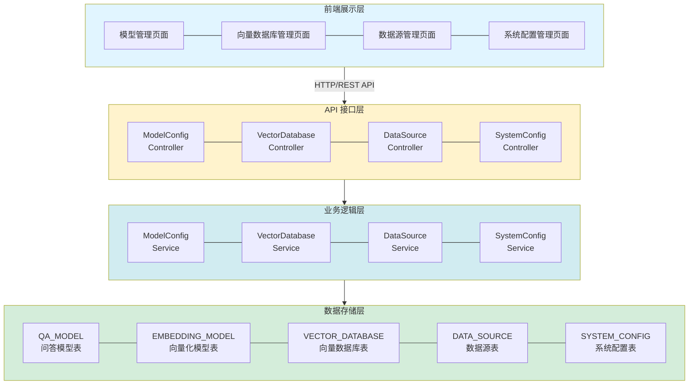
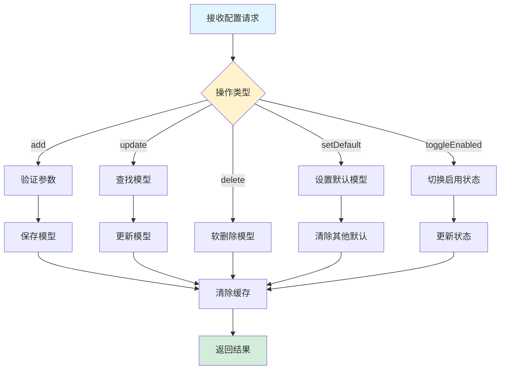
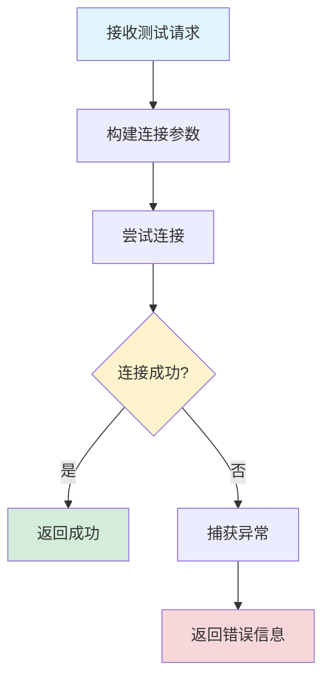
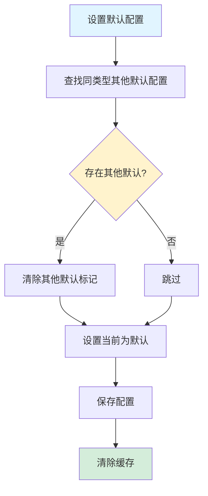

# 系统配置管理功能设计文档

## 1. 概述

### 1.1 功能简介

系统配置管理功能是 DifyApp 系统的核心基础设施模块，负责管理系统的各类配置信息。该功能包含四个主要子模块：**模型管理模块**（管理 LLM 问答模型和向量化模型，支持视觉模型配置）、**向量数据库管理模块**（管理 Qdrant、Milvus、FAISS、Chroma、Weaviate、PgVector、Elasticsearch 等向量数据库配置）、**数据源管理模块**（管理 MySQL、PostgreSQL、Oracle、MongoDB、Elasticsearch 等连接配置）和**系统配置管理模块**（管理通用的键值对配置）。这些配置模块为系统的各个业务功能提供基础支撑，支持配置的创建、查询、更新、删除、测试连接等完整的管理能力。

### 1.2 功能目标

- 提供统一的配置管理平台
- 支持多种模型提供商（OpenAI、vLLM、Ollama 等）
- 支持多种向量数据库（Qdrant、Milvus、FAISS、Chroma、Weaviate、PgVector、Elasticsearch）
- 支持多种关系型与搜索型数据库（MySQL、PostgreSQL、Oracle、MongoDB、Elasticsearch）
- 提供配置的增删改查功能
- 支持配置的连接测试
- 支持默认配置管理
- 提供配置的启用/禁用功能
- 支持配置分组和分类管理

### 1.3 适用范围

- 系统管理员配置管理
- 模型服务配置
- 向量数据库配置
- 数据源连接配置
- 系统参数配置
- 帮助信息配置

## 2. 功能架构

### 2.1 总体架构

系统配置管理功能采用分层架构设计，包含以下层次：



### 2.2 核心模块

#### 2.2.1 模型管理模块

负责管理 LLM 问答模型和向量化模型的配置。

**主要功能：**
- 问答模型管理（添加、更新、删除、启用/禁用、设置默认）
- 向量化模型管理（添加、更新、删除、启用/禁用、设置默认）
- 视觉模型配置（支持多模态和视觉输入配置）
- 模型连接测试
- 获取可用模型列表
- 自动检测模型视觉能力（根据模型名称自动识别）

#### 2.2.2 向量数据库管理模块

负责管理向量数据库的连接配置。

**主要功能：**
- 向量数据库配置管理（Qdrant、Milvus、FAISS、Chroma、Weaviate、PgVector、Elasticsearch）
- 配置的增删改查
- 连接测试
- 默认配置管理

#### 2.2.3 数据源管理模块

负责管理数据库的连接配置（关系型与搜索型）。

**主要功能：**
- 数据源配置管理（MySQL、PostgreSQL、Oracle、MongoDB、Elasticsearch）
- 配置的增删改查
- 连接测试
- 表结构刷新
- 用户可见性管理

#### 2.2.4 系统配置管理模块

负责管理通用的键值对配置。

**主要功能：**
- 配置的增删改查
- 配置分组管理
- 配置类型管理（string、number、boolean、json）
- 配置的软删除
- 统一超时策略（全局默认 30 秒）

## 3. 数据库设计

### 3.1 问答模型表 (QA_MODEL)

**表结构：**

| 字段名 | 类型 | 说明 | 约束 |
|--------|------|------|------|
| id | BIGINT | 主键 | PRIMARY KEY, AUTO_INCREMENT |
| name | VARCHAR(100) | 模型名称 | NOT NULL |
| provider | VARCHAR(20) | 提供商类型（openai, vllm, ollama） | NOT NULL |
| provider_type | VARCHAR(20) | 提供商类型（原始值，用于前端显示） | |
| api_url | VARCHAR(500) | API 地址 | NOT NULL |
| api_key | VARCHAR(500) | API Key | |
| model | VARCHAR(200) | 模型标识 | NOT NULL |
| use_for | VARCHAR(20) | 使用场景（chat-仅智能问答, rag-仅知识库问答, both-两者都使用） | NOT NULL |
| supports_multimodal | BOOLEAN | 是否支持多模态 | DEFAULT false |
| supports_vision | BOOLEAN | 是否支持视觉输入 | DEFAULT false |
| enabled | BOOLEAN | 是否启用 | DEFAULT true |
| is_default | BOOLEAN | 是否默认 | DEFAULT false |
| create_time | TIMESTAMP | 创建时间 | DEFAULT CURRENT_TIMESTAMP |
| update_time | TIMESTAMP | 更新时间 | DEFAULT CURRENT_TIMESTAMP |
| deleted | INTEGER | 是否删除（0-未删除，1-已删除） | DEFAULT 0 |

**索引设计：**
- PRIMARY KEY (id)
- INDEX idx_provider (provider)
- INDEX idx_use_for (use_for)
- INDEX idx_enabled (enabled)
- INDEX idx_is_default (is_default)
- INDEX idx_deleted (deleted)

### 3.2 向量化模型表 (EMBEDDING_MODEL)

**表结构：**

| 字段名 | 类型 | 说明 | 约束 |
|--------|------|------|------|
| id | BIGINT | 主键 | PRIMARY KEY, AUTO_INCREMENT |
| name | VARCHAR(100) | 模型名称 | NOT NULL |
| provider | VARCHAR(20) | 提供商类型（openai, vllm, ollama） | NOT NULL |
| provider_type | VARCHAR(20) | 提供商类型（原始值，用于前端显示） | |
| api_url | VARCHAR(500) | API 地址 | NOT NULL |
| api_key | VARCHAR(500) | API Key | |
| model | VARCHAR(200) | 模型标识 | NOT NULL |
| timeout | INTEGER | 超时时间（毫秒） | DEFAULT 300000 |
| batch_size | INTEGER | 批处理大小 | DEFAULT 100 |
| enabled | BOOLEAN | 是否启用 | DEFAULT true |
| is_default | BOOLEAN | 是否默认 | DEFAULT false |
| create_time | TIMESTAMP | 创建时间 | DEFAULT CURRENT_TIMESTAMP |
| update_time | TIMESTAMP | 更新时间 | DEFAULT CURRENT_TIMESTAMP |
| deleted | INTEGER | 是否删除（0-未删除，1-已删除） | DEFAULT 0 |

**索引设计：**
- PRIMARY KEY (id)
- INDEX idx_provider (provider)
- INDEX idx_enabled (enabled)
- INDEX idx_is_default (is_default)
- INDEX idx_deleted (deleted)

### 3.3 向量数据库配置表 (VECTOR_DATABASE)

**表结构：**

| 字段名 | 类型 | 说明 | 约束 |
|--------|------|------|------|
| id | BIGINT | 主键 | PRIMARY KEY, AUTO_INCREMENT |
| name | VARCHAR(100) | 配置名称 | NOT NULL |
| type | VARCHAR(20) | 数据库类型（qdrant, milvus, faiss, chroma, weaviate, elasticsearch） | NOT NULL |
| url | VARCHAR(500) | 连接地址（URL或路径） | NOT NULL |
| api_key | VARCHAR(500) | API Key（可选） | |
| timeout | INTEGER | 超时时间（毫秒） | DEFAULT 30000 |
| extra_config | TEXT | 额外配置（JSON格式） | |
| enabled | BOOLEAN | 是否启用 | DEFAULT true |
| is_default | BOOLEAN | 是否默认 | DEFAULT false |
| description | VARCHAR(500) | 描述 | |
| create_time | TIMESTAMP | 创建时间 | DEFAULT CURRENT_TIMESTAMP |
| update_time | TIMESTAMP | 更新时间 | DEFAULT CURRENT_TIMESTAMP |
| deleted | INTEGER | 是否删除（0-未删除，1-已删除） | DEFAULT 0 |

**索引设计：**
- PRIMARY KEY (id)
- INDEX idx_type (type)
- INDEX idx_enabled (enabled)
- INDEX idx_deleted (deleted)
- INDEX idx_type_default (type, is_default)

### 3.4 数据源表 (DATA_SOURCE)

**表结构：**

| 字段名 | 类型 | 说明 | 约束 |
|--------|------|------|------|
| id | BIGINT | 主键 | PRIMARY KEY, AUTO_INCREMENT |
| name | VARCHAR(100) | 数据源名称 | NOT NULL |
| type | VARCHAR(20) | 数据库类型（mysql, postgresql, oracle, mongodb, elasticsearch） | NOT NULL |
| host | VARCHAR(255) | 主机地址 | NOT NULL |
| port | INTEGER | 端口 | NOT NULL |
| database | VARCHAR(100) | 数据库名 | NOT NULL |
| username | VARCHAR(100) | 用户名 | NOT NULL |
| password | VARCHAR(500) | 密码（加密存储） | NOT NULL |
| status | INTEGER | 状态（1-启用，0-禁用） | DEFAULT 1 |
| tenant_id | INTEGER | 租户ID | DEFAULT 1 |
| create_time | TIMESTAMP | 创建时间 | DEFAULT CURRENT_TIMESTAMP |
| update_time | TIMESTAMP | 更新时间 | DEFAULT CURRENT_TIMESTAMP |
| creator | VARCHAR(64) | 创建者 | |
| creator_id | BIGINT | 创建者ID | |
| deleted | INTEGER | 是否删除（0-未删除，1-已删除） | DEFAULT 0 |

**索引设计：**
- PRIMARY KEY (id)
- INDEX idx_type (type)
- INDEX idx_status (status)
- INDEX idx_tenant_id (tenant_id)
- INDEX idx_deleted (deleted)

### 3.5 系统配置表 (SYSTEM_CONFIG)

**表结构：**

| 字段名 | 类型 | 说明 | 约束 |
|--------|------|------|------|
| id | BIGINT | 主键 | PRIMARY KEY, AUTO_INCREMENT |
| config_key | VARCHAR(100) | 配置键（唯一） | NOT NULL, UNIQUE |
| config_value | TEXT | 配置值（JSON格式，支持复杂类型） | |
| description | VARCHAR(500) | 配置描述 | |
| config_group | VARCHAR(50) | 配置分组（如：help-帮助配置，system-系统配置） | |
| config_type | VARCHAR(20) | 配置类型（number, string, boolean, json） | |
| create_time | TIMESTAMP | 创建时间 | DEFAULT CURRENT_TIMESTAMP |
| update_time | TIMESTAMP | 更新时间 | DEFAULT CURRENT_TIMESTAMP |
| creator | VARCHAR(64) | 创建者 | |
| creator_id | BIGINT | 创建者ID | |
| deleted | INTEGER | 是否删除（0-未删除，1-已删除） | DEFAULT 0 |

**索引设计：**
- PRIMARY KEY (id)
- UNIQUE KEY uk_config_key (config_key)
- INDEX idx_config_group (config_group)
- INDEX idx_deleted (deleted)

### 3.6 典型配置键示例

| 配置键 | 说明 | 示例值 |
|--------|------|--------|
| drawio.defaultModelId | AI 绘图默认模型 ID | `1` |
| help.knowledgeBaseId | 帮助中心使用的知识库 ID | `2` |
| userlog.elasticsearchDataSourceId | 用户行为日志使用的 Elasticsearch 数据源 ID | `16` |

## 4. API 接口设计

### 4.1 模型管理接口

#### 4.1.1 获取模型配置

**接口路径：** `GET /api/models/config`

**响应格式：**

```json
{
  "qaModels": [
    {
      "id": 1,
      "name": "GPT-4",
      "provider": "openai",
      "apiUrl": "https://api.openai.com/v1",
      "model": "gpt-4",
      "useFor": "both",
      "enabled": true,
      "isDefault": true
    }
  ],
  "embeddingModels": [
    {
      "id": 1,
      "name": "text-embedding-ada-002",
      "provider": "openai",
      "apiUrl": "https://api.openai.com/v1",
      "model": "text-embedding-ada-002",
      "enabled": true,
      "isDefault": true
    }
  ]
}
```

#### 4.1.2 更新模型配置

**接口路径：** `PUT /api/models/config`

**请求参数：**

```json
{
  "action": "add",
  "type": "qa",
  "name": "GPT-4",
  "provider": "openai",
  "apiUrl": "https://api.openai.com/v1",
  "apiKey": "sk-...",
  "model": "gpt-4",
  "useFor": "both"
}
```

**操作类型：**
- `add`：添加模型
- `update`：更新模型
- `delete`：删除模型
- `setDefault`：设置默认模型
- `toggleEnabled`：启用/禁用模型

#### 4.1.3 测试模型连接

**接口路径：** `POST /api/models/test`

**请求参数：**

```json
{
  "type": "qa",
  "provider": "openai",
  "apiUrl": "https://api.openai.com/v1",
  "apiKey": "sk-...",
  "model": "gpt-4"
}
```

#### 4.1.4 获取可用问答模型列表

**接口路径：** `GET /api/models/qa/available`

**查询参数：**
- 无参数：返回所有可用模型
- 或通过 `useFor` 参数筛选

**响应格式：**

```json
[
  {
    "id": 1,
    "name": "GPT-4",
    "provider": "openai",
    "model": "gpt-4",
    "useFor": "both",
    "enabled": true
  }
]
```

### 4.2 向量数据库管理接口

#### 4.2.1 获取所有向量数据库配置

**接口路径：** `GET /api/vector-databases`

**响应格式：**

```json
[
  {
    "id": 1,
    "name": "默认Qdrant配置",
    "type": "qdrant",
    "url": "http://localhost:6333",
    "enabled": true,
    "isDefault": true
  }
]
```

#### 4.2.2 根据类型获取配置列表

**接口路径：** `GET /api/vector-databases/type/{type}`

**路径参数：**
- `type`：数据库类型（qdrant, milvus, faiss, chroma, weaviate, elasticsearch）

#### 4.2.3 更新向量数据库配置

**接口路径：** `PUT /api/vector-databases`

**请求参数：**

```json
{
  "id": 1,
  "name": "Qdrant配置",
  "type": "qdrant",
  "url": "http://localhost:6333",
  "apiKey": "",
  "timeout": 30000,
  "enabled": true,
  "isDefault": true
}
```

#### 4.2.4 测试向量数据库连接

**接口路径：** `POST /api/vector-databases/test`

**请求参数：**

```json
{
  "type": "qdrant",
  "url": "http://localhost:6333",
  "apiKey": ""
}
```

### 4.3 数据源管理接口

#### 4.3.1 创建数据源

**接口路径：** `POST /api/data-sources`

**请求参数：**

```json
{
  "name": "生产数据库",
  "type": "mysql",
  "host": "localhost",
  "port": 3306,
  "database": "test",
  "username": "root",
  "password": "password"
}
```

**查询参数：**
- `force`：是否强制创建（如果名称重复，默认 false）

#### 4.3.2 更新数据源

**接口路径：** `PUT /api/data-sources/{id}`

**请求参数：**

```json
{
  "name": "生产数据库",
  "host": "localhost",
  "port": 3306,
  "database": "test",
  "username": "root",
  "password": "password"
}
```

#### 4.3.3 获取数据源列表

**接口路径：** `GET /api/data-sources`

**查询参数：**
- `tenantId`：租户ID（可选）
- `status`：状态（可选，1-启用，0-禁用）
- `keyword`：搜索关键词（可选）
- `type`：数据库类型（可选）
- `userId`：用户ID（可选）

#### 4.3.4 测试数据源连接

**接口路径：** `POST /api/data-sources/{id}/test`

**响应格式：**

```json
{
  "success": true,
  "message": "连接成功"
}
```

#### 4.3.5 测试数据源连接配置

**接口路径：** `POST /api/data-sources/test-config`

**请求参数：**

```json
{
  "type": "mysql",
  "host": "localhost",
  "port": 3306,
  "database": "test",
  "username": "root",
  "password": "password"
}
```

#### 4.3.6 刷新表结构

**接口路径：** `POST /api/data-sources/{id}/refresh-schema`

**查询参数：**
- `tableName`：表名（可选，不指定则刷新所有表）

### 4.4 系统配置管理接口

#### 4.4.1 根据配置键获取配置值

**接口路径：** `GET /api/system-config/value/{configKey}`

**响应格式：**

```json
{
  "configKey": "help.knowledgeBaseId",
  "configValue": "1"
}
```

#### 4.4.2 根据配置键获取配置

**接口路径：** `GET /api/system-config/{configKey}`

**响应格式：**

```json
{
  "id": 1,
  "configKey": "help.knowledgeBaseId",
  "configValue": "1",
  "description": "帮助知识库ID",
  "configGroup": "help",
  "configType": "number"
}
```

#### 4.4.3 根据配置分组获取配置列表

**接口路径：** `GET /api/system-config/group/{configGroup}`

**路径参数：**
- `configGroup`：配置分组（如：help, system）

#### 4.4.4 获取所有配置

**接口路径：** `GET /api/system-config`

#### 4.4.5 设置或更新配置

**接口路径：** `POST /api/system-config`

**请求参数：**

```json
{
  "configKey": "help.knowledgeBaseId",
  "configValue": "1",
  "description": "帮助知识库ID",
  "configGroup": "help",
  "configType": "number"
}
```

#### 4.4.6 删除配置

**接口路径：** `DELETE /api/system-config/{configKey}`

## 5. 核心业务流程

### 5.1 模型配置管理流程



### 5.2 连接测试流程



### 5.3 默认配置管理流程



## 6. 技术实现

### 6.1 模型配置管理

**实现方式：**

```java
@Transactional
@CacheEvict(value = {"modelConfig", "qaModel", "embeddingModel"}, allEntries = true)
public Object updateModelConfig(ModelConfigRequest request) {
    String action = request.getAction();
    String type = request.getType();
    
    if ("add".equals(action)) {
        return addModel(request, type);
    } else if ("update".equals(action)) {
        return updateModel(request, type);
    } else if ("delete".equals(action)) {
        deleteModel(request.getModelId(), type);
        return null;
    } else if ("setDefault".equals(action)) {
        setDefaultModel(request.getModelId(), type, request.getUseFor());
        return null;
    } else if ("toggleEnabled".equals(action)) {
        toggleEnabled(request.getModelId(), type, request.getEnabled());
        return null;
    }
}
```

**特点：**
- 支持多种操作类型
- 自动清除缓存
- 事务管理

### 6.2 连接测试

**模型连接测试：**

```java
public void testModelConnection(TestModelConnectionRequest request) {
    // 构建测试请求
    // 调用模型API
    // 验证响应
}
```

**向量数据库连接测试：**

```java
public void testConnection(TestVectorDatabaseConnectionRequest request) {
    // 根据类型创建客户端
    // 尝试连接
    // 验证连接
}
```

**数据源连接测试：**

```java
public boolean testConnection(Long id) {
    DataSource dataSource = getDataSourceById(id);
    // 构建JDBC连接字符串
    // 尝试连接
    // 返回结果
}
```

### 6.3 缓存机制

**缓存策略：**
- 使用 Spring Cache 注解
- 缓存模型配置
- 更新时清除缓存

**缓存配置：**

```java
@Cacheable(value = "modelConfig", key = "'all'")
public ModelConfigResponse getModelConfig()

@CacheEvict(value = {"modelConfig", "qaModel", "embeddingModel"}, allEntries = true)
public Object updateModelConfig(ModelConfigRequest request)
```

### 6.4 配置分组

**系统配置分组：**
- `help`：帮助配置
- `system`：系统配置
- 其他自定义分组

**实现方式：**

```java
public List<SystemConfigResp> getConfigsByGroup(String configGroup) {
    List<SystemConfig> configs = 
        systemConfigRepository.findByConfigGroupAndNotDeleted(configGroup);
    return configs.stream()
        .map(this::convertToResp)
        .collect(Collectors.toList());
}
```

## 7. 安全设计

### 7.1 敏感信息加密

**安全措施：**
- API Key 加密存储
- 数据库密码加密存储
- 不在日志中输出敏感信息

### 7.2 权限控制

**安全措施：**
- 配置管理需要管理员权限
- 用户只能查看自己的数据源
- JWT Token 验证

### 7.3 输入验证

**安全措施：**
- 参数类型验证
- 参数范围验证
- SQL 注入防护

## 8. 性能优化

### 8.1 缓存优化

**优化策略：**
- 模型配置缓存
- 向量数据库配置缓存
- 减少数据库查询

### 8.2 连接池管理

**优化策略：**
- 数据源连接池
- 连接复用
- 连接超时控制

### 8.3 查询优化

**优化策略：**
- 数据库索引优化
- 分页查询
- 懒加载

## 9. 错误处理

### 9.1 连接错误

**错误类型：**
- 连接超时
- 认证失败
- 网络错误

**处理方式：**
- 返回明确的错误信息
- 记录错误日志
- 提供重试机制

### 9.2 配置错误

**错误类型：**
- 配置不存在
- 配置格式错误
- 配置冲突

**处理方式：**
- 参数验证
- 返回错误信息
- 记录错误日志

## 10. 监控和日志

### 10.1 日志记录

**关键操作日志：**
- 配置创建日志
- 配置更新日志
- 配置删除日志
- 连接测试日志
- 错误日志

**日志级别：**
- INFO：正常操作日志
- WARN：警告日志
- ERROR：错误日志

### 10.2 性能监控

**监控指标：**
- 配置查询响应时间
- 连接测试成功率
- 缓存命中率
- 数据库查询性能

## 11. 使用示例

### 11.1 添加问答模型

**请求示例：**
```json
PUT /api/models/config
{
  "action": "add",
  "type": "qa",
  "name": "GPT-4",
  "provider": "openai",
  "apiUrl": "https://api.openai.com/v1",
  "apiKey": "sk-...",
  "model": "gpt-4",
  "useFor": "both"
}
```

### 11.2 测试向量数据库连接

**请求示例：**
```json
POST /api/vector-databases/test
{
  "type": "qdrant",
  "url": "http://localhost:6333",
  "apiKey": ""
}
```

### 11.3 创建数据源

**请求示例：**
```json
POST /api/data-sources
{
  "name": "生产数据库",
  "type": "mysql",
  "host": "localhost",
  "port": 3306,
  "database": "test",
  "username": "root",
  "password": "password"
}
```

### 11.4 设置系统配置

**请求示例：**
```json
POST /api/system-config
{
  "configKey": "help.knowledgeBaseId",
  "configValue": "1",
  "description": "帮助知识库ID",
  "configGroup": "help",
  "configType": "number"
}
```

## 12. 常见问题

### Q1: 如何设置默认模型？

**A**: 使用 `updateModelConfig` 接口，设置 `action=setDefault`，指定 `modelId` 和 `type`。

### Q2: 如何测试模型连接？

**A**: 使用 `/api/models/test` 接口，提供模型的连接参数，系统会尝试连接并返回结果。

### Q3: 支持哪些向量数据库？

**A**: 支持 Qdrant、Milvus、FAISS、Chroma、Weaviate、Elasticsearch。

### Q4: 如何管理数据源的用户可见性？

**A**: 通过用户数据源可见性表（USER_DATA_SOURCE_VISIBILITY）管理，管理员可以设置哪些用户可以看到哪些数据源。

### Q5: 系统配置支持哪些类型？

**A**: 支持 string、number、boolean、json 四种类型。

### Q6: 如何按分组查询系统配置？

**A**: 使用 `/api/system-config/group/{configGroup}` 接口，指定配置分组名称。

### Q7: 配置删除是物理删除吗？

**A**: 不是。所有配置都使用软删除机制（设置 `deleted=1`），数据不会被物理删除。

### Q8: 如何刷新数据源的表结构？

**A**: 使用 `/api/data-sources/{id}/refresh-schema` 接口，可以刷新指定数据源的表结构缓存。

## 13. 未来规划

### 13.1 功能增强

- 支持配置导入导出
- 支持配置版本管理
- 支持配置变更历史
- 支持配置模板
- 支持配置验证规则
- 支持配置依赖管理

### 13.2 性能优化

- 优化配置查询性能
- 实现配置热更新
- 优化连接池管理
- 实现配置缓存预热

### 13.3 安全增强

- 支持配置加密存储
- 支持配置访问审计
- 支持配置权限细分
- 支持配置备份恢复
