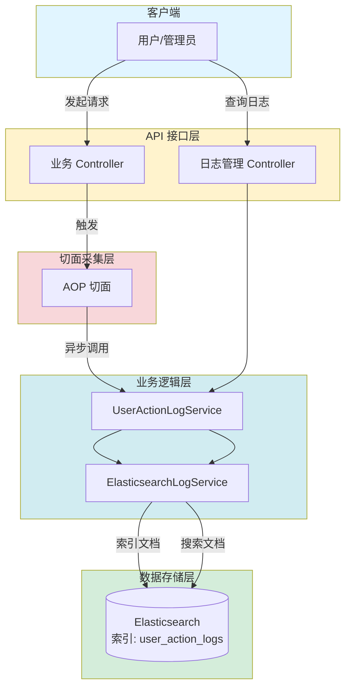

# 用户行为日志功能设计文档

## 文档同步状态（2026-03）

- 已按当前实现全量校准。
- 已与可观测性模块边界对齐：用户行为日志与 LLM/业务链路追踪分层治理、查询职责分离。
- 2026-05 已补充页面助手问答的行为日志边界说明。

## 1. 概述

### 1.1 功能简介

用户行为日志功能旨在记录系统中用户的关键操作行为，为安全审计、用户行为分析和系统故障排查提供数据支持。系统通过 AOP（面向切面编程）技术自动采集用户请求信息，并将日志数据异步存储到 Elasticsearch 中，以支持高性能的全文检索和复杂聚合分析。

用户端全局页面助手是高频问答型能力，当前主要通过对话历史和 `ChatService` 业务追踪记录问答结果与模型链路。用户行为日志模块只采集带 `@UserAction` 注解的方法；如果后续需要单独统计页面助手入口点击或问答请求，可在 `AssistantController` 上补充 `@UserAction` 注解，并对 `pageContext` 做摘要化记录，避免把页面正文写入行为日志。

### 1.2 功能目标

- **全方位采集**：自动记录用户的操作时间、操作类型、请求参数、响应结果、IP 地址等关键信息。
- **高性能存储与检索**：利用 Elasticsearch 的倒排索引特性，支持海量日志的毫秒级检索。
- **异步处理**：采用异步方式记录日志，确保不影响主业务流程的性能。
- **灵活查询**：支持多维度组合查询（用户、模块、时间范围、操作结果等）。
- **非侵入式接入**：通过注解方式（`@UserAction`）标记需要记录的方法，降低对业务代码的侵入。

### 1.3 适用范围

- 管理员审计用户操作。
- 分析系统使用情况（如热门功能模块）。
- 排查系统异常和安全事件。
- 对页面助手等高频问答入口做审计时，应记录“发生了问答行为”，避免记录完整页面上下文。

## 2. 功能架构

### 2.1 总体架构

用户行为日志功能采用分层架构设计，包含采集层、处理层、存储层和展示层。



### 2.2 核心模块

#### 2.2.1 日志采集模块 (`UserActionAspect`)
- **职责**：拦截带有 `@UserAction` 注解的 Controller 方法。
- **功能**：
  - 解析 JWT Token 获取用户信息（用户ID、用户名）。
  - 提取 HTTP 请求信息（URL、Method、IP、User-Agent）。
  - 记录方法执行参数和返回值。
  - 捕获执行异常信息。
  - 计算方法执行耗时。

**页面助手采集边界：**
- 当前页面助手接口未单独标注 `@UserAction` 时，不会作为独立用户行为日志写入 `user_action_logs`。
- 页面助手请求仍会进入 `ChatService`，其模型调用、历史保存和异常可通过对话历史与可观测性链路排查。
- 如需为页面助手增加行为日志，应只记录用户 ID、接口路径、页面路由、页面标题、问题长度、上下文区块数量等摘要字段，不记录完整 `pageContext.sections.content`。

#### 2.2.2 日志服务模块 (`UserActionLogService`)
- **职责**：提供日志管理的业务接口。
- **功能**：
  - 异步保存日志。
  - 分页查询日志。
  - 获取日志聚合信息（如操作类型列表）。
  - 封装 Elasticsearch 操作细节。

#### 2.2.3 Elasticsearch 服务模块 (`ElasticsearchLogService`)
- **职责**：直接与 Elasticsearch 交互。
- **功能**：
  - 索引生命周期管理（自动创建索引）。
  - 文档转换与存储。
  - 构建复杂查询条件（BoolQuery、Wildcard、Range）。
  - 执行聚合查询（Aggregations）。

## 3. 数据设计

### 3.1 Elasticsearch 索引设计

- **索引名称**：`user_action_logs`
- **映射结构 (Mapping)**：

| 字段名 | 类型 | 说明 |
|--------|------|------|
| id | keyword | 日志唯一标识 (UUID) |
| userId | long | 用户ID |
| username | text | 用户名（支持模糊搜索） |
| module | keyword | 操作模块 |
| actionType | keyword | 操作类型 |
| description | text | 操作描述 |
| method | keyword | 请求方法 (GET/POST/...) |
| requestPath | keyword | 请求路径 |
| requestParams | text | 请求参数 (JSON字符串) |
| result | keyword | 操作结果 (SUCCESS/FAILURE) |
| errorMsg | text | 错误信息 |
| ipAddress | ip | IP 地址 |
| userAgent | text | 用户代理信息 |
| executionTime | long | 执行耗时 (ms) |
| createTime | date | 创建时间 (yyyy-MM-dd'T'HH:mm:ss) |

### 3.2 实体类设计

#### UserActionLogDocument
用于映射 Elasticsearch 文档的 Java 对象。

```java
public class UserActionLogDocument {
    private String id;
    private Long userId;
    private String username;
    private String module;
    private String actionType;
    // ... 其他字段
    @JsonFormat(pattern = "yyyy-MM-dd'T'HH:mm:ss")
    private LocalDateTime createTime;
}
```

## 4. 核心流程

### 4.1 日志采集流程

1. **拦截请求**：`UserActionAspect` 拦截目标方法。
2. **前置处理**：记录开始时间。
3. **执行目标方法**：执行实际的业务逻辑。
4. **后置处理**：
   - 计算执行耗时。
   - 获取请求上下文（HttpServletRequest）。
   - 解析用户信息（从 SecurityContext 或 Token）。
   - 提取请求参数和响应结果。
   - 判断执行状态（成功/失败）。
5. **异步保存**：调用 `UserActionLogService.saveLog()` 将封装好的日志对象推送到 Elasticsearch。

### 4.2 日志查询流程

1. **接收请求**：`UserActionLogController` 接收查询参数（userId, module, timeRange 等）。
2. **构建查询**：`ElasticsearchLogService` 使用 `co.elastic.clients` 构建 `BoolQuery`。
   - `term` 查询：精确匹配 module, actionType, result。
   - `wildcard` 查询：模糊匹配 username。
   - `range` 查询：匹配 createTime 时间范围。
3. **执行搜索**：向 Elasticsearch 发起搜索请求，支持分页和排序。
4. **结果封装**：将 ES 响应结果转换为 `PageResponse<UserActionLogResp>` 返回给前端。

## 5. API 接口设计

### 5.1 页面助手日志策略

页面助手内容可能包含当前页面的业务数据，因此不建议把完整请求体作为行为日志参数保存。推荐策略如下：

| 字段 | 是否记录 | 说明 |
| --- | --- | --- |
| userId / username | 是 | 由 JWT 解析 |
| URL / Method | 是 | 标识页面助手接口 |
| page.route / page.title | 可选 | 用于统计入口来源 |
| message | 可选摘要 | 可记录长度或脱敏后的短文本 |
| pageContext.sections.content | 否 | 页面正文可能包含业务敏感信息 |
| response.answer | 否 | 模型回答已在会话历史中保存 |

### 5.2 分页查询日志

**接口路径**：`GET /api/admin/user-action-logs`

**请求参数**：

| 参数名 | 类型 | 必填 | 说明 |
|--------|------|------|------|
| userId | Long | 否 | 用户ID |
| username | String | 否 | 用户名（模糊匹配） |
| module | String | 否 | 模块名称 |
| actionType | String | 否 | 操作类型 |
| result | String | 否 | 结果 (SUCCESS/FAILURE) |
| startTime | String | 否 | 开始时间 (ISO 8601) |
| endTime | String | 否 | 结束时间 (ISO 8601) |
| page | Integer | 否 | 页码 (默认1) |
| pageSize | Integer | 否 | 每页条数 (默认20) |

**响应示例**：

```json
{
  "code": 0,
  "msg": "success",
  "data": {
    "list": [
      {
        "id": "550e8400-e29b-41d4-a716-446655440000",
        "userId": 1001,
        "username": "admin",
        "module": "系统配置",
        "actionType": "更新配置",
        "description": "更新了系统超时策略",
        "result": "SUCCESS",
        "createTime": "2023-10-27T10:00:00"
        // ...
      }
    ],
    "total": 100,
    "page": 1,
    "pageSize": 20
  }
}
```

## 6. 关键技术点

### 6.1 异步非阻塞
使用 Spring 的 `@Async` 注解标记保存日志的方法，确保日志记录操作不会阻塞主业务线程，从而最小化对系统响应时间的影响。

### 6.2 Elasticsearch Java Client
使用官方的 `co.elastic.clients:elasticsearch-java` 客户端，提供类型安全的 API 操作，替代旧版的 `RestHighLevelClient`。

### 6.3 动态索引管理
系统启动时自动检测并创建 `user_action_logs` 索引及其 Mapping 配置，减少运维成本。

## 7. 配置说明

### 7.1 用户行为日志 Elasticsearch 配置

用户行为日志功能不再直接使用 `application.yml` 中的 `elasticsearch.*` 配置，而是通过**数据源管理 + 系统配置**进行组合配置，步骤如下：

1. 在管理端「数据源管理」中创建一个类型为 `elasticsearch` 的数据源：
   - 主机地址：Elasticsearch 服务地址（如 `106.54.124.170`）
   - 端口：Elasticsearch HTTP 端口（默认 `9200`）
   - 数据库名：可填写任意非空字符串（内部仅用于区分连接）
   - 用户名 / 密码：如果 Elasticsearch 开启了安全认证，则填写对应账号密码；否则可留空
   - 状态：启用
2. 记下该数据源的 **ID**（例如：`16`）。
3. 在「系统配置」中新增或更新配置：
   - 配置键：`userlog.elasticsearchDataSourceId`
   - 配置值：上面创建的数据源 ID，例如：`16`
   - 配置分组：建议填写 `system`
   - 配置类型：`number`

当 `userlog.elasticsearchDataSourceId` 指向的 Elasticsearch 数据源存在且为启用状态、类型为 `elasticsearch` 时：

- 用户行为日志采集与查询功能自动启用；
- 系统会基于该数据源创建并使用 `user_action_logs` 索引；
- 配置更新后，无需重启应用即可生效（通过系统配置接口动态读取）。

如果：

- 未配置 `userlog.elasticsearchDataSourceId`，或
- 指向的数据源不存在 / 被删除 / 已禁用 / 类型不是 `elasticsearch`，

则用户行为日志仍会通过切面采集，但不会写入 Elasticsearch，相关查询接口会返回空结果并在日志中输出「Elasticsearch 未启用」提示。

### 7.2 注解使用示例

在 Controller 方法上添加注解即可自动记录日志：

```java
@UserAction(module = "模型管理", actionType = "创建模型", description = "创建新的LLM模型")
@PostMapping
public ResponseEntity<Void> createModel(@RequestBody ModelReq req) {
    // ... 业务逻辑
}
```
