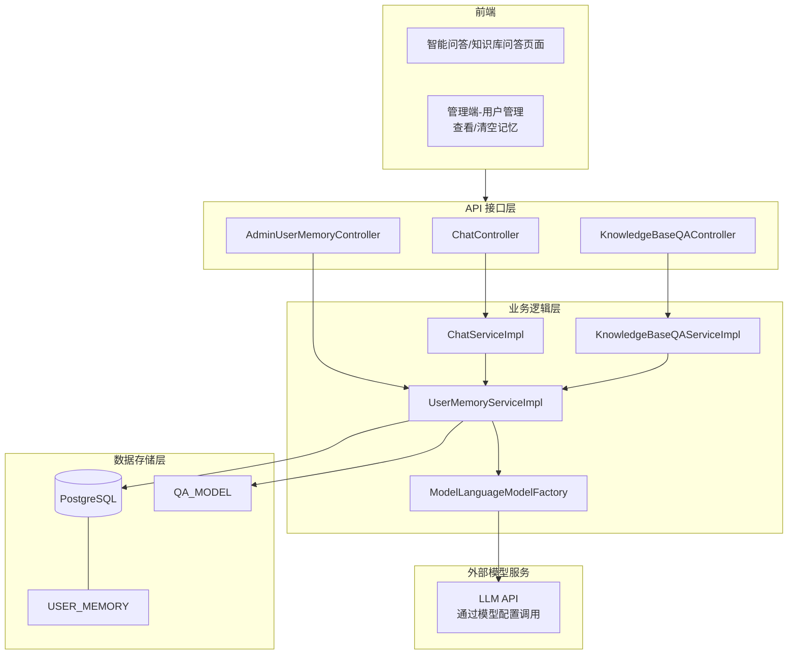
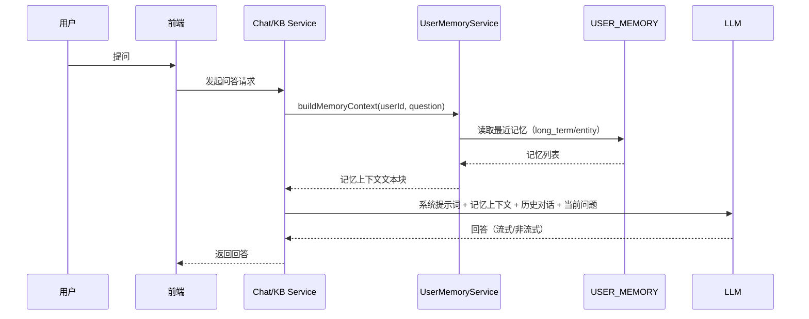
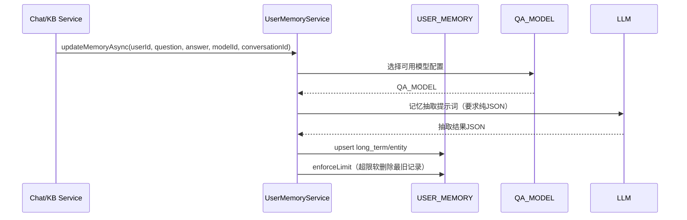

# 记忆模块功能设计文档

## 1. 概述

### 1.1 功能简介

记忆模块用于在多轮对话中沉淀“长期可复用”的用户信息，并在后续提问时作为上下文注入到系统提示词中，提升回答的个性化、一致性与任务连续性。

本系统的记忆模块与“对话历史”不同：

- 对话历史：保存一段会话内/跨会话的消息记录，用于回放与上下文压缩
- 记忆模块：抽取并保存更稳定的用户偏好、背景、常用技术栈、项目上下文、关键实体及属性，用于长期个性化

当前实现提供两类记忆：

- 长期记忆（`long_term`）：面向“事实/偏好/背景”的一句话记忆（文本）
- 实体记忆（`entity`）：面向“实体-属性”的结构化记忆（JSON 字符串）

### 1.2 功能目标

- 自动从“用户问题 + 助手回答”中抽取可长期复用的信息
- 在后续问答中注入与当前问题最相关的记忆片段
- 对记忆进行去重更新、软删除清理与容量上限约束
- 提供管理端查看/清空用户记忆能力，便于合规与运营排障

### 1.3 适用范围

- 智能问答（`/api/chat`、`/api/chat/stream`）
- 知识库问答（RAG，`/api/knowledge-bases/{id}/qa` 等）

记忆模块以“用户ID”为唯一归属维度，不区分应用/知识库；如果需要按应用隔离，可在后续扩展中增加作用域字段（见 8. 扩展建议）。

## 2. 功能架构

### 2.1 总体架构



### 2.2 核心模块说明

#### 2.2.1 记忆上下文构建（读路径）

由 [UserMemoryServiceImpl](file:///d:/lark-projects/DifyApp/backend/src/main/java/com/github/app/dify/memory/service/impl/UserMemoryServiceImpl.java) 的 `buildMemoryContext(userId, question)` 提供：

- 读取近期长期记忆/实体记忆（各取最近 30 条）
- 按当前问题做轻量 token 匹配挑选（各挑选最多 8 条）
- 单条记忆截断到 400 字符以内，组装成可注入提示词的文本块

#### 2.2.2 记忆抽取与写入（写路径）

由 `updateMemoryAsync(userId, question, answer, modelId, conversationId)` 异步触发：

- 选择可用的问答模型（优先 `modelId`，否则默认 `use_for=chat` 或 `use_for=both`）
- 调用模型进行“记忆抽取”，要求输出严格 JSON
- 将抽取结果 upsert 到 `USER_MEMORY`（基于 `(user_id, memory_type, memory_key)` 唯一约束）
- 对每类记忆执行容量上限（每类最多 200 条，超出则软删除最旧的部分）

#### 2.2.3 管理端运维接口

由 [AdminUserMemoryController](file:///d:/lark-projects/DifyApp/backend/src/main/java/com/github/app/dify/memory/controller/AdminUserMemoryController.java) 提供：

- 管理员查看指定用户的记忆列表
- 管理员清空指定用户的记忆（软删除）

## 3. 数据库设计

### 3.1 用户记忆表（USER_MEMORY）

初始化 SQL 位于 [init_database_complete.sql](file:///d:/lark-projects/DifyApp/backend/src/main/resources/sql/init_database_complete.sql#L645-L676)。

| 字段名 | 类型 | 说明 | 约束 |
|---|---|---|---|
| id | BIGSERIAL | 主键 | PK |
| user_id | BIGINT | 用户ID | NOT NULL |
| memory_type | VARCHAR(32) | 记忆类型：`long_term`/`entity` | NOT NULL |
| memory_key | VARCHAR(200) | 记忆键（用于去重更新） | NOT NULL |
| content | TEXT | 记忆内容 |  |
| importance | INTEGER | 重要度（0-5） |  |
| create_time | TIMESTAMP | 创建时间 | 默认当前时间 |
| update_time | TIMESTAMP | 更新时间 | 默认当前时间 |
| deleted | INTEGER | 是否删除：0-未删除，1-已删除 | 默认 0 |

唯一约束：

- `UNIQUE (user_id, memory_type, memory_key)`

索引：

- `idx_user_memory_user_id (user_id)`
- `idx_user_memory_type (memory_type)`
- `idx_user_memory_user_type (user_id, memory_type)`
- `idx_user_memory_deleted (deleted)`

### 3.2 记忆内容格式

#### 3.2.1 长期记忆（long_term）

- `content`：纯文本（建议一句话描述）
- `importance`：0-5（当前实现用于保存，未参与排序）
- `memory_key`：由抽取 JSON 的 `key` 字段提供；若缺失则用 `content` 的短哈希生成（稳定去重）

#### 3.2.2 实体记忆（entity）

- `content`：JSON 字符串，结构为：

```json
{
  "type": "project",
  "name": "DifyApp",
  "attributes": {
    "stack": ["Spring Boot", "Vue 3"],
    "db": "PostgreSQL"
  }
}
```

- `memory_key`：`{type}:{name}`（例如 `project:DifyApp`）
- `importance`：固定为 3（当前实现）

## 4. API 接口设计（管理端）

### 4.1 查看用户记忆

接口：

- `GET /api/admin/memory/users/{userId}/items`

查询参数：

- `type`：可选，`long_term`/`entity`，不传表示全部
- `page`：可选，默认 1
- `size`：可选，默认 50，最大 200

请求头：

- `Authorization: Bearer {token}`（必填）

响应示例：

```json
[
  {
    "id": 1,
    "memoryType": "long_term",
    "memoryKey": "tech_stack",
    "content": "用户常用技术栈是 Spring Boot + Vue 3。",
    "importance": 4,
    "updateTime": "2026-01-14T10:00:00.000+00:00"
  }
]
```

权限：

- 仅管理员可访问（`role == 1`）

### 4.2 清空用户记忆

接口：

- `DELETE /api/admin/memory/users/{userId}`

请求头：

- `Authorization: Bearer {token}`（必填）

响应：

- 200 OK，无响应体

权限：

- 仅管理员可访问（`role == 1`）

## 5. 核心流程设计

### 5.1 读路径：在问答前注入记忆上下文



注入位置：

- 智能问答：在 [ChatServiceImpl](file:///d:/lark-projects/DifyApp/backend/src/main/java/com/github/app/dify/chat/service/impl/ChatServiceImpl.java) 构建系统消息时附加 `【用户记忆】...`
- 知识库问答：在 [KnowledgeBaseQAServiceImpl](file:///d:/lark-projects/DifyApp/backend/src/main/java/com/github/app/dify/knowledgebase/service/impl/KnowledgeBaseQAServiceImpl.java) 构建系统消息时附加 `【用户记忆】...`

### 5.2 写路径：问答完成后异步抽取并更新记忆



触发时机：

- 智能问答：保存助手消息后触发（流式/非流式均会触发）
- 知识库问答：保存助手消息后触发（流式/非流式均会触发）

失败策略：

- 抽取或写入失败不会影响主问答流程（以 `debug` 级别记录）

## 6. 关键实现细节

### 6.1 记忆抽取 JSON 约束

抽取器系统提示词要点（见 [UserMemoryServiceImpl](file:///d:/lark-projects/DifyApp/backend/src/main/java/com/github/app/dify/memory/service/impl/UserMemoryServiceImpl.java#L193-L224)）：

- 只记录稳定、可复用的信息
- 不记录一次性内容与敏感信息（密码、token、身份证、银行卡等）
- 没有可保存内容时返回 `{}`（空对象）
- 输出必须是“纯 JSON”，不能包含 Markdown/代码块

预期 JSON 结构：

```json
{
  "long_term_facts": [
    { "key": "tech_stack", "content": "用户常用技术栈是 Spring Boot + Vue 3。", "importance": 4 }
  ],
  "entities": [
    { "type": "project", "name": "DifyApp", "attributes": { "db": "PostgreSQL" } }
  ]
}
```

### 6.2 上下文挑选策略

当前实现为轻量策略：

- 候选集：按 `update_time` 倒序读取（各类型最多 30 条）
- 匹配：将问题分词为 token，若 token 命中记忆内容（小写包含）则优先
- 回退：若无 token，则直接取最新的若干条
- 输出上限：长期记忆最多 8 条、实体记忆最多 8 条

### 6.3 容量控制与软删除

- 每个用户每种记忆类型最多保留 200 条
- 超出后按 `update_time` 升序（最旧）选择若干条置 `deleted=1`
- 清空用户记忆同样使用软删除（便于审计与恢复策略扩展）

## 7. 权限与安全设计

### 7.1 访问控制

- 管理端记忆 API 仅管理员可用（`role == 1`）
- 普通用户侧无直接的记忆管理 API（记忆在服务端自动读写）

### 7.2 隐私与敏感信息

- 记忆抽取提示词明确禁止记录敏感信息
- 仍需在运维与合规层面定期抽检：避免模型误抽取敏感数据
- 管理端提供“清空记忆”用于合规删除请求与排障

## 8. 性能与扩展建议

### 8.1 性能评估

- 读路径：两次分页查询（每次最多 30 条），依赖 `user_id + memory_type` 索引，开销可控
- 写路径：异步执行，不影响主流程延迟；上限裁剪仅在超过 200 条时触发

### 8.2 可扩展方向

- 作用域隔离：增加 `scope_type/scope_id`（如按应用、按知识库隔离）
- 更好的相关性：引入向量化检索或基于重要度/时间衰减的排序
- 用户自助：提供用户端“查看/删除/固定某条记忆”的接口（需权限与审计）
- 结构化实体标准化：对 `entities` 引入 schema 校验与字段白名单

## 9. 测试要点

- 抽取 JSON 的健壮性：模型输出包含多余文本时仍能解析（取首尾花括号）
- 去重更新：相同 `(user_id, type, key)` 应更新内容与 `update_time`
- 上下文拼接：单条记忆超长时能正确截断，且不会破坏系统提示词结构
- 容量上限：超过 200 条时自动软删除最旧记录
- 权限校验：非管理员调用管理端记忆 API 返回 403

