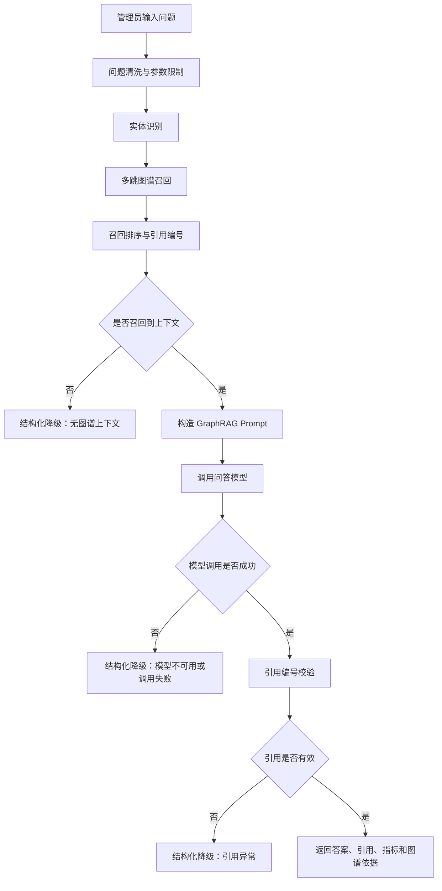

# GraphRAG 知识图谱问答设计文档

## 1. 功能定位

GraphRAG 知识图谱问答是数据分析模块中的管理员能力，用于基于 Neo4j 中的系统关系图谱进行自然语言问答。该能力面向管理员排查、分析和运营场景，当前不与用户侧知识库问答链路强绑定。

当前实现目标是形成可实际试用的 GraphRAG 闭环：从系统数据同步到 Neo4j，经过图谱展示、实体识别、多跳召回、召回排序、LLM 生成、引用编号、引用校验、错误降级和可观测指标，最终在管理端页面展示可核验的答案和图谱依据。

用户端全局页面助手不调用 GraphRAG 接口，也不直接查询 Neo4j。页面助手面向普通用户当前页面可见内容；GraphRAG 面向管理员系统关系图谱分析。若页面助手出现在展示图谱结果的页面上，它也只能解释页面已展示内容，不越权执行图谱查询。

## 2. 当前能力边界

### 2.1 已具备能力

- 图谱数据同步：将用户、应用、知识库、文档、会话、消息、问答模型等实体同步到 Neo4j。
- 关系建模：构建用户-应用、用户-知识库、知识库-文档、会话-应用、会话-知识库、消息-模型等关系。
- 图谱展示：支持节点/关系可视化、节点详情弹窗、关键词筛选、节点类型筛选、关系类型筛选和 1-3 跳展示。
- 快速图谱问答：基于规则意图和 Cypher 模板回答常见统计类、列表类问题。
- GraphRAG 知识问答：支持实体识别、多跳图谱召回、召回排序、LLM 生成和引用编号。
- 引用校验：要求模型回答使用 `[G1]`、`[G2]` 等图谱引用，服务端校验引用是否存在。
- 引用展示体验：前端将答案中的引用编号渲染为可点击元素，点击后定位并高亮对应图谱证据。
- 降级策略：无上下文、模型不可用、模型生成失败或引用异常时，降级为结构化图谱依据。
- 可观测性：接入行为日志、业务 Trace、步骤 Trace、耗时指标和慢查询日志。
- Neo4j 性能治理：创建常用唯一约束和名称类索引，记录慢图谱查询。
- 安全与成本控制：限制问题长度、召回数量、关系深度和进入提示词的图谱来源数量。

### 2.2 暂不覆盖能力

- 暂不与用户侧知识库问答接口合并。
- 暂不与用户端全局页面助手合并。
- 暂不面向普通用户开放，当前按管理员工具设计。
- 暂不提供离线评测集和自动化质量回归。
- 暂不提供可视化权重配置、别名词典配置和人工反馈闭环。
- 暂不承诺复杂业务推理完全准确，复杂问题需要结合引用结果人工核验。

## 3. 业务流程

## 4. 接口设计

### 4.1 图谱展示

`GET /api/admin/data-analysis/graph`

主要参数：

- `limit`：节点/关系限制，后端会做最大值限制。
- `keyword`：图谱搜索关键词。
- `nodeLabel`：节点类型，例如 `User`、`KnowledgeBase`、`KnowledgeDocument`。
- `relationshipType`：关系类型，例如 `HAS_DOCUMENT`、`USING_MODEL`。
- `depth`：图谱展示深度，限制在 1-3 跳。

### 4.2 快速图谱问答

`POST /api/admin/data-analysis/qa`

用于规则型、统计型、列表型问题，不依赖 LLM。适合快速验证图谱数据是否同步正确。

### 4.3 GraphRAG 知识问答

`POST /api/admin/data-analysis/rag`

请求参数：

- `question`：自然语言问题，不能为空，后端限制最大长度。
- `limit`：图谱召回数量，后端限制最大值。
- `depth`：图谱召回深度，限制在 1-3 跳。
- `modelId`：可选，指定问答模型；不传则使用默认 RAG 或 both 场景模型。

响应字段：

- `answer`：最终答案或结构化降级答案。
- `llmGenerated`：是否由 LLM 生成。
- `modelId` / `modelName`：实际使用的问答模型。
- `graphHitCount`：图谱召回命中数量。
- `citationValid`：引用是否通过服务端校验。
- `recognizedEntities`：识别到的图谱实体。
- `graphSources`：召回到的图谱证据，包含 `citationId`。
- `message`：提示消息。
- `errorCode`：错误码或降级码。
- `fallbackReason`：降级原因。
- `metrics`：GraphRAG 执行指标。

## 5. 召回与排序策略

当前召回策略以图谱实体和问题关键词为入口，在 Neo4j 中检索 1-3 跳关系路径，并对召回结果进行排序。

排序会综合考虑：

- 路径跳数：更短路径通常相关性更高。
- 实体命中：命中识别实体的路径优先。
- 关键词命中：命中问题关键词或搜索词的节点优先。
- 关系偏好：根据问题意图推断优先关系类型。
- 去重：相同来源、关系、目标的图谱证据会压缩。

排序后的结果会分配引用编号，例如 `G1`、`G2`，并进入 Prompt 和前端结果明细。

## 6. 错误与降级策略

GraphRAG 的原则是：宁可返回可核验的图谱依据，也不返回无法验证的模型猜测。

主要降级场景：

- `GRAPH_CONTEXT_EMPTY`：未召回到可用于回答的图谱上下文。
- `CITATION_INVALID`：模型答案未使用引用，或引用了不存在的编号。
- `LLM_GENERATION_FAILED`：模型调用异常或生成失败。
- `MODEL_NOT_FOUND`：未找到可用问答模型。
- `GRAPH_RAG_FAILED`：未归类的 GraphRAG 失败。

降级后的响应仍会尽量返回：

- 已识别实体。
- 已召回图谱证据。
- 可点击引用编号。
- 执行耗时指标。
- 错误码和降级原因。

## 7. 引用展示体验

LLM 生成答案时，每个关键结论必须带图谱引用编号，例如 `[G1]`。

前端展示规则：

- 只将后端召回结果中真实存在的引用编号渲染为可点击引用。
- 点击引用后滚动到对应结果明细，并高亮该证据。
- 不使用 `v-html` 渲染模型输出，避免 HTML 注入风险。
- 引用异常时展示 `引用异常` 状态，并显示降级原因。

该设计的目标是让管理员能够直接核对“答案是否被图谱证据支撑”。

## 8. 安全与成本控制

当前已实现的控制：

- 问题长度限制，防止超长输入导致 Prompt 膨胀。
- 召回 limit 上限，防止单次请求拉取过多图谱关系。
- depth 限制在 1-3 跳，避免无界多跳查询。
- Prompt 来源数量上限，仅将排序靠前的图谱证据注入模型。
- 引用编号校验，防止模型引用不存在的证据。
- 图谱标签和关系类型白名单，避免前端参数直接拼接为任意 Cypher。
- 模型失败、引用失败、无上下文时自动降级。

后续可按实际使用情况配置化：

- 最大问题长度。
- 最大召回数量。
- 最大 Prompt 来源数量。
- GraphRAG 查询超时。
- LLM 生成超时。
- 慢查询阈值。
- 是否启用 LLM 生成。

## 9. 可观测性与日志

GraphRAG 已接入以下观测能力：

- 用户行为日志：记录管理员触发图谱问答和知识问答的行为。
- 业务 Trace：以 `GraphRAG` 作为 trace source，记录一次 GraphRAG 请求的主链路。
- 步骤 Trace：记录实体识别、图谱召回、模型解析、模型生成等步骤。
- 应用日志：记录召回数量、实体数量、降级原因、慢查询和生成成功/失败。
- 响应指标：返回 `entityCount`、`graphHitCount`、`graphRetrievalMs`、`llmGenerationMs`、`citationValidationMs`、`totalMs` 等指标。

实际排查时优先观察：

- `graphRetrievalMs`：Neo4j 召回是否偏慢。
- `llmGenerationMs`：模型生成是否偏慢。
- `citationValid`：模型是否严格按引用回答。
- `errorCode` / `fallbackReason`：是否经常触发同类降级。
- `graphHitCount`：是否召回过少或过多。

## 10. 实际使用观察清单

当前阶段建议根据真实管理员问题逐步优化，不急于一次性堆叠复杂策略。每次发现效果不好时，应记录问题、期望结果和实际结果。

重点观察以下情况：

1. 问题没有召回结果  
   记录原问题、期望命中的实体、实际识别出的实体和 `graphHitCount`。

2. 召回结果有但排序不理想  
   检查 `[G1]`、`[G2]` 是否是最应排在前面的依据，必要时调整关系权重和路径权重。

3. 答案使用了错误引用  
   检查 `citationValid`、答案中的引用编号和对应 `graphSources` 是否真正支撑结论。

4. 多跳问题回答过浅  
   重点检查 depth、召回路径、关系类型偏好，以及是否需要放宽或重排多跳路径。

5. 慢查询或成本偏高  
   观察 `graphRetrievalMs`、`llmGenerationMs`、`totalMs`，再决定优化 Neo4j 查询、降低 limit、减少 Prompt 来源或增加超时控制。

6. 实体识别不稳定  
   记录未识别或误识别的实体名称，后续可增加别名表、同义词、拼音/模糊匹配或实体消歧。

7. 回答不够完整  
   检查是否因为召回范围不足、关系过滤过严、Prompt 来源截断或模型生成限制导致。

## 11. 后续优化方向

建议按真实失败样本优先级推进：

- 建立 GraphRAG 评测集：沉淀典型问题、期望实体、期望路径、期望答案和期望引用。
- 增强实体识别：支持别名、同义词、拼音、模糊匹配和实体消歧。
- 优化召回排序：加入关系权重配置、路径多样性、重复路径压缩和低质量路径过滤。
- 配置化安全与成本阈值：将当前硬编码上限迁移为系统配置。
- 增加运行时治理：Neo4j 查询超时、LLM 超时、并发限流、失败窗口熔断。
- 建立反馈闭环：允许管理员标记“有用/无用/引用错误”，用于后续权重优化和评测集扩充。

## 12. 结论

当前 GraphRAG 已具备相对完整的主链路，适合管理员内部试用和真实问题验证。它已经不是单纯 demo，但仍应定位为“可运营优化的 GraphRAG MVP+”。后续优化应以真实使用样本为依据，优先修复召回不到、排序不准、引用不可靠和耗时偏高的问题。
