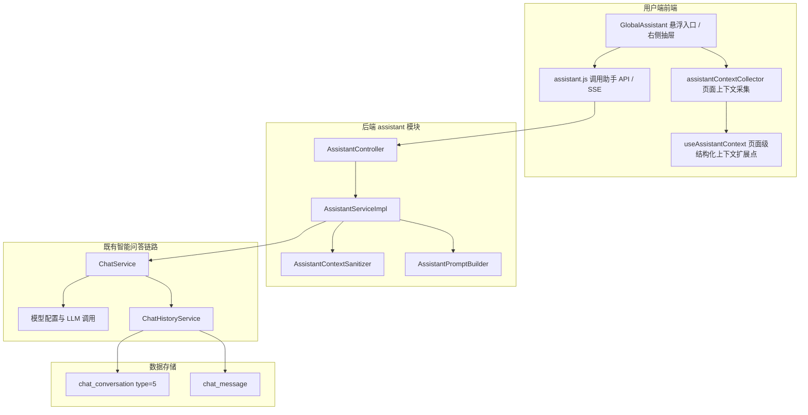

# 用户端全局页面助手设计文档

## 文档同步状态（2026-05）

- 已按当前实现编写。
- 已覆盖用户端悬浮入口、页面上下文采集、上下文 JSON 化、服务端清洗裁剪、流式问答、会话历史入库与继续对话策略。

## 1. 概述

### 1.1 功能简介

用户端全局页面助手是 DifyApp 用户端的轻量级页面问答能力。它在用户端布局中提供一个全局悬浮入口，用户可以在任意用户端页面打开助手，并基于当前页面的可见内容、选中文本、页面标题、路由等上下文进行提问。

该功能不为每个页面单独构建知识库，也不把完整 HTML 直接发送给大模型，而是在前端采集当前页面的核心内容并组织为结构化 JSON，再由后端进行白名单清洗、HTML 标签剥离、敏感字段脱敏和长度裁剪，最后拼接为提示词调用已有智能问答链路。

### 1.2 功能目标

- 在用户端任意页面提供统一的页面问答入口。
- 让大模型基于当前页面内容回答问题，而不是泛泛回答。
- 使用结构化 JSON 保留页面基本结构，避免发送大量 HTML 标签和无效 UI 噪声。
- 复用现有 `ChatService`、模型配置、SSE 流式响应和对话历史能力，降低实现成本。
- 将页面助手问答写入会话历史，并用 `type=5` 标记为“页面助手”。
- 避免误触发备忘录创建、浏览器检索等与页面问答无关的增强能力。

### 1.3 适用范围

- 用户端业务页面的内容解释、字段说明、表格总结、配置检查。
- 当前页面内容的快速问答与操作建议。
- 用户选中文本后的局部解释。
- 不适用于自动执行创建、删除、修改、提交等系统动作。
- 不适用于跨大量历史页面或全站知识沉淀场景；这类场景应使用知识库或专门的 RAG 能力。

## 2. 设计原则

### 2.1 轻量优先

页面助手优先采用“当前页面上下文动态传递”的方式，而不是“每个页面单独构建知识库”。

原因如下：

- 当前页面问答通常只需要几 KB 到十几 KB 的可见内容，不需要向量化、索引、召回和同步。
- 页面内容经常随筛选条件、分页、用户权限、表单状态变化，静态知识库难以准确表达当前状态。
- 用户端页面问答更看重即时性和低工程复杂度，动态上下文更符合场景。
- 知识库适合稳定、可复用、跨页面的大规模资料；页面助手适合短生命周期的页面现场信息。

### 2.2 上下文结构化

前端将页面内容处理为 JSON，而不是拼接散乱文本或发送原始 DOM。

核心结构如下：

```json
{
  "source": "dom-fallback",
  "page": {
    "route": "/user/chat-history",
    "title": "会话历史",
    "type": "UserChatHistory"
  },
  "selection": {
    "text": "用户当前选中的文本"
  },
  "sections": [
    {
      "type": "text",
      "title": "页面区块 1",
      "content": "清洗后的页面核心内容"
    }
  ],
  "meta": {
    "generatedAt": "2026-05-19T06:12:06.000Z",
    "collector": "dom"
  }
}
```

这样做可以保留“页面 - 区块 - 内容”的层次，方便模型理解当前内容来自哪里，也方便后端统一清洗和裁剪。

### 2.3 不发送原始 HTML

页面上下文需要过滤大量标签和无意义内容。原始 HTML 通常包含菜单、按钮、弹窗、样式、脚本、隐藏节点、组件内部结构等噪声，会浪费 token 并降低回答准确性。

当前实现采用两级过滤：

- 前端采集时移除布局、弹窗、助手自身、脚本、样式、隐藏节点和短按钮文本。
- 后端再次剥离 HTML 标签、清理控制字符、折叠空白、裁剪长度并脱敏敏感字段。

### 2.4 能力边界清晰

页面助手当前只做问答和建议，不执行系统操作。提示词明确要求模型不要声称已经执行创建、删除、修改、提交等动作。

## 3. 总体架构

### 3.1 架构图



### 3.2 核心链路

1. 用户点击用户端页面右侧悬浮按钮，打开页面助手抽屉。
2. 前端采集当前页面上下文，包括路由、标题、选中文本和页面主要内容区块。
3. 用户输入问题后，前端将问题、会话 ID、页面上下文和最近对话历史发送到 `/api/assistant/stream`。
4. 后端清洗页面上下文并构造页面助手提示词。
5. `AssistantServiceImpl` 将请求适配为 `ChatRequest`，复用 `ChatService.chatStream(...)`。
6. `ChatService` 调用模型并按既有 SSE 格式返回答案。
7. 会话历史自动保存到 `chat_conversation` 和 `chat_message`，其中会话类型为 `5-页面助手`。

## 4. 前端设计

### 4.1 全局入口

实现文件：`frontend/src/components/assistant/GlobalAssistant.vue`

组件挂载位置：`frontend/src/layouts/UserLayout.vue`

设计要点：

- 仅挂载在用户端布局中，避免影响管理端页面。
- 使用右侧悬浮圆形按钮作为入口，不遮挡主流程。
- 打开后使用 Element Plus `el-drawer` 从右侧展开，保留当前页面可见。
- `modal=false`，用户可以继续查看页面内容。
- 点击助手外部区域自动收起，减少页面干扰。
- 移动端抽屉宽度自适应为 100%。

### 4.2 页面上下文采集

实现文件：`frontend/src/utils/assistantContextCollector.js`

采集内容：

- 当前路由、页面标题、路由类型。
- 用户当前选中文本，最大长度 2000。
- 页面主要可见内容区块。
- 上下文生成时间、采集器类型等元信息。

默认主内容选择器：

```text
.main-content:not(.portal-content)
.portal-content
.app-main
main
#app
```

默认噪声过滤选择器：

```text
.el-header
.app-header
.home-floating-button
.global-assistant
.assistant-drawer
.el-overlay
.el-drawer
.el-dialog
.el-message
.el-notification
script
style
noscript
```

采集策略：

- 优先读取页面注册的结构化上下文。
- 如果页面没有注册上下文，则回退到 DOM 可见文本采集。
- 优先按 `.el-card`、`section`、`article`、`.page-container`、`.content-card` 等区块拆分。
- 如果无法拆分区块，则采集主内容整体文本。
- 前端限制单区块和总长度，避免一次请求携带过多内容。

### 4.3 页面级结构化上下文扩展点

实现文件：`frontend/src/composables/useAssistantContext.js`

页面可以通过 `useAssistantContext(provider)` 注册自己的上下文提供器。适用于表格、图表、复杂表单等 DOM 文本难以准确表达的页面。

示例：

```js
useAssistantContext(() => ({
  source: 'page-provider',
  page: {
    title: '会话历史',
    type: 'chat-history'
  },
  sections: [
    {
      type: 'table',
      title: '当前筛选结果',
      content: JSON.stringify(rows)
    }
  ],
  meta: {
    filter,
    pageSize
  }
}))
```

工程化建议：

- 普通页面先使用 DOM 回退采集。
- 信息密度高、表格多、图表多的页面再补充页面级 provider。
- provider 输出应是业务语义数据，不应输出组件内部 HTML。

### 4.4 前端问答状态

`GlobalAssistant.vue` 维护本次抽屉内的局部消息列表和 `conversationId`。

关键逻辑：

- 发送前刷新一次页面上下文，确保问题基于当前页面最新状态。
- 只向后端传递最近 8 条局部历史，控制 token。
- 从 SSE 响应中读取 `conversationId`，后续追问继续写入同一会话。
- 点击“清空”会清空前端消息并重置 `conversationId`，下一轮会创建新页面助手会话。

## 5. 后端设计

### 5.1 API 接口

实现文件：`backend/src/main/java/com/github/app/dify/assistant/controller/AssistantController.java`

接口列表：

| 方法 | 路径 | 说明 |
| --- | --- | --- |
| POST | `/api/assistant` | 页面助手非流式问答 |
| POST | `/api/assistant/stream` | 页面助手流式问答 |

请求 DTO：`AssistantChatReq`

主要字段：

| 字段 | 类型 | 说明 |
| --- | --- | --- |
| message | String | 用户问题，必填 |
| conversationId | String | 会话 ID，用于连续追问 |
| modelId | Long | 指定模型 ID，可选 |
| pageContext | AssistantPageContext | 当前页面上下文 |
| history | List\<AssistantMessage\> | 前端局部对话历史 |

### 5.2 服务适配

实现文件：`backend/src/main/java/com/github/app/dify/assistant/service/impl/AssistantServiceImpl.java`

页面助手不单独实现一套模型调用链路，而是将 `AssistantChatReq` 转换为已有 `ChatRequest`。

关键参数：

| ChatRequest 字段 | 设置值 | 目的 |
| --- | --- | --- |
| question | 页面助手提示词 + 上下文 JSON + 用户问题 | 让模型基于页面回答 |
| conversationId | 前端传入的会话 ID | 支持连续追问 |
| stream | 根据接口类型设置 | 复用流式/非流式能力 |
| enableBrowserSearch | false | 页面助手默认不联网检索 |
| enableTimeInfo | true | 保留当前时间信息能力 |
| enableMemo | false | 防止“提醒”等页面文本误触发备忘录创建 |
| conversationType | 5 | 标记为页面助手会话 |
| historyQuestion | 用户原始问题 | 历史中保存干净问题，不保存完整提示词 |
| conversationTitle | `页面助手 - 页面标题` | 会话列表可识别来源 |
| history | 清洗后的最近对话历史 | 支持多轮上下文 |

### 5.3 上下文清洗与裁剪

实现文件：`backend/src/main/java/com/github/app/dify/assistant/util/AssistantContextSanitizer.java`

服务端清洗是必须步骤，即使前端已经做过过滤，也不能信任客户端输入。

清洗策略：

- 用户问题最大长度 2000。
- 选中文本最大长度 2000。
- 单个页面区块最大长度 3000。
- 页面区块总长度最大 9000。
- 对话历史最多保留 8 条，每条最大 1200。
- 只接受 `user` 和 `assistant` 两种历史角色。
- 移除 `<script>`、`<style>` 和普通 HTML 标签。
- 对 `api_key`、`token`、`password`、`secret` 等敏感字段做脱敏。
- 清理控制字符并压缩空白。

### 5.4 提示词构造

实现文件：`backend/src/main/java/com/github/app/dify/assistant/util/AssistantPromptBuilder.java`

提示词包含三部分：

- 页面助手身份和能力边界。
- 页面上下文 JSON。
- 用户原始问题。

关键约束：

- 优先依据页面上下文作答。
- 页面上下文不足时说明缺少哪些信息。
- 不编造系统数据。
- 不声称已经执行系统操作。
- 默认使用中文，回答简洁可执行。

## 6. 对话历史设计

### 6.1 会话类型

页面助手会话复用既有对话历史表，不新增专表。

`chat_conversation.type` 增加业务枚举：

| type | 含义 |
| --- | --- |
| 1 | 普通聊天 |
| 2 | 知识库问答 |
| 3 | 文档问答 |
| 4 | Agent 任务 |
| 5 | 页面助手 |

### 6.2 消息保存

为了避免历史详情中出现完整页面上下文和系统提示词，页面助手写入历史时使用 `historyQuestion` 保存用户原始问题。

保存效果：

- `chat_message(role=user)`：保存用户在助手输入框中的原始问题。
- `chat_message(role=assistant)`：保存模型最终回答。
- `chat_conversation.title`：优先使用 `页面助手 - 当前页面标题`。
- `chat_conversation.type`：保存为 `5`。

### 6.3 历史列表展示

用户端和管理端会话历史支持展示和筛选“页面助手”类型。

相关文件：

- `frontend/src/views/user/ChatHistory.vue`
- `frontend/src/views/admin/ChatHistory.vue`
- `frontend/src/composables/useChatHistory.js`

页面助手历史可以打开详情查看。由于页面助手依赖“当前页面现场上下文”，从历史列表继续页面助手会话时不直接跳回某个历史页面，而是优先打开历史详情，避免在错误页面上下文中继续追问。

## 7. Token 与成本控制

页面助手比任务型 Agent 更省 token 的原因是：它只做问答，不需要持续规划、工具调用、多步骤反思、执行日志和中间状态恢复。当前实现进一步通过以下方式控制成本：

- 不发送原始 HTML，只发送清洗后的文本和结构化 JSON。
- 限制选中文本、区块内容、区块总长度和历史条数。
- 不为每页创建向量知识库，避免索引和召回成本。
- 默认关闭浏览器检索。
- 默认关闭备忘录识别。
- 前端只传最近 8 条局部历史。

## 8. 安全与隐私

### 8.1 输入可信边界

页面上下文来自浏览器端，后端必须视为不可信输入，因此执行二次清洗和长度限制。

### 8.2 敏感信息处理

当前实现对常见敏感字段做文本级脱敏：

```text
api_key: [已脱敏]
token: [已脱敏]
password: [已脱敏]
secret: [已脱敏]
```

后续如页面中存在更复杂的敏感数据，可在页面级 provider 中主动排除，或在后端增加字段级白名单。

### 8.3 操作边界

助手不直接调用业务写接口，不执行数据库写入，不代替用户点击确认按钮。所有回答都应保持为解释、建议和操作指引。

## 9. 扩展方案

### 9.1 页面级 Provider 优先级提升

对表格、图表、复杂配置页，建议逐步接入 `useAssistantContext`，让页面输出更准确的业务 JSON。例如：

- 表格页输出列定义、当前筛选条件、当前页数据摘要。
- 详情页输出实体 ID、状态、关键字段。
- 配置页输出配置分组、启用状态和校验结果。

### 9.2 大页面摘要缓存

如果某些页面内容很长，可以引入页面侧摘要缓存：

- 页面内容变化时生成摘要。
- 提问时发送摘要 + 选中文本 + 当前局部区块。
- 避免每次携带完整页面内容。

### 9.3 操作型助手

当前页面助手只做问答。如果未来需要“帮我执行操作”，建议单独设计操作型 Agent：

- 增加工具白名单。
- 增加用户确认机制。
- 增加操作审计日志。
- 增加高风险动作拦截。
- 与当前问答型页面助手保持能力隔离。

## 10. 关键文件

### 10.1 前端

| 文件 | 说明 |
| --- | --- |
| `frontend/src/components/assistant/GlobalAssistant.vue` | 全局页面助手 UI、局部会话状态、SSE 消费 |
| `frontend/src/utils/assistantContextCollector.js` | 页面上下文采集、DOM 回退、噪声过滤 |
| `frontend/src/composables/useAssistantContext.js` | 页面级结构化上下文注册机制 |
| `frontend/src/api/assistant.js` | 页面助手 API 封装 |
| `frontend/src/layouts/UserLayout.vue` | 用户端全局挂载位置 |
| `frontend/src/composables/useChatHistory.js` | 会话历史继续对话与页面助手详情策略 |

### 10.2 后端

| 文件 | 说明 |
| --- | --- |
| `backend/src/main/java/com/github/app/dify/assistant/controller/AssistantController.java` | 页面助手 REST/SSE 接口 |
| `backend/src/main/java/com/github/app/dify/assistant/service/AssistantService.java` | 页面助手服务接口 |
| `backend/src/main/java/com/github/app/dify/assistant/service/impl/AssistantServiceImpl.java` | 页面助手到 ChatService 的适配 |
| `backend/src/main/java/com/github/app/dify/assistant/req/AssistantChatReq.java` | 页面助手请求 DTO |
| `backend/src/main/java/com/github/app/dify/assistant/util/AssistantContextSanitizer.java` | 上下文清洗、脱敏、裁剪 |
| `backend/src/main/java/com/github/app/dify/assistant/util/AssistantPromptBuilder.java` | 页面助手提示词构造 |
| `backend/src/main/java/com/github/app/dify/chat/req/ChatRequest.java` | 支持 `enableMemo`、`conversationType`、`historyQuestion`、`conversationTitle` |
| `backend/src/main/java/com/github/app/dify/chat/service/impl/ChatServiceImpl.java` | 复用智能问答、历史保存与类型标记 |

## 11. 设计取舍

### 11.1 为什么不每个页面做自己的知识库

页面助手面向的是“当前页面现场问答”，上下文短、变化快、权限相关强。每页知识库会带来索引同步、权限隔离、数据过期、召回调优和存储成本，不适合轻量用户端能力。

### 11.2 为什么不直接发送 HTML

HTML 对模型理解业务问题帮助有限，但会显著增加 token，并引入菜单、按钮、样式、脚本、弹窗等噪声。当前方案使用结构化 JSON 表达页面内容，保留必要结构，去掉无效标签。

### 11.3 为什么复用 ChatService

复用 `ChatService` 可以直接继承模型配置、流式响应、历史保存、上下文历史、多模型支持等能力，避免创建平行问答链路。页面助手只负责“采集页面上下文”和“构造页面问答提示词”。

### 11.4 为什么使用右侧抽屉

右侧抽屉更符合“基于当前页面问答”的定位。用户可以一边看页面一边提问，也能保持当前业务页面上下文。居中弹窗更像全系统问答，会遮挡页面内容，不利于页面现场问题。

