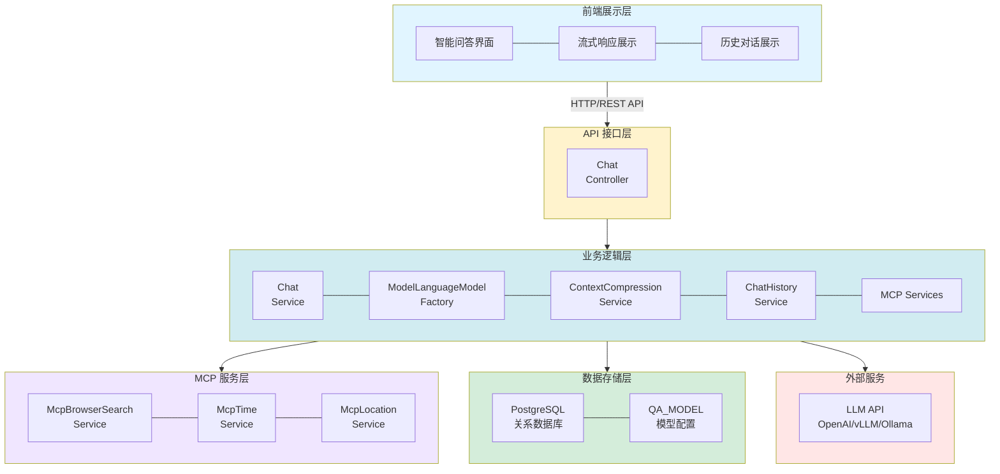
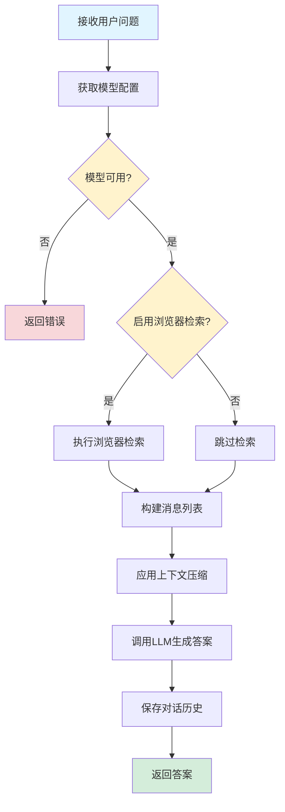
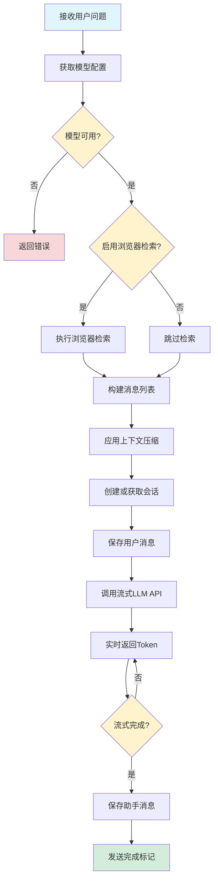
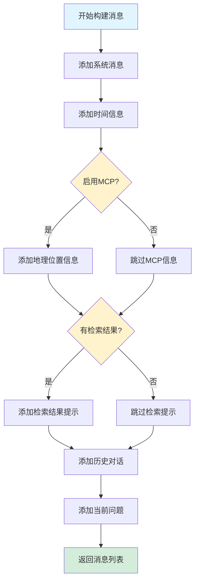
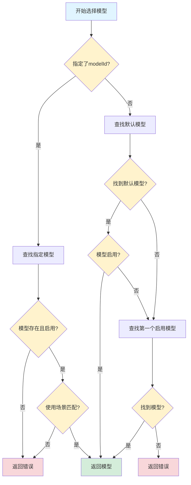

# 智能问答功能设计文档

## 1. 概述

### 1.1 功能简介

智能问答功能是 DifyApp 系统的核心模块之一，提供了基于大语言模型（LLM）的直接对话能力。该功能不依赖知识库，而是直接调用配置的 LLM 模型进行问答，支持流式和非流式两种响应模式。系统集成了 MCP（Model Context Protocol）协议支持，可以实现浏览器检索、时间信息获取、地理位置信息获取等增强功能，同时支持上下文压缩、历史对话管理、自动保存对话记录等特性。

### 1.2 功能目标

- 提供基于 LLM 的智能问答能力
- 支持流式和非流式两种响应模式
- 支持多轮对话和历史上下文管理
- 集成 MCP 协议支持（浏览器检索、时间、地理位置）
- 实现上下文压缩以优化长对话性能
- 自动保存对话历史记录
- 支持多种 LLM 模型提供商（OpenAI、vLLM、Ollama 等）
- 提供 Markdown 格式的格式化回答

### 1.3 适用范围

- 通用智能问答场景
- 编程和技术问题咨询
- 实时信息查询（结合 MCP 浏览器检索）
- 多轮对话场景
- 需要流式响应的交互式应用

## 2. 功能架构

### 2.1 总体架构

智能问答功能采用分层架构设计，包含以下层次：



### 2.2 核心模块

#### 2.2.1 问答处理模块

负责处理用户的问答请求，协调各个子模块完成问答流程。

**主要功能：**
- 接收用户问题
- 获取和验证模型配置
- 构建消息列表（包含历史对话）
- 调用 LLM 生成答案
- 保存对话历史

#### 2.2.2 MCP 集成模块

负责集成 MCP 协议，提供增强功能。

**主要功能：**
- 浏览器检索（网络搜索）
- 时间信息获取
- 地理位置信息获取
- 将 MCP 结果整合到对话上下文

#### 2.2.3 上下文压缩模块

负责压缩长对话历史，优化性能和成本。

**主要功能：**
- 分析对话历史长度
- 应用压缩策略
- 保留关键信息
- 优化 Token 使用

#### 2.2.4 流式响应模块

负责处理流式响应，实现实时输出。

**主要功能：**
- 流式调用 LLM API
- 实时返回 Token
- SSE（Server-Sent Events）格式转换
- 累积完整答案

#### 2.2.5 对话历史管理模块

负责管理对话历史记录。

**主要功能：**
- 创建或获取会话
- 保存用户消息
- 保存助手消息
- 关联会话和消息

## 3. 数据库设计

### 3.1 问答模型表 (QA_MODEL)

智能问答功能使用问答模型表来存储和管理 LLM 模型配置。

**表结构：**

| 字段名 | 类型 | 说明 | 约束 |
|--------|------|------|------|
| id | BIGINT | 主键 | PRIMARY KEY, AUTO_INCREMENT |
| name | VARCHAR(100) | 模型名称 | NOT NULL |
| provider | VARCHAR(20) | 提供商类型（openai, vllm, ollama） | NOT NULL |
| provider_type | VARCHAR(20) | 提供商类型（原始值，用于前端显示） | |
| api_url | VARCHAR(500) | API 地址 | NOT NULL |
| api_key | VARCHAR(500) | API Key | |
| model | VARCHAR(200) | 模型标识 | NOT NULL |
| use_for | VARCHAR(20) | 使用场景（chat-仅智能问答, rag-仅知识库问答, both-两者都使用） | NOT NULL |
| enabled | BOOLEAN | 是否启用 | DEFAULT true |
| is_default | BOOLEAN | 是否默认 | DEFAULT false |
| create_time | TIMESTAMP | 创建时间 | DEFAULT CURRENT_TIMESTAMP |
| update_time | TIMESTAMP | 更新时间 | DEFAULT CURRENT_TIMESTAMP |
| deleted | INTEGER | 是否删除（0-未删除，1-已删除） | DEFAULT 0 |

**索引设计：**
- PRIMARY KEY (id)
- INDEX idx_provider (provider)
- INDEX idx_use_for (use_for)
- INDEX idx_enabled (enabled)
- INDEX idx_is_default (is_default)
- INDEX idx_deleted (deleted)

**说明：**
- 智能问答功能使用 `use_for` 为 `chat` 或 `both` 的模型
- 如果未指定 `modelId`，系统会使用默认模型（`is_default=true`）
- 如果未找到默认模型，会使用第一个启用的模型

### 3.2 对话历史表

智能问答功能使用对话历史表来存储会话和消息记录。详细设计请参考《对话历史管理功能设计文档》。

## 4. API 接口设计

### 4.1 智能问答（非流式）

**接口路径：** `POST /api/chat`

**请求头：**
- `Authorization: Bearer {token}`（必填）

**请求参数：**

```json
{
  "question": "什么是Spring Boot？",
  "conversationId": "123",
  "modelId": 1,
  "enableBrowserSearch": false,
  "history": [
    {
      "role": "user",
      "content": "你好"
    },
    {
      "role": "assistant",
      "content": "你好！有什么可以帮助你的吗？"
    }
  ]
}
```

**参数说明：**
- `question`：用户问题（必填）
- `conversationId`：对话ID（可选，用于多轮对话）
- `modelId`：模型ID（可选，不指定则使用默认模型）
- `enableBrowserSearch`：是否启用浏览器检索（可选，默认 false）
- `history`：对话历史（可选，格式为消息数组）

**响应格式：**

```json
{
  "answer": "Spring Boot是一个基于Spring框架的快速开发框架...",
  "conversationId": 123
}
```

**响应说明：**
- `answer`：AI 生成的答案
- `conversationId`：会话ID（用于后续多轮对话）

### 4.2 智能问答（流式）

**接口路径：** `POST /api/chat/stream`

**请求头：**
- `Authorization: Bearer {token}`（必填）
- `Accept: text/event-stream`

**请求参数：** 同非流式接口

**响应格式：** SSE（Server-Sent Events）格式

```
data: {"answer":"Spring","finished":false,"conversationId":123}

data: {"answer":"Spring Boot","finished":false,"conversationId":123}

data: {"answer":"Spring Boot是一个基于Spring框架的快速开发框架...","finished":true,"conversationId":123}
```

**响应说明：**
- 每个 `data:` 行包含一个 JSON 对象
- `answer`：累积的答案内容（逐步增加）
- `finished`：是否完成（false 表示进行中，true 表示完成）
- `conversationId`：会话ID

## 5. 核心业务流程

### 5.1 非流式问答流程



**流程说明：**

1. **接收请求**：接收用户的问题和可选参数
2. **获取模型**：根据 `modelId` 或默认配置获取问答模型
3. **浏览器检索**：如果启用了 `enableBrowserSearch`，执行网络搜索
4. **构建消息**：构建包含系统消息、历史对话、检索结果和当前问题的消息列表
5. **上下文压缩**：如果对话历史过长，应用压缩策略
6. **调用LLM**：调用 LLM API 生成答案
7. **保存历史**：保存用户问题和AI答案到对话历史
8. **返回结果**：返回答案和会话ID

### 5.2 流式问答流程



**流程说明：**

1. **接收请求**：接收用户的问题和可选参数
2. **获取模型**：根据 `modelId` 或默认配置获取问答模型
3. **浏览器检索**：如果启用了 `enableBrowserSearch`，执行网络搜索
4. **构建消息**：构建包含系统消息、历史对话、检索结果和当前问题的消息列表
5. **上下文压缩**：如果对话历史过长，应用压缩策略
6. **创建会话**：创建或获取会话，并保存用户消息
7. **流式调用**：调用流式 LLM API，实时接收 Token
8. **实时返回**：将每个 Token 转换为 SSE 格式返回给前端
9. **保存答案**：流式完成后，保存完整的助手消息
10. **发送完成**：发送 `finished=true` 的最终响应

### 5.3 消息构建流程



**流程说明：**

1. **系统消息**：添加系统提示，定义 AI 助手的角色和行为
2. **时间信息**：如果启用 MCP，添加当前时间信息（用于时效性判断）
3. **地理位置**：如果启用 MCP，添加地理位置信息
4. **检索结果**：如果有浏览器检索结果，添加到系统消息和用户消息中
5. **历史对话**：将历史对话消息转换为 LangChain4j 消息格式
6. **当前问题**：添加当前用户问题（可能包含检索结果）

### 5.4 模型选择流程



**流程说明：**

1. **检查指定模型**：如果请求中指定了 `modelId`，查找该模型
2. **验证模型**：检查模型是否存在、是否启用、使用场景是否匹配
3. **查找默认模型**：如果未指定模型，查找默认模型（`is_default=true`）
4. **查找备用模型**：如果未找到默认模型，查找第一个启用的模型
5. **返回结果**：返回找到的模型或错误

## 6. 技术实现

### 6.1 LLM 模型集成

**技术选型：** LangChain4j

**实现方式：**

```java
// 创建模型实例
ModelLanguageModelFactory.ChatLanguageModel chatLanguageModel = 
    modelLanguageModelFactory.createChatLanguageModel(qaModel);

// 非流式调用
Response<AiMessage> response = chatLanguageModel.generate(messages);
String answer = response.content().text();

// 流式调用
Flux<String> tokenFlux = streamingChatLanguageModel.generateStream(messages);
```

**支持的提供商：**
- OpenAI（GPT-3.5、GPT-4 等）
- vLLM（本地部署的 LLM）
- Ollama（本地 LLM 服务）

### 6.2 MCP 协议集成

**MCP 服务：**

1. **浏览器检索服务** (`McpBrowserSearchService`)
   - 功能：网络搜索，获取实时信息
   - 使用场景：需要最新信息的问答
   - 结果格式：搜索结果列表（标题、链接、摘要）

2. **时间服务** (`McpTimeService`)
   - 功能：获取当前时间信息
   - 使用场景：时效性判断、时间相关问答
   - 返回信息：年份、日期、时间等

3. **地理位置服务** (`McpLocationService`)
   - 功能：获取地理位置信息
   - 使用场景：地理位置相关问答
   - 返回信息：国家、城市、时区等

**集成方式：**

```java
// 浏览器检索
if (Boolean.TRUE.equals(request.getEnableBrowserSearch())) {
    List<SearchResult> searchResults = 
        mcpBrowserSearchService.search(request.getQuestion(), 5);
    String browserSearchContext = 
        mcpBrowserSearchService.formatSearchResultsForContext(searchResults);
}

// 时间信息
String currentTimeInfo = mcpTimeService.getFormattedTimeInfo();

// 地理位置信息
String locationInfo = mcpLocationService.getFormattedLocationInfo();
```

### 6.3 上下文压缩

**技术选型：** ContextCompressionService

**压缩策略：**
- 分析对话历史长度
- 如果超过阈值，应用压缩策略
- 保留关键信息（最近对话、重要上下文）
- 优化 Token 使用

**实现方式：**

```java
// 转换为知识库问答请求格式（复用压缩逻辑）
KnowledgeBaseQARequest kbRequest = convertToKBQARequest(request);
messages = contextCompressionService.compressContext(messages, kbRequest);
```

### 6.4 流式响应

**技术选型：** Spring WebFlux + SSE（Server-Sent Events）

**实现方式：**

```java
// 流式调用
Flux<String> tokenFlux = streamingChatLanguageModel.generateStream(messages);

// 累积答案
return tokenFlux
    .scan("", (accumulated, token) -> accumulated + token)
    .skip(1)
    .map(fullAnswer -> {
        ChatResponse response = new ChatResponse();
        response.setAnswer(fullAnswer);
        response.setFinished(false);
        return response;
    })
    .concatWith(Flux.defer(() -> {
        // 发送完成标记
        ChatResponse finalResponse = new ChatResponse();
        finalResponse.setFinished(true);
        return Flux.just(finalResponse);
    }));
```

**SSE 格式转换：**

```java
return responseFlux
    .map(response -> {
        String json = objectMapper.writeValueAsString(response);
        return ServerSentEvent.<String>builder()
            .data(json)
            .build();
    });
```

### 6.5 对话历史管理

**实现方式：**

```java
// 创建或获取会话
Long conversationId = chatHistoryService.getOrCreateConversation(
    userId, requestConversationId, 1, null, null, request.getQuestion());

// 保存用户消息
chatHistoryService.saveMessage(conversationId, "user", request.getQuestion());

// 保存助手消息
chatHistoryService.saveMessage(conversationId, "assistant", answer);
```

**会话类型：**
- `type=1`：智能问答会话（不使用知识库）

### 6.6 系统提示词设计

**系统消息内容：**

1. **角色定义**：定义 AI 助手的角色和能力
2. **时间信息**：提供当前时间信息（用于时效性判断）
3. **地理位置信息**：提供地理位置信息（如果启用 MCP）
4. **检索结果提示**：如果有检索结果，提示 AI 使用检索结果
5. **格式要求**：要求使用 Markdown 格式，包括：
   - 代码块必须包含语言标识符
   - 数学公式使用 LaTeX 格式
   - 使用标题、列表、表格等组织内容

**示例系统消息：**

```
你是一个专业的AI助手，能够回答各种问题，特别擅长编程和技术问题。

【当前时间信息】
当前年份：2024年

【重要提示】当用户问题中包含网络搜索结果时，你必须：
1. 优先使用搜索结果中的信息来回答问题
2. 在回答中明确引用搜索结果中的内容，并标注来源链接
...

重要：请使用Markdown格式来组织你的回答...
```

## 7. 配置说明

### 7.1 模型配置

**配置位置：** 数据库 `QA_MODEL` 表

**关键配置项：**
- `provider`：提供商类型（openai, vllm, ollama）
- `api_url`：API 地址
- `api_key`：API Key
- `model`：模型标识
- `use_for`：使用场景（chat, rag, both）
- `enabled`：是否启用
- `is_default`：是否默认

### 7.2 MCP 配置

**浏览器检索配置：**
- 启用方式：请求参数 `enableBrowserSearch=true`
- 检索数量：默认 5 个结果
- 结果格式：标题、链接、摘要

**时间服务配置：**
- 自动启用（如果启用浏览器检索）
- 返回格式：年份、日期、时间

**地理位置服务配置：**
- 自动启用（如果启用浏览器检索）
- 返回格式：国家、城市、时区

### 7.3 上下文压缩配置

**压缩策略：**
- 阈值：可配置（默认根据模型 Token 限制）
- 保留策略：保留最近对话和关键上下文
- 压缩算法：基于 LangChain4j 的压缩实现

## 8. 错误处理

### 8.1 模型相关错误

**错误类型：**
- 模型不存在
- 模型未启用
- 模型使用场景不匹配
- API 调用失败

**处理方式：**
- 返回明确的错误信息
- 记录错误日志
- 提供降级方案（使用默认模型）

### 8.2 MCP 相关错误

**错误类型：**
- 浏览器检索失败
- 时间服务失败
- 地理位置服务失败

**处理方式：**
- 不抛出异常，继续使用原始问题
- 记录警告日志
- 不影响主流程

### 8.3 流式响应错误

**错误类型：**
- Token 流中断
- 序列化失败
- 网络错误

**处理方式：**
- 发送错误响应
- 标记 `finished=true`
- 记录错误日志

## 9. 性能优化

### 9.1 上下文压缩

**优化策略：**
- 自动压缩长对话历史
- 保留关键信息
- 减少 Token 使用

### 9.2 流式响应

**优化策略：**
- 实时返回 Token，提升用户体验
- 使用响应式编程（Reactor）
- 异步处理，不阻塞请求

### 9.3 模型选择

**优化策略：**
- 缓存模型配置
- 快速查找默认模型
- 支持模型热切换

## 10. 安全设计

### 10.1 认证授权

**安全措施：**
- JWT Token 验证
- 用户身份验证
- 权限检查

### 10.2 API Key 安全

**安全措施：**
- API Key 加密存储
- 不在日志中输出敏感信息
- 支持 API Key 轮换

### 10.3 输入验证

**安全措施：**
- 问题内容验证
- 参数类型验证
- 防止注入攻击

## 11. 监控和日志

### 11.1 日志记录

**关键操作日志：**
- 问答请求日志（问题内容）
- 模型选择日志
- MCP 服务调用日志
- 流式响应日志
- 错误日志

**日志级别：**
- INFO：正常操作日志
- DEBUG：详细调试日志
- WARN：警告日志（MCP 服务失败等）
- ERROR：错误日志

### 11.2 性能监控

**监控指标：**
- 问答响应时间
- 流式响应延迟
- 模型调用成功率
- MCP 服务调用成功率
- Token 使用量

## 12. 使用示例

### 12.1 简单问答

**请求示例：**
```json
POST /api/chat
{
  "question": "什么是Spring Boot？"
}
```

**响应示例：**
```json
{
  "answer": "Spring Boot是一个基于Spring框架的快速开发框架...",
  "conversationId": 123
}
```

### 12.2 多轮对话

**请求示例：**
```json
POST /api/chat
{
  "question": "它有什么优势？",
  "conversationId": "123",
  "history": [
    {
      "role": "user",
      "content": "什么是Spring Boot？"
    },
    {
      "role": "assistant",
      "content": "Spring Boot是一个基于Spring框架的快速开发框架..."
    }
  ]
}
```

### 12.3 启用浏览器检索

**请求示例：**
```json
POST /api/chat
{
  "question": "2024年最新的AI技术有哪些？",
  "enableBrowserSearch": true
}
```

### 12.4 流式响应

**请求示例：**
```json
POST /api/chat/stream
{
  "question": "请详细解释一下RESTful API的设计原则"
}
```

**响应示例（SSE 格式）：**
```
data: {"answer":"RESTful","finished":false,"conversationId":123}

data: {"answer":"RESTful API","finished":false,"conversationId":123}

data: {"answer":"RESTful API的设计原则包括：\n\n1. **统一接口**...","finished":true,"conversationId":123}
```

## 13. 常见问题

### Q1: 如何选择使用的模型？

**A**: 
1. 如果请求中指定了 `modelId`，使用指定的模型
2. 如果未指定，使用默认模型（`is_default=true`）
3. 如果未找到默认模型，使用第一个启用的模型（`use_for` 为 `chat` 或 `both`）

### Q2: 如何启用浏览器检索？

**A**: 在请求中设置 `enableBrowserSearch=true`，系统会自动执行网络搜索并将结果整合到对话中。

### Q3: 流式响应和非流式响应有什么区别？

**A**: 
- **非流式响应**：等待 LLM 生成完整答案后一次性返回
- **流式响应**：实时返回每个 Token，提供更好的用户体验

### Q4: 对话历史如何管理？

**A**: 
- 系统会自动保存对话历史
- 使用 `conversationId` 关联多轮对话
- 可以通过对话历史管理接口查询和管理历史记录

### Q5: 如何控制回答的格式？

**A**: 系统会自动要求 LLM 使用 Markdown 格式回答，包括代码块、数学公式、列表、表格等。

### Q6: 上下文压缩是如何工作的？

**A**: 
- 当对话历史过长时，系统会自动应用压缩策略
- 保留最近对话和关键上下文
- 优化 Token 使用，提升性能和降低成本

### Q7: MCP 服务失败会影响问答吗？

**A**: 不会。MCP 服务失败不会影响主流程，系统会继续使用原始问题调用 LLM。

### Q8: 如何查看对话历史？

**A**: 可以通过对话历史管理接口（`/api/chat/history`）查询和管理对话历史。

## 14. 未来规划

### 14.1 功能增强

- 支持更多 MCP 服务（文件操作、数据库查询等）
- 支持多模态输入（图片、音频等）
- 支持函数调用（Function Calling）
- 支持工具使用（Tools）
- 支持自定义系统提示词
- 支持回答质量评估

### 14.2 性能优化

- 优化上下文压缩算法
- 实现更智能的 Token 管理
- 支持模型缓存和预热
- 优化流式响应性能

### 14.3 安全增强

- 支持内容过滤和审核
- 支持速率限制
- 支持用户配额管理
- 支持敏感信息检测