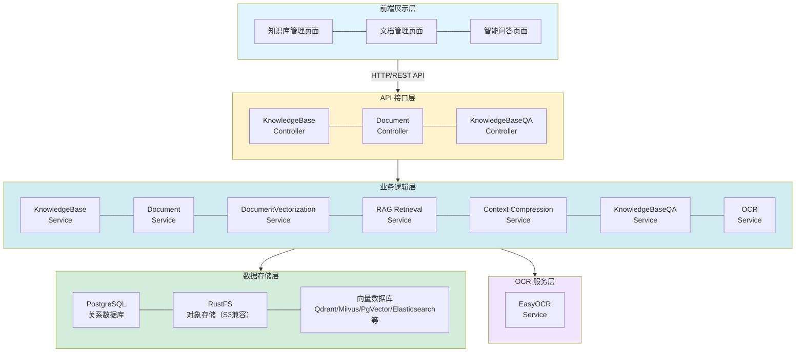
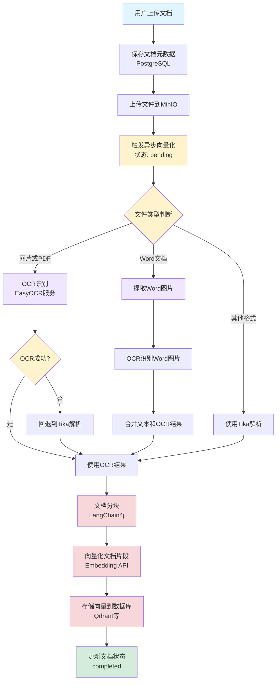
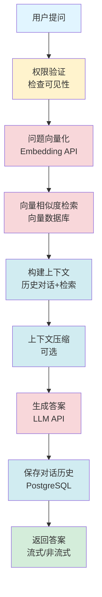
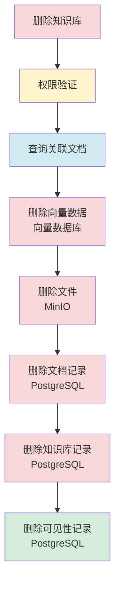

# 知识库功能设计文档

## 1. 概述

### 1.1 功能简介

知识库功能是 DifyApp 系统的核心模块之一，提供了完整的知识库管理、文档管理、文档向量化和基于 RAG（检索增强生成）的智能问答能力。该功能支持多种文档格式，集成了多种向量数据库，实现了从文档上传到智能问答的完整流程。此外，系统还集成了 OCR（光学字符识别）服务，支持对图片文件和PDF文件进行文字识别，以及对Word文档中的图片进行OCR识别，从而实现对非文本文档的完整处理。

### 1.2 功能目标

- 提供知识库的完整生命周期管理（创建、编辑、删除、查询）
- 支持多种文档格式的上传、管理和下载
- 实现文档的自动解析、分块和向量化处理
- 提供基于向量检索的智能问答功能
- 支持流式和非流式两种问答模式
- 实现细粒度的权限控制和多租户隔离
- 支持多种向量数据库（Qdrant、FAISS、Milvus、Chroma、Weaviate、PgVector、Elasticsearch）
- 集成 OCR 服务，支持图片文件和PDF文件的文字识别
- 支持 Word 文档中图片的 OCR 识别，实现完整文档内容提取

### 1.3 适用范围

- 企业内部知识库管理系统
- 智能问答系统
- 文档检索和分析系统
- 多租户知识库平台

## 2. 功能架构

### 2.1 总体架构

知识库功能采用分层架构设计，包含以下层次：



### 2.2 核心模块

#### 2.2.1 知识库管理模块

负责知识库的创建、编辑、删除、查询等基础管理功能。

**主要功能：**
- 创建知识库（支持配置向量化模型、向量存储、Top-K 等参数）
- 编辑知识库信息
- 删除知识库（级联删除关联文档和向量数据）
- 查询知识库列表（支持分页、搜索、筛选）
- 获取知识库详情
- **生成知识库摘要**：利用 LLM 自动生成知识库的简洁摘要，概括核心内容
- 权限验证和可见性控制

#### 2.2.2 文档管理模块

负责文档的上传、删除、查询、下载等管理功能。

**主要功能：**
- 文档上传（支持 PDF, DOC, DOCX, TXT, MD, XLS, XLSX, PPT, PPTX, 图片等格式）
- 文档删除（同步删除向量数据）
- 文档列表查询（支持分页、关键词搜索、状态过滤）
- 文档详情查询
- 文档下载
- 文档重新向量化
- 图片文件和PDF文件的OCR识别
- Word文档中图片的OCR识别和内容合并

#### 2.2.3 文档向量化模块

负责文档的解析、分块、向量化和存储。

**主要功能：**
- 文档解析（使用 Apache Tika）
- OCR 识别（图片文件、PDF文件、Word文档中的图片）
- 文档分块（可配置分块大小和重叠）
- 文档向量化（调用 Embedding API）
- 向量存储（存储到向量数据库）
- 异步处理机制
- 状态管理（pending/processing/completed/failed）

#### 2.2.6 OCR 处理模块

负责图片和PDF文件的文字识别，以及Word文档中图片的识别。

**主要功能：**
- 图片文件OCR识别（PNG、JPEG、JPG、GIF、BMP等）
- PDF文件OCR识别（将PDF页面转换为图片后识别）
- Word文档中图片的提取和OCR识别
- OCR结果与文本内容的合并
- OCR服务健康检查和错误处理
- 支持OCR失败时回退到Tika解析

#### 2.2.4 RAG 问答模块

基于检索增强生成技术，实现智能问答功能。

**主要功能：**
- 问题向量化
- 向量相似度检索
- 上下文构建
- 答案生成（支持流式和非流式）
- 历史对话管理
- 上下文压缩

#### 2.2.5 权限管理模块

负责知识库的可见性控制和权限验证。

**主要功能：**
- 知识库可见性设置（公开/私有）
- 用户权限验证
- 多租户隔离

## 3. 数据库设计

### 3.1 知识库表 (KNOWLEDGE_BASE)

**表结构：**

| 字段名 | 类型 | 说明 | 约束 |
|--------|------|------|------|
| id | BIGINT | 主键 | PRIMARY KEY, AUTO_INCREMENT |
| name | VARCHAR(255) | 知识库名称 | NOT NULL |
| description | TEXT | 描述 | |
| tenant_id | BIGINT | 租户ID | |
| status | INTEGER | 状态（0-禁用，1-启用） | DEFAULT 1 |
| is_public | BOOLEAN | 是否公开 | DEFAULT false |
| embedding_model_id | BIGINT | 向量化模型ID | |
| top_k | INTEGER | Top-K检索数量 | |
| vector_store_type | VARCHAR(50) | 向量存储类型 | |
| vector_database_id | BIGINT | 向量数据库实例ID | |
| creator_id | BIGINT | 创建者ID | |
| created_time | TIMESTAMP | 创建时间 | DEFAULT CURRENT_TIMESTAMP |
| updated_time | TIMESTAMP | 更新时间 | DEFAULT CURRENT_TIMESTAMP ON UPDATE CURRENT_TIMESTAMP |

**索引设计：**
- PRIMARY KEY (id)
- INDEX idx_tenant_id (tenant_id)
- INDEX idx_status (status)
- INDEX idx_creator_id (creator_id)
- INDEX idx_vector_store_type (vector_store_type)

### 3.2 知识库文档表 (KNOWLEDGE_BASE_DOCUMENT)

**表结构：**

| 字段名 | 类型 | 说明 | 约束 |
|--------|------|------|------|
| id | BIGINT | 主键 | PRIMARY KEY, AUTO_INCREMENT |
| knowledge_base_id | BIGINT | 知识库ID | NOT NULL, FOREIGN KEY |
| original_file_name | VARCHAR(255) | 原始文件名 | NOT NULL |
| stored_file_name | VARCHAR(255) | 存储文件名 | NOT NULL |
| file_path | VARCHAR(500) | 文件存储路径 | |
| file_size | BIGINT | 文件大小（字节） | |
| file_type | VARCHAR(50) | 文件类型 | |
| mime_type | VARCHAR(100) | MIME类型 | |
| vectorized_status | INTEGER | 向量化状态（0-待处理，1-处理中，2-已完成，3-失败） | DEFAULT 0 |
| vectorized_error | TEXT | 向量化错误信息 | |
| upload_user | BIGINT | 上传用户ID | |
| upload_time | TIMESTAMP | 上传时间 | DEFAULT CURRENT_TIMESTAMP |
| created_time | TIMESTAMP | 创建时间 | DEFAULT CURRENT_TIMESTAMP |
| updated_time | TIMESTAMP | 更新时间 | DEFAULT CURRENT_TIMESTAMP ON UPDATE CURRENT_TIMESTAMP |

**索引设计：**
- PRIMARY KEY (id)
- INDEX idx_knowledge_base_id (knowledge_base_id)
- INDEX idx_vectorized_status (vectorized_status)
- INDEX idx_upload_user (upload_user)
- FOREIGN KEY (knowledge_base_id) REFERENCES KNOWLEDGE_BASE(id) ON DELETE CASCADE

### 3.3 用户知识库可见性表 (USER_KNOWLEDGE_BASE_VISIBILITY)

**表结构：**

| 字段名 | 类型 | 说明 | 约束 |
|--------|------|------|------|
| id | BIGINT | 主键 | PRIMARY KEY, AUTO_INCREMENT |
| user_id | BIGINT | 用户ID | NOT NULL, FOREIGN KEY |
| knowledge_base_id | BIGINT | 知识库ID | NOT NULL, FOREIGN KEY |
| visible | BOOLEAN | 是否可见 | DEFAULT true |
| created_time | TIMESTAMP | 创建时间 | DEFAULT CURRENT_TIMESTAMP |
| updated_time | TIMESTAMP | 更新时间 | DEFAULT CURRENT_TIMESTAMP ON UPDATE CURRENT_TIMESTAMP |

**索引设计：**
- PRIMARY KEY (id)
- UNIQUE KEY uk_user_kb (user_id, knowledge_base_id)
- INDEX idx_user_id (user_id)
- INDEX idx_knowledge_base_id (knowledge_base_id)
- FOREIGN KEY (user_id) REFERENCES SYS_USER(id) ON DELETE CASCADE
- FOREIGN KEY (knowledge_base_id) REFERENCES KNOWLEDGE_BASE(id) ON DELETE CASCADE

## 4. API 接口设计

### 4.1 知识库管理接口

#### 4.1.1 创建知识库

**接口路径：** `POST /api/knowledge-bases`

**请求参数：**

```json
{
  "name": "知识库名称",
  "description": "知识库描述",
  "status": 1,
  "isPublic": false,
  "embeddingModelId": 1,
  "topK": 5,
  "vectorStoreType": "qdrant",
  "vectorDatabaseId": 1
}
```

**响应格式：**

```json
{
  "id": 1,
  "name": "知识库名称",
  "description": "知识库描述",
  "status": 1,
  "isPublic": false,
  "embeddingModelId": 1,
  "topK": 5,
  "vectorStoreType": "qdrant",
  "vectorDatabaseId": 1,
  "documentCount": 0,
  "createTime": "2024-01-01T00:00:00"
}
```

#### 4.1.2 更新知识库

**接口路径：** `PUT /api/knowledge-bases/{id}`

**请求参数：** 同创建接口

**响应格式：** 同创建接口

#### 4.1.3 删除知识库

**接口路径：** `DELETE /api/knowledge-bases/{id}`

**响应格式：** 204 No Content

#### 4.1.4 获取知识库列表

**接口路径：** `GET /api/knowledge-bases`

**查询参数：**
- `page`: 页码（从1开始）
- `pageSize`: 每页大小
- `keyword`: 搜索关键词
- `status`: 状态筛选
- `vectorStoreType`: 向量存储类型筛选

**响应格式：**

```json
{
  "content": [
    {
      "id": 1,
      "name": "知识库名称",
      "description": "知识库描述",
      "status": 1,
      "documentCount": 10,
      "createTime": "2024-01-01T00:00:00"
    }
  ],
  "total": 100,
  "page": 1,
  "pageSize": 10
}
```

#### 4.1.5 获取知识库详情

**接口路径：** `GET /api/knowledge-bases/{id}`

**响应格式：** 同创建接口

### 4.2 文档管理接口

#### 4.2.1 上传文档

**接口路径：** `POST /api/knowledge-bases/{kbId}/documents/upload`

**请求方式：** `multipart/form-data`

**请求参数：**
- `file`: 文件（必填）
- `uploadUser`: 上传用户（可选）
- `tenantId`: 租户ID（可选）

**响应格式：**

```json
{
  "id": 1,
  "knowledgeBaseId": 1,
  "originalFileName": "document.pdf",
  "fileSize": 1024000,
  "fileType": "pdf",
  "mimeType": "application/pdf",
  "vectorizedStatus": 0,
  "uploadTime": "2024-01-01T00:00:00"
}
```

#### 4.2.2 删除文档

**接口路径：** `DELETE /api/knowledge-bases/{kbId}/documents/{docId}`

**响应格式：** 204 No Content

#### 4.2.3 获取文档列表

**接口路径：** `GET /api/knowledge-bases/{kbId}/documents`

**响应格式：**

```json
[
  {
    "id": 1,
    "originalFileName": "document.pdf",
    "fileSize": 1024000,
    "fileType": "pdf",
    "vectorizedStatus": 2,
    "uploadTime": "2024-01-01T00:00:00"
  }
]
```

#### 4.2.4 获取文档详情

**接口路径：** `GET /api/knowledge-bases/{kbId}/documents/{docId}`

**响应格式：** 同上传接口

#### 4.2.5 下载文档

**接口路径：** `GET /api/knowledge-bases/{kbId}/documents/{docId}/download`

**响应格式：** 文件流

#### 4.2.6 重新向量化文档

**接口路径：** `POST /api/knowledge-bases/{kbId}/documents/{docId}/reindex`

**响应格式：** 204 No Content

### 4.3 知识库问答接口

#### 4.3.1 非流式问答

**接口路径：** `POST /api/knowledge-bases/{kbId}/qa`

**请求参数：**

```json
{
  "question": "问题内容",
  "conversationId": "会话ID（可选）",
  "history": [
    {
      "role": "user",
      "content": "历史问题"
    },
    {
      "role": "assistant",
      "content": "历史回答"
    }
  ]
}
```

**响应格式：**

```json
{
  "answer": "答案内容",
  "sources": [
    {
      "documentId": 1,
      "documentName": "document.pdf",
      "chunkIndex": 0,
      "content": "相关文档片段",
      "score": 0.95
    }
  ],
  "conversationId": "会话ID"
}
```

#### 4.3.2 流式问答

**接口路径：** `POST /api/knowledge-bases/{kbId}/qa/stream`

**请求参数：** 同非流式问答

**响应格式：** Server-Sent Events (SSE)

```
data: {"answer":"答案片段","finished":false,"sources":[]}

data: {"answer":"答案片段","finished":false,"sources":[]}

data: {"answer":"答案片段","finished":true,"sources":[...]}
```

## 5. 核心业务流程

### 5.1 文档上传和向量化流程



**流程说明：**

1. **文档上传**：用户通过前端上传文档，后端接收文件并保存文档元数据到 PostgreSQL
2. **文件存储**：将文件上传到 MinIO 对象存储服务
3. **异步向量化**：触发异步向量化任务，更新文档状态为 `pending`
4. **文件类型判断**：根据文件类型选择处理方式
   - **图片文件**：使用 OCR 服务识别图片中的文字
   - **PDF文件**：将PDF页面转换为图片后使用 OCR 识别
   - **Word文档**：提取文档中的图片，对图片进行 OCR 识别，然后与文本内容合并
   - **其他格式**：使用 Apache Tika 解析文档内容
5. **OCR处理**：调用 EasyOCR 服务进行文字识别
   - 如果 OCR 成功，使用 OCR 结果作为文档内容
   - 如果 OCR 失败，回退到 Tika 解析（PDF可能包含文本层）
6. **文档分块**：使用 LangChain4j 将文档内容分割成多个文本片段（chunks）
7. **向量化**：调用 Embedding API 将文本片段转换为向量
8. **向量存储**：将向量存储到向量数据库（Qdrant、FAISS 等）
9. **状态更新**：更新文档状态为 `completed`

**异常处理：**

- 如果 OCR 服务不可用，自动回退到 Tika 解析
- 如果文档解析失败，更新状态为 `failed`，记录错误信息
- 如果向量化失败，更新状态为 `failed`，记录错误信息
- 支持重新向量化功能，删除旧向量后重新处理

### 5.2 RAG 问答流程



**流程说明：**

1. **权限验证**：检查用户是否有权限访问该知识库
2. **问题向量化**：将用户问题转换为向量
3. **向量检索**：在向量数据库中检索最相关的文档片段（Top-K）
4. **上下文构建**：将检索到的文档片段和历史对话组合成上下文
5. **上下文压缩**：如果上下文过长，应用压缩策略（滑动窗口、总结等）
6. **答案生成**：调用 LLM API 生成答案
7. **历史保存**：保存用户问题和助手回答到对话历史
8. **返回结果**：返回答案和相关文档来源

**检索策略：**

- **Top-K 检索**：返回最相关的 K 个文档片段（K 可配置）
- **相似度阈值**：可设置相似度阈值，过滤低相关性结果
- **知识库级别配置**：每个知识库可配置独立的 Top-K 值

### 5.3 知识库删除流程



**流程说明：**

1. **权限验证**：检查用户是否有权限删除该知识库
2. **查询关联文档**：查询知识库下的所有文档
3. **删除向量数据**：从向量数据库中删除所有相关向量
4. **删除文件**：从 MinIO 中删除所有文档文件
5. **删除文档记录**：删除 PostgreSQL 中的文档记录
6. **删除知识库记录**：删除知识库记录
7. **删除可见性记录**：删除用户可见性记录

## 6. 技术实现

### 6.1 文档解析

**技术选型：** Apache Tika + OCR 服务（EasyOCR）

**支持格式：**
- PDF（.pdf）- 支持OCR识别和文本层解析
- Word（.doc, .docx）- 支持文本提取和图片OCR识别
- 文本文件（.txt）
- Markdown（.md）
- Excel（.xls, .xlsx）
- PowerPoint（.ppt, .pptx）
- HTML（.html）
- 图片文件（.png, .jpg, .jpeg, .gif, .bmp等）- 使用OCR识别

**实现方式：**

```java
// 对于图片文件和PDF文件，优先使用OCR
if (isImage || isPdf) {
    String ocrText = ocrService.recognizeImage(file);
    if (ocrText != null && !ocrText.trim().isEmpty()) {
        return ocrText.trim();
    }
    // OCR失败时回退到Tika解析
}

// 对于Word文档，提取图片并进行OCR
if (isWordDoc) {
    List<String> ocrTexts = extractAndOcrImagesFromWord(file);
    String textContent = tika.parseToString(inputStream);
    // 合并文本内容和OCR结果
    return mergeTextAndOcr(textContent, ocrTexts);
}

// 其他格式使用Tika解析
String content = tika.parseToString(inputStream);
```

### 6.1.1 OCR 服务

**技术选型：** EasyOCR（基于Python的OCR服务）

**功能特性：**
- 支持多种图片格式（PNG、JPEG、JPG、GIF、BMP等）
- 支持PDF文件识别（将PDF页面转换为图片后识别）
- 支持多语言识别
- 支持批量图片识别
- 提供健康检查接口

**实现方式：**

```java
// OCR服务接口
public interface OcrService {
    String recognizeImage(MultipartFile imageFile) throws Exception;
    List<String> recognizeImages(List<MultipartFile> imageFiles) throws Exception;
    boolean isServiceAvailable();
}

// 调用OCR服务
String ocrText = ocrService.recognizeImage(file);
```

**OCR处理流程：**
1. 检查OCR服务是否可用
2. 对于PDF文件，将PDF页面转换为图片（使用PyMuPDF）
3. 调用EasyOCR服务进行文字识别
4. 返回识别结果
5. 如果OCR失败，回退到Tika解析

**Word文档图片OCR处理：**
1. 使用Apache POI提取Word文档中的图片
2. 对每张图片调用OCR服务进行识别
3. 将OCR结果与文档文本内容合并
4. 返回完整的文档内容

### 6.2 文档分块

**技术选型：** LangChain4j

**分块策略：**
- **分块大小**：可配置（默认 500 字符）
- **重叠大小**：可配置（默认 50 字符）
- **分块方法**：递归字符文本分割器

**实现方式：**

```java
DocumentSplitter documentSplitter = new ConfigurableDocumentSplitter(
    chunkSize,  // 分块大小
    chunkOverlap  // 重叠大小
);
List<TextSegment> segments = documentSplitter.split(document);
```

### 6.3 向量化

**技术选型：** LangChain4j + Embedding API

**支持的 Embedding 提供商：**
- OpenAI 兼容 API
- Ollama
- VLLM

**实现方式：**

```java
EmbeddingModel embeddingModel = customEmbeddingModel;
List<Embedding> embeddings = embeddingModel.embedAll(segments).content();
```

### 6.4 向量存储

**技术选型：** 支持多种向量数据库

**支持的向量数据库：**
- **Qdrant**：分布式向量数据库，适合生产环境
- **FAISS**：本地文件存储，无需额外服务，适合开发测试
- **Milvus**：开源向量数据库，支持大规模向量检索
- **Chroma**：轻量级向量数据库，易于部署
- **Weaviate**：支持 GraphQL 和 REST API
- **PgVector**：PostgreSQL 扩展，支持向量存储和检索
- **Elasticsearch**：企业级分布式搜索和分析引擎

**实现方式：**

```java
EmbeddingStore<TextSegment> embeddingStore = 
    vectorStoreFactory.createEmbeddingStore(knowledgeBaseId);
embeddingStore.addAll(embeddings, segments);
```

### 6.5 向量检索

**检索算法：**
- **相似度计算**：余弦相似度
- **Top-K 选择**：返回最相关的 K 个结果
- **阈值过滤**：可设置相似度阈值

**实现方式：**

```java
List<EmbeddingMatch<TextSegment>> matches = 
    embeddingStore.findRelevant(queryEmbedding, topK, minScore);
```

### 6.6 答案生成

**技术选型：** LangChain4j + LLM API

**支持的 LLM 提供商：**
- OpenAI 兼容 API
- Ollama
- VLLM

**实现方式：**

```java
// 非流式
String answer = chatLanguageModel.generate(messages);

// 流式
StreamingChatLanguageModel streamingModel = customStreamingChatLanguageModel;
Flux<String> answerStream = streamingModel.generateStream(messages);
```

### 6.7 上下文压缩

**压缩策略：**
- **滑动窗口**：保留最近的 N 条消息
- **总结策略**：将历史对话总结为一条消息
- **混合策略**：结合滑动窗口和总结

**实现方式：**

```java
List<ChatMessage> compressedMessages = 
    contextCompressionService.compressContext(messages, request);
```

## 7. 配置管理

### 7.1 知识库配置

**配置项：**
- `embeddingModelId`：向量化模型ID（可选，不设置则使用系统默认）
- `topK`：Top-K 检索数量（可选，不设置则使用系统全局配置）
- `vectorStoreType`：向量存储类型（必填）
- `vectorDatabaseId`：向量数据库实例ID（可选）

### 7.2 文档分块配置

**全局配置（application.yml）：**

```yaml
rag:
  chunk:
    size: 500        # 分块大小（字符数）
    overlap: 50      # 重叠大小（字符数）
```

### 7.3 检索配置

**全局配置（application.yml）：**

```yaml
rag:
  retrieval:
    topK: 5                    # 默认 Top-K 值
    minScore: 0.0             # 最小相似度阈值
```

### 7.4 上下文压缩配置

**全局配置（application.yml）：**

```yaml
rag:
  context-compression:
    enabled: true              # 是否启用上下文压缩
    strategy: sliding-window   # 压缩策略（sliding-window/summary/hybrid）
    maxMessages: 10            # 最大消息数（滑动窗口）
    maxTokens: 2000           # 最大Token数
```

### 7.5 OCR 服务配置

**配置位置：** 数据库 `SYSTEM_CONFIG` 表

**配置项：**
- `ocr.service.url`：OCR服务地址（如：http://localhost:8000）
- `ocr.service.timeout`：OCR服务请求超时时间（毫秒，默认：30000）

**配置说明：**
- OCR服务地址需要在系统配置中设置
- 如果OCR服务不可用，系统会自动回退到Tika解析
- 支持动态更新OCR配置，无需重启服务

**初始化SQL：**
```sql
INSERT INTO SYSTEM_CONFIG (config_key, config_value, description, category)
VALUES 
  ('ocr.service.url', 'http://localhost:8000', 'EasyOCR服务地址', 'ocr'),
  ('ocr.service.timeout', '30000', 'EasyOCR服务请求超时时间（毫秒）', 'ocr');
```

## 8. 权限控制

### 8.1 知识库可见性

**可见性类型：**
- **公开（isPublic=true）**：所有用户都可以访问
- **私有（isPublic=false）**：只有创建者和被授权的用户可以访问

**权限验证逻辑：**

1. 管理员可以访问所有知识库
2. 知识库创建者可以访问自己创建的知识库
3. 公开知识库所有用户都可以访问
4. 私有知识库需要检查用户可见性表

### 8.2 用户可见性管理

**管理方式：**
- 通过 `USER_KNOWLEDGE_BASE_VISIBILITY` 表管理
- 管理员可以设置用户对知识库的可见性
- 支持批量设置用户可见性

## 9. 性能优化

### 9.1 异步处理

**文档向量化：**
- 使用 `@Async` 注解实现异步处理
- 避免阻塞主线程
- 支持并发处理多个文档

### 9.2 批量操作

**向量存储：**
- 批量存储向量，减少数据库交互次数
- 使用批量插入提高性能

### 9.3 缓存策略

**知识库配置缓存：**
- 缓存知识库配置信息
- 减少数据库查询次数

### 9.4 索引优化

**数据库索引：**
- 在常用查询字段上建立索引
- 优化查询性能

## 10. 错误处理

### 10.1 文档上传错误

**错误类型：**
- 文件格式不支持
- 文件大小超限
- 文件损坏

**处理方式：**
- 返回明确的错误信息
- 记录错误日志

### 10.2 向量化错误

**错误类型：**
- 文档解析失败
- OCR识别失败
- 向量化 API 调用失败
- 向量存储失败

**处理方式：**
- OCR识别失败时，自动回退到Tika解析
- 文档解析失败时，更新文档状态为 `failed`
- 记录错误信息到 `vectorized_error` 字段
- 支持重新向量化

### 10.4 OCR 服务错误

**错误类型：**
- OCR服务不可用
- OCR识别超时
- OCR识别失败
- 图片格式不支持

**处理方式：**
- OCR服务不可用时，自动回退到Tika解析
- OCR识别超时时，记录警告日志并回退到Tika解析
- OCR识别失败时，记录错误日志并回退到Tika解析
- 不支持的图片格式时，返回明确的错误信息

### 10.3 问答错误

**错误类型：**
- 权限验证失败
- 向量检索失败
- LLM API 调用失败

**处理方式：**
- 返回友好的错误提示
- 记录错误日志
- 支持重试机制

## 11. 监控和日志

### 11.1 日志记录

**关键操作日志：**
- 文档上传日志
- OCR识别日志（图片文件、PDF文件、Word文档图片）
- 向量化过程日志
- 问答请求日志
- 错误日志

**日志级别：**
- INFO：正常操作日志（包括OCR识别成功日志）
- WARN：警告日志（包括OCR服务不可用、OCR识别失败等）
- ERROR：错误日志
- DEBUG：调试日志（包括OCR服务调用详情）

### 11.2 性能监控

**监控指标：**
- 文档上传耗时
- OCR识别耗时（图片、PDF、Word图片）
- 向量化耗时
- 问答响应时间
- 向量检索耗时
- OCR服务可用性

## 12. 扩展性设计

### 12.1 向量数据库扩展

**扩展方式：**
- 通过 `VectorStoreFactory` 接口实现新的向量数据库支持
- 实现 `EmbeddingStore` 接口
- 配置向量数据库连接信息

### 12.2 Embedding 模型扩展

**扩展方式：**
- 实现 `EmbeddingModel` 接口
- 配置 Embedding API 连接信息
- 支持多种 Embedding 提供商

### 12.3 LLM 模型扩展

**扩展方式：**
- 实现 `ChatLanguageModel` 接口
- 实现 `StreamingChatLanguageModel` 接口
- 配置 LLM API 连接信息

## 13. 安全设计

### 13.1 文件上传安全

**安全措施：**
- 文件类型验证
- 文件大小限制
- 文件名安全处理
- 防止路径遍历攻击

### 13.2 权限控制

**安全措施：**
- JWT Token 验证
- 角色权限验证
- 资源可见性控制
- 多租户隔离

### 13.3 数据安全

**安全措施：**
- 敏感信息加密存储
- SQL 注入防护
- XSS 防护
- CSRF 防护

## 14. 测试策略

### 14.1 单元测试

**测试范围：**
- Service 层业务逻辑
- Repository 层数据访问
- 工具类功能

### 14.2 集成测试

**测试范围：**
- API 接口测试
- 数据库集成测试
- 外部服务集成测试

### 14.3 性能测试

**测试内容：**
- 文档上传性能
- 向量化性能
- 问答响应性能
- 并发性能

## 15. 部署说明

### 15.1 依赖服务

**必需服务：**
- PostgreSQL 15（关系数据库）
- MinIO（对象存储）
- 向量数据库（Qdrant/FAISS/Milvus/Chroma/Weaviate/PgVector/Elasticsearch 等，至少一种）

**可选服务：**
- Redis（缓存，推荐使用，但系统在 Redis 不可用时仍能正常工作）
- EasyOCR服务（OCR识别，推荐使用，但系统在OCR不可用时会回退到Tika解析）

**OCR服务部署：**
- EasyOCR服务可以独立部署，通过HTTP接口调用
- 支持Docker部署，参考 `easy_ocr/docker-compose.yml`
- 默认服务地址：http://localhost:8000
- 支持配置服务地址和超时时间

### 15.2 配置要求

**环境变量：**
- 数据库连接配置
- MinIO 连接配置
- 向量数据库连接配置
- Embedding API 配置
- LLM API 配置

## 16. 未来规划

### 16.1 功能增强

- 支持更多文档格式
- 支持文档预览
- 支持文档版本管理
- 支持文档标签和分类
- 支持文档全文检索
- 优化OCR识别准确率和速度
- 支持更多OCR服务提供商
- 支持OCR结果后处理和优化

### 16.2 性能优化

- 支持文档增量更新
- 优化大文件处理
- 支持分布式向量存储
- 实现向量检索缓存

### 16.3 用户体验

- 优化文档上传体验
- 提供向量化进度显示
- 优化问答界面
- 支持答案引用高亮
