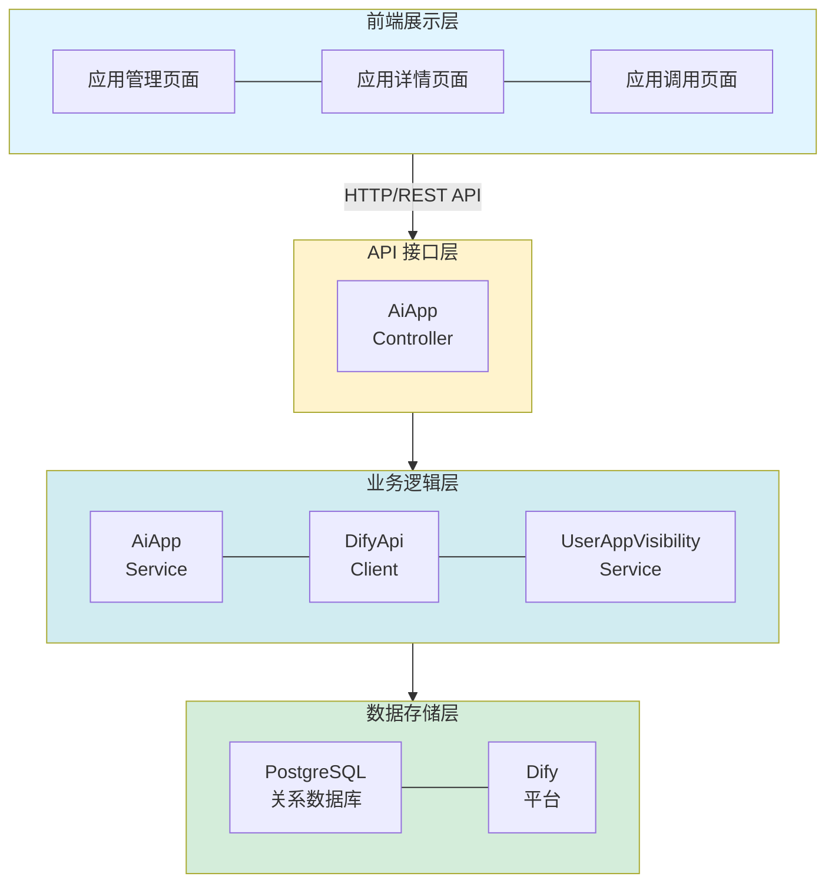
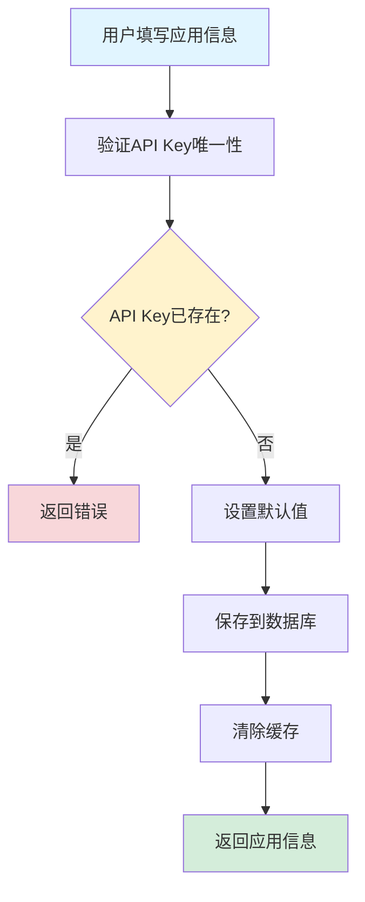
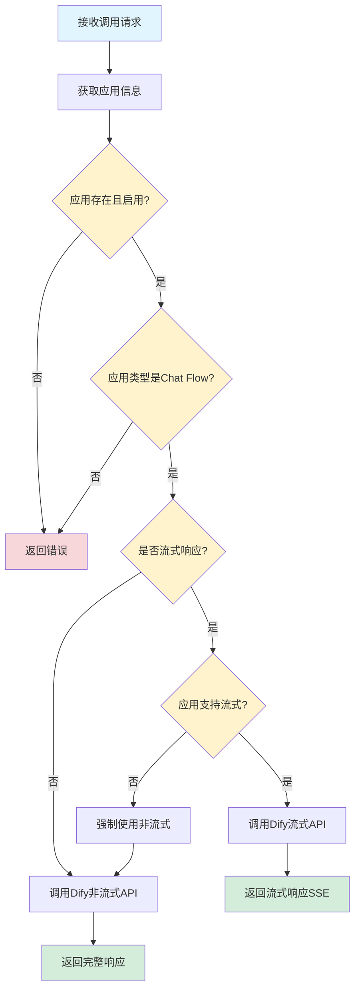
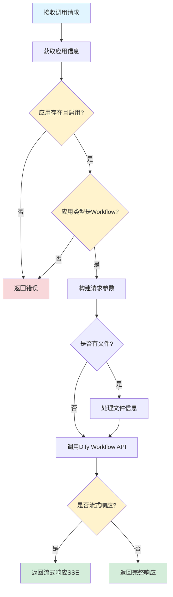
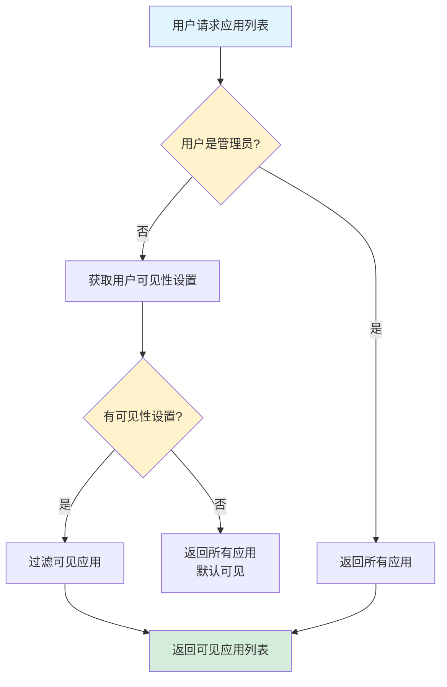

# AI 应用管理功能设计文档

## 1. 概述

### 1.1 功能简介

AI 应用管理功能是 DifyApp 系统的核心模块之一，提供了完整的 AI 应用生命周期管理能力。该功能基于 Dify 平台，支持 Chat Flow 和 Workflow 两种应用类型，实现了应用的创建、配置、调用、权限管理等完整流程。系统通过封装 Dify API，为上层应用提供了统一的 AI 应用管理接口，支持流式和非流式两种响应模式，并提供了细粒度的权限控制和多租户隔离能力。

### 1.2 功能目标

- 提供 AI 应用的完整生命周期管理（创建、编辑、删除、查询）
- 支持 Chat Flow 和 Workflow 两种应用类型
- 实现流式和非流式两种调用模式
- 提供文件上传功能，支持应用处理文件
- 实现细粒度的权限控制（用户可见性管理）
- 支持多租户隔离
- 提供应用配置管理（输入参数、主题色等）
- 实现应用状态管理（启用/禁用）

### 1.3 适用范围

- 企业内部 AI 应用管理平台
- 多租户 AI 应用服务
- Chat Flow 和 Workflow 应用集成
- AI 应用权限管理系统
- 企业级 AI 应用分发平台

## 2. 功能架构

### 2.1 总体架构

AI 应用管理功能采用分层架构设计，包含以下层次：



### 2.2 核心模块

#### 2.2.1 AI 应用管理模块

负责应用的创建、编辑、删除、查询等基础管理功能。

**主要功能：**
- 创建应用（支持配置应用类型、API Key、API Base URL 等）
- 编辑应用信息
- 删除应用（软删除）
- 查询应用列表（支持分页、搜索、筛选）
- 获取应用详情
- 应用状态管理（启用/禁用）

#### 2.2.2 应用调用模块

负责调用 Dify 平台的 Chat Flow 和 Workflow API。

**主要功能：**
- Chat Flow 调用（流式和非流式）
- Workflow 调用（流式和非流式）
- 文件上传到 Dify
- 响应处理和错误处理
- 超时控制

#### 2.2.3 权限管理模块

负责用户对应用的可见性控制。

**主要功能：**
- 用户应用可见性设置
- 用户可见应用列表查询
- 权限验证

#### 2.2.4 Dify API 客户端模块

负责与 Dify 平台的 API 交互。

**主要功能：**
- Chat Flow API 调用
- Workflow API 调用
- 文件上传 API 调用
- 流式响应处理（SSE）
- 错误处理和重试机制

## 3. 数据库设计

### 3.1 应用表 (AI_APP)

**表结构：**

| 字段名 | 类型 | 说明 | 约束 |
|--------|------|------|------|
| id | BIGINT | 主键 | PRIMARY KEY, AUTO_INCREMENT |
| name | VARCHAR(255) | 应用名称 | NOT NULL |
| description | TEXT | 应用描述 | |
| type | INTEGER | 应用类型（1-Chat Flow，2-Workflow） | NOT NULL |
| status | INTEGER | 应用状态（0-禁用，1-启用） | DEFAULT 1 |
| app_id | VARCHAR(255) | Dify API Key | NOT NULL, UNIQUE |
| api_base_url | VARCHAR(500) | Dify API Base URL | |
| stream_enabled | BOOLEAN | 是否支持流式响应 | DEFAULT false |
| file_upload_enabled | BOOLEAN | 是否支持文件上传 | DEFAULT false |
| input_enabled | BOOLEAN | 是否显示文本输入框 | DEFAULT true |
| inputs | TEXT | 应用配置JSON（输入参数） | |
| icon | VARCHAR(255) | 应用图标 | |
| theme_color | VARCHAR(50) | 主题色 | |
| sort | INTEGER | 排序 | DEFAULT 0 |
| tenant_id | INTEGER | 租户ID | |
| creator | VARCHAR(100) | 创建者 | |
| create_time | TIMESTAMP | 创建时间 | DEFAULT CURRENT_TIMESTAMP |
| updater | VARCHAR(100) | 更新者 | |
| update_time | TIMESTAMP | 更新时间 | DEFAULT CURRENT_TIMESTAMP ON UPDATE CURRENT_TIMESTAMP |
| deleted | INTEGER | 是否删除（0-未删除，1-已删除） | DEFAULT 0 |

**索引设计：**
- PRIMARY KEY (id)
- UNIQUE KEY uk_app_id (app_id)
- INDEX idx_tenant_id (tenant_id)
- INDEX idx_type (type)
- INDEX idx_status (status)
- INDEX idx_deleted (deleted)
- INDEX idx_tenant_type_status (tenant_id, type, status)

### 3.2 用户应用可见性表 (USER_APP_VISIBILITY)

**表结构：**

| 字段名 | 类型 | 说明 | 约束 |
|--------|------|------|------|
| id | BIGINT | 主键 | PRIMARY KEY, AUTO_INCREMENT |
| user_id | BIGINT | 用户ID | NOT NULL |
| app_id | BIGINT | 应用ID | NOT NULL |
| visible | BOOLEAN | 是否可见 | DEFAULT true |
| create_time | TIMESTAMP | 创建时间 | DEFAULT CURRENT_TIMESTAMP |
| update_time | TIMESTAMP | 更新时间 | DEFAULT CURRENT_TIMESTAMP ON UPDATE CURRENT_TIMESTAMP |

**索引设计：**
- PRIMARY KEY (id)
- UNIQUE KEY uk_user_app (user_id, app_id)
- INDEX idx_user_id (user_id)
- INDEX idx_app_id (app_id)

## 4. API 接口设计

### 4.1 创建应用

**接口路径：** `POST /api/ai-apps`

**请求参数：**

```json
{
  "name": "智能客服助手",
  "description": "基于Chat Flow的智能客服应用",
  "type": 1,
  "appId": "app-xxxxxxxxxxxx",
  "apiBaseUrl": "https://api.dify.ai",
  "streamEnabled": true,
  "fileUploadEnabled": false,
  "inputEnabled": true,
  "inputs": "{\"temperature\": 0.7}",
  "icon": "https://example.com/icon.png",
  "themeColor": "blue",
  "tenantId": 1
}
```

**参数说明：**
- `name`：应用名称（必填）
- `description`：应用描述（可选）
- `type`：应用类型（必填，1-Chat Flow，2-Workflow）
- `appId`：Dify API Key（必填，唯一）
- `apiBaseUrl`：Dify API Base URL（可选，不填则使用系统默认）
- `streamEnabled`：是否支持流式响应（可选，默认 false）
- `fileUploadEnabled`：是否支持文件上传（可选，默认 false）
- `inputEnabled`：是否显示文本输入框（可选，默认 true）
- `inputs`：应用配置JSON（可选）
- `icon`：应用图标（可选）
- `themeColor`：主题色（可选）
- `tenantId`：租户ID（可选）

**响应格式：**

```json
{
  "id": 1,
  "name": "智能客服助手",
  "description": "基于Chat Flow的智能客服应用",
  "type": 1,
  "status": 1,
  "appId": "app-xxxxxxxxxxxx",
  "apiBaseUrl": "https://api.dify.ai",
  "streamEnabled": true,
  "fileUploadEnabled": false,
  "inputEnabled": true,
  "inputs": "{\"temperature\": 0.7}",
  "icon": "https://example.com/icon.png",
  "themeColor": "blue",
  "tenantId": 1,
  "createTime": "2024-01-01T00:00:00",
  "updateTime": "2024-01-01T00:00:00"
}
```

### 4.2 更新应用

**接口路径：** `PUT /api/ai-apps/{id}`

**请求参数：** 同创建应用（appId 不可修改）

**响应格式：** 同创建应用

### 4.3 获取应用详情

**接口路径：** `GET /api/ai-apps/{id}`

**响应格式：** 同创建应用

### 4.4 删除应用

**接口路径：** `DELETE /api/ai-apps/{id}`

**响应格式：** 204 No Content

### 4.5 获取应用列表

**接口路径：** `GET /api/ai-apps`

**查询参数：**
- `tenantId`：租户ID（可选）
- `type`：应用类型（可选，1-Chat Flow，2-Workflow）
- `status`：应用状态（可选，0-禁用，1-启用）
- `keyword`：搜索关键词（可选，搜索名称或描述）
- `userId`：用户ID（可选，指定则返回用户可见的应用）
- `page`：页码（可选，指定则返回分页结果）
- `pageSize`：每页大小（可选）

**响应格式（列表）：**

```json
[
  {
    "id": 1,
    "name": "智能客服助手",
    "description": "基于Chat Flow的智能客服应用",
    "type": 1,
    "status": 1,
    "streamEnabled": true,
    "createTime": "2024-01-01T00:00:00"
  }
]
```

**响应格式（分页）：**

```json
{
  "content": [...],
  "total": 100,
  "page": 1,
  "pageSize": 20
}
```

### 4.6 调用 Chat Flow（非流式）

**接口路径：** `POST /api/ai-apps/{id}/chat`

**请求参数：**

```json
{
  "query": "你好，请介绍一下你自己",
  "conversationId": "conv-xxxxxxxxxxxx",
  "userId": "user-123",
  "inputs": {
    "temperature": 0.7
  },
  "stream": false
}
```

**参数说明：**
- `query`：用户查询内容（必填）
- `conversationId`：会话ID（可选，用于连续对话）
- `userId`：用户ID（可选）
- `inputs`：输入参数（可选，JSON对象）
- `stream`：是否流式响应（可选，默认 false）

**响应格式：**

```json
{
  "event": "message",
  "id": "msg-xxxxxxxxxxxx",
  "answer": "你好！我是智能客服助手...",
  "conversationId": "conv-xxxxxxxxxxxx",
  "createdAt": 1704067200,
  "finished": true
}
```

### 4.7 调用 Chat Flow（流式）

**接口路径：** `POST /api/ai-apps/{id}/chat/stream`

**请求参数：** 同非流式接口

**响应格式：** Server-Sent Events (SSE)

```
event: message
data: {"event":"message","id":"msg-xxx","answer":"你好","conversationId":"conv-xxx","createdAt":1704067200,"finished":false}

event: message
data: {"event":"message","id":"msg-xxx","answer":"你好！我是","conversationId":"conv-xxx","createdAt":1704067200,"finished":false}

event: message_end
data: {"event":"message_end","id":"msg-xxx","answer":"你好！我是智能客服助手...","conversationId":"conv-xxx","createdAt":1704067200,"finished":true}
```

### 4.8 调用 Workflow（非流式）

**接口路径：** `POST /api/ai-apps/{id}/workflow`

**请求参数：**

```json
{
  "userId": "user-123",
  "inputs": {
    "text": "分析这段文本的情感倾向",
    "file": {
      "transfer_method": "remote_url",
      "url": "https://example.com/file.pdf"
    }
  },
  "traceId": "trace-xxxxxxxxxxxx"
}
```

**参数说明：**
- `userId`：用户ID（必填）
- `inputs`：输入参数（必填，JSON对象）
- `traceId`：追踪ID（可选，用于追踪工作流执行）

**响应格式：** 同 Chat Flow 非流式接口

### 4.9 调用 Workflow（流式）

**接口路径：** `POST /api/ai-apps/{id}/workflow/stream`

**请求参数：** 同 Workflow 非流式接口

**响应格式：** Server-Sent Events (SSE)，同 Chat Flow 流式接口

### 4.10 上传文件到 Dify

**接口路径：** `POST /api/ai-apps/{id}/files/upload`

**请求参数：**
- `file`：文件（multipart/form-data，必填）
- `user`：用户ID（可选）

**响应格式：**

```json
{
  "id": "file-xxxxxxxxxxxx",
  "name": "document.pdf",
  "size": 1024000,
  "extension": "pdf",
  "mimeType": "application/pdf",
  "createdBy": "user-123",
  "createdAt": 1704067200,
  "url": "https://api.dify.ai/files/file-xxxxxxxxxxxx"
}
```

### 4.11 获取 Dify 配置信息

**接口路径：** `GET /api/ai-apps/config`

**响应格式：**

```json
{
  "fileUrlPrefix": "https://api.dify.ai/files"
}
```

## 5. 核心业务流程

### 5.1 应用创建流程



**流程说明：**

1. **用户输入**：用户填写应用信息（名称、类型、API Key 等）
2. **验证唯一性**：检查 API Key 是否已存在
3. **设置默认值**：设置默认状态、流式响应等配置
4. **保存数据**：将应用信息保存到数据库
5. **清除缓存**：清除相关缓存
6. **返回结果**：返回创建的应用信息

### 5.2 Chat Flow 调用流程



**流程说明：**

1. **接收请求**：接收 Chat Flow 调用请求
2. **验证应用**：检查应用是否存在、是否启用、类型是否正确
3. **判断响应模式**：根据请求和应用配置决定使用流式或非流式
4. **调用 Dify API**：调用 Dify 平台的 Chat Flow API
5. **返回响应**：返回流式（SSE）或非流式响应

### 5.3 Workflow 调用流程



**流程说明：**

1. **接收请求**：接收 Workflow 调用请求
2. **验证应用**：检查应用是否存在、是否启用、类型是否正确
3. **构建参数**：构建 Dify API 请求参数
4. **处理文件**：如果有文件，将文件信息添加到 inputs 中
5. **调用 API**：调用 Dify 平台的 Workflow API
6. **返回响应**：返回流式或非流式响应

### 5.4 用户可见应用查询流程



**流程说明：**

1. **接收请求**：接收用户的应用列表查询请求
2. **判断角色**：检查用户是否是管理员
3. **获取权限**：如果是普通用户，获取用户的可见性设置
4. **过滤应用**：根据可见性设置过滤应用列表
5. **返回结果**：返回用户可见的应用列表

## 6. 技术实现

### 6.1 应用类型

**应用类型定义：**
- **Chat Flow（type=1）**：对话式应用，支持多轮对话
- **Workflow（type=2）**：工作流应用，支持复杂的任务处理流程

### 6.2 Dify API 调用

**技术选型：** Spring WebFlux + WebClient

**实现方式：**

```java
// 非流式调用
Mono<DifyResponse> chat(String apiKey, String baseUrl, String query, 
                        String conversationId, String userId, Map<String, Object> inputs)

// 流式调用
Flux<DifyResponse> chatStream(String apiKey, String baseUrl, String query, 
                               String conversationId, String userId, Map<String, Object> inputs)
```

**API 端点：**
- Chat Flow：`/v1/chat-messages`
- Workflow：`/v1/workflows/run`

**请求头：**
- `Authorization: Bearer {apiKey}`
- `Content-Type: application/json`

### 6.3 流式响应处理

**技术选型：** Server-Sent Events (SSE)

**实现方式：**

```java
@PostMapping(value = "/{id}/chat/stream", produces = MediaType.TEXT_EVENT_STREAM_VALUE)
public Flux<ServerSentEvent<DifyResponse>> chatStream(...) {
    return aiAppService.chatStream(id, request)
        .map(response -> ServerSentEvent.<DifyResponse>builder()
            .event(response.getEvent())
            .data(response)
            .build());
}
```

**SSE 事件类型：**
- `message`：消息事件
- `message_end`：消息结束事件
- `error`：错误事件

### 6.4 文件上传

**实现方式：**

1. 前端上传文件到 DifyApp
2. DifyApp 转发文件到 Dify 平台
3. 返回 Dify 文件信息（包含文件 ID 和 URL）
4. 前端使用文件信息调用 Workflow API

**文件处理：**
- 支持多种文件格式（PDF、Word、图片等）
- 文件信息添加到 `inputs.file` 中
- 支持单个文件或多个文件

### 6.5 缓存机制

**缓存策略：**
- 使用 Spring Cache 注解
- 缓存应用信息（按 ID 和 API Key）
- 创建/更新/删除时清除缓存

**缓存配置：**
```java
@Cacheable(value = "aiApp", key = "#id")
public AiAppResp getAiAppById(Long id)

@CacheEvict(value = "aiApp", allEntries = true)
public AiAppResp createAiApp(CreateAiAppReq req)
```

### 6.6 权限控制

**权限模型：**
- 管理员：可以看到所有应用
- 普通用户：只能看到被设置为可见的应用

**可见性设置：**
- 通过 `USER_APP_VISIBILITY` 表管理
- 默认情况下，所有应用对用户可见
- 管理员可以设置应用的可见性

### 6.7 多租户支持

**租户隔离：**
- 通过 `tenant_id` 字段实现租户隔离
- 查询时自动过滤租户
- 支持跨租户应用共享（可选）

### 6.8 错误处理

**错误类型：**
- 应用不存在
- 应用已禁用
- 应用类型不匹配
- Dify API 调用失败
- 流式响应中断

**处理方式：**
- 返回友好的错误提示
- 记录错误日志
- 流式响应错误时发送错误事件

### 6.9 超时控制

**超时配置：**
- 非流式调用：至少 2 分钟
- 流式调用：至少 10 分钟
- 可配置超时时间

**超时处理：**
- 捕获超时异常
- 返回超时错误提示
- 记录超时日志

## 7. 配置管理

### 7.1 Dify 配置

**配置项：**
- 默认 API Base URL（`dify.defaultBaseUrl`）
- 默认超时时间（`dify.timeout`）
- 文件 URL 前缀（`dify.fileUrlPrefix`）

**配置优先级：**
1. 应用配置的 `apiBaseUrl`
2. 系统配置的 `dify.defaultBaseUrl`

### 7.2 应用配置

**应用级别配置：**
- 流式响应开关
- 文件上传开关
- 输入框显示开关
- 主题色配置
- 输入参数配置（JSON）

## 8. 安全设计

### 8.1 API Key 管理

**安全措施：**
- API Key 唯一性验证
- API Key 加密存储（可选）
- API Key 访问日志记录（可选）

### 8.2 权限控制

**安全措施：**
- JWT Token 验证
- 用户可见性验证
- 管理员权限验证

### 8.3 数据安全

**安全措施：**
- 软删除机制（不物理删除数据）
- 数据访问日志记录（可选）
- 敏感信息脱敏（可选）

## 9. 性能优化

### 9.1 缓存优化

**优化策略：**
- 应用信息缓存
- 减少数据库查询
- 缓存失效策略

### 9.2 查询优化

**优化策略：**
- 数据库索引优化
- 分页查询
- 搜索索引优化

### 9.3 流式响应优化

**优化策略：**
- 响应式编程（WebFlux）
- 背压处理
- 连接池优化

## 10. 监控和日志

### 10.1 日志记录

**关键操作日志：**
- 应用创建/更新/删除日志
- Dify API 调用日志
- 错误日志
- 性能日志

**日志级别：**
- INFO：正常操作日志
- WARN：警告日志
- ERROR：错误日志
- DEBUG：调试日志

### 10.2 性能监控

**监控指标：**
- Dify API 调用耗时
- 流式响应延迟
- 应用调用次数
- 错误率统计

## 11. 扩展性设计

### 11.1 应用类型扩展

**扩展方式：**
- 添加新的应用类型枚举
- 实现对应的 API 调用逻辑
- 更新前端界面

### 11.2 Dify API 扩展

**扩展方式：**
- 实现新的 Dify API 客户端方法
- 添加新的 API 端点支持
- 扩展请求/响应模型

### 11.3 功能扩展

**扩展方向：**
- 应用使用统计
- 应用版本管理
- 应用模板功能
- 应用分享功能
- 应用市场功能

## 12. 使用示例

### 12.1 创建 Chat Flow 应用

**请求示例：**
```json
POST /api/ai-apps
{
  "name": "智能客服助手",
  "description": "基于Chat Flow的智能客服应用",
  "type": 1,
  "appId": "app-xxxxxxxxxxxx",
  "apiBaseUrl": "https://api.dify.ai",
  "streamEnabled": true,
  "inputEnabled": true,
  "themeColor": "blue"
}
```

### 12.2 调用 Chat Flow（流式）

**请求示例：**
```json
POST /api/ai-apps/1/chat/stream
{
  "query": "你好，请介绍一下你自己",
  "userId": "user-123",
  "stream": true
}
```

**响应示例（SSE）：**
```
event: message
data: {"event":"message","answer":"你好","finished":false}

event: message
data: {"event":"message","answer":"你好！我是","finished":false}

event: message_end
data: {"event":"message_end","answer":"你好！我是智能客服助手...","finished":true}
```

### 12.3 调用 Workflow

**请求示例：**
```json
POST /api/ai-apps/2/workflow
{
  "userId": "user-123",
  "inputs": {
    "text": "分析这段文本的情感倾向",
    "file": {
      "transfer_method": "remote_url",
      "url": "https://example.com/file.pdf"
    }
  }
}
```

### 12.4 上传文件

**请求示例：**
```
POST /api/ai-apps/2/files/upload
Content-Type: multipart/form-data

file: [文件内容]
user: user-123
```

**响应示例：**
```json
{
  "id": "file-xxxxxxxxxxxx",
  "name": "document.pdf",
  "size": 1024000,
  "url": "https://api.dify.ai/files/file-xxxxxxxxxxxx"
}
```

## 13. 常见问题

### Q1: 如何创建第一个应用？

**A**: 
1. 在 Dify 平台创建应用，获取 API Key
2. 在 DifyApp 中创建应用，填写应用信息和 API Key
3. 配置应用参数（流式响应、文件上传等）
4. 保存后即可使用

### Q2: Chat Flow 和 Workflow 有什么区别？

**A**: 
- **Chat Flow**：对话式应用，支持多轮对话，适合聊天场景
- **Workflow**：工作流应用，支持复杂的任务处理流程，适合自动化场景

### Q3: 如何启用流式响应？

**A**: 
1. 在创建或编辑应用时，设置 `streamEnabled` 为 `true`
2. 调用 API 时，设置 `stream` 参数为 `true`
3. 使用流式接口（`/chat/stream` 或 `/workflow/stream`）

### Q4: 如何上传文件？

**A**: 
1. 使用文件上传接口上传文件到 Dify
2. 获取文件信息（ID 和 URL）
3. 在调用 Workflow API 时，将文件信息添加到 `inputs.file` 中

### Q5: 如何设置用户可见性？

**A**: 
1. 在用户管理页面，找到要管理的用户
2. 点击"应用管理"按钮
3. 切换应用的可见性开关
4. 保存设置

### Q6: 应用调用失败怎么办？

**A**: 
1. 检查应用是否启用
2. 检查应用类型是否正确
3. 检查 API Key 是否正确
4. 检查 Dify 平台是否正常
5. 查看错误日志

### Q7: 如何配置应用输入参数？

**A**: 
1. 在创建或编辑应用时，在 `inputs` 字段中填写 JSON 配置
2. JSON 格式：`{"temperature": 0.7, "max_tokens": 1000}`
3. 这些参数会传递给 Dify API

### Q8: 支持哪些文件格式？

**A**: 支持 Dify 平台支持的所有文件格式，包括：
- PDF
- Word（.doc, .docx）
- 图片（.jpg, .png 等）
- 文本文件（.txt）
- 其他格式（根据 Dify 平台支持）

## 14. 未来规划

### 14.1 功能增强

- 应用使用统计和分析
- 应用版本管理
- 应用模板功能
- 应用市场功能
- 应用分享和协作

### 14.2 性能优化

- 应用调用缓存
- 批量调用支持
- 连接池优化
- 响应压缩

### 14.3 用户体验

- 应用预览功能
- 应用测试工具
- 应用配置向导
- 应用使用文档