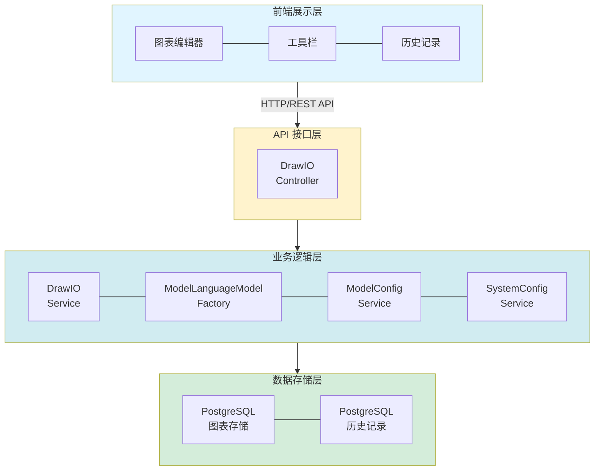
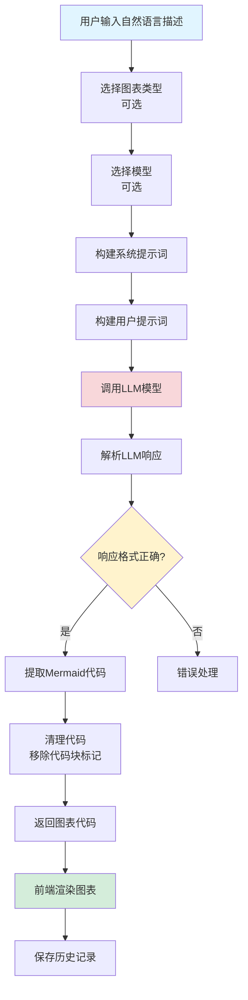
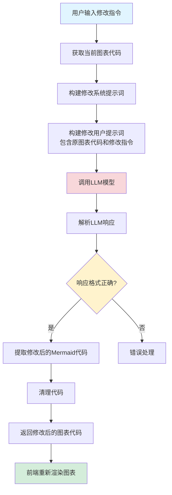
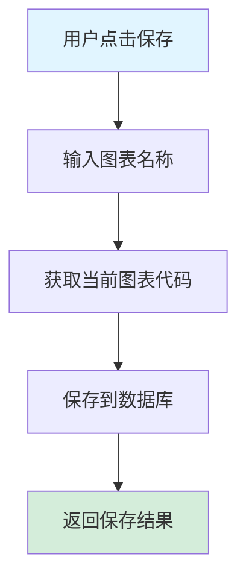
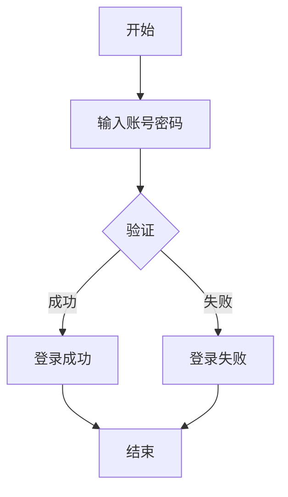
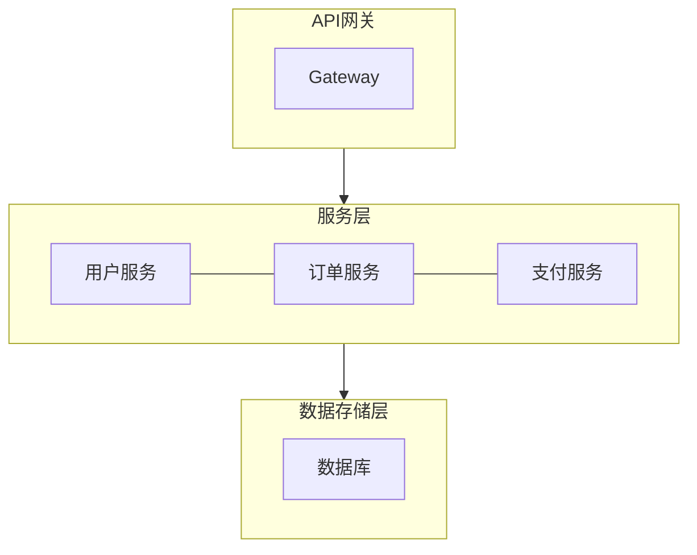
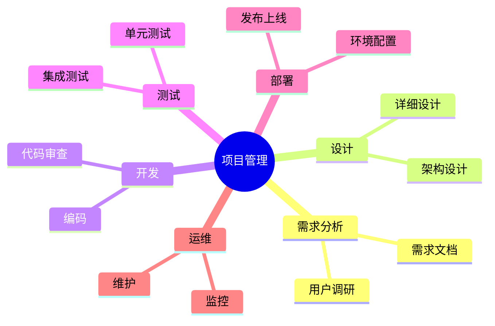
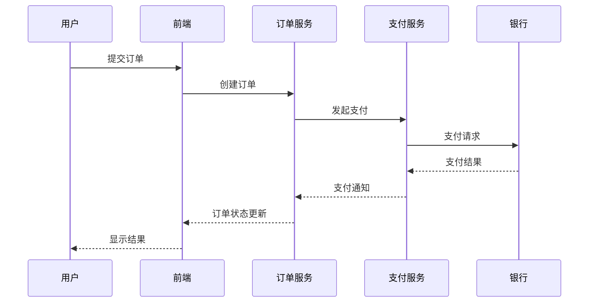

# AI 绘图功能设计文档

## 文档同步状态（2026-03）

- 已按当前实现全量校准。
- 已对齐当前日志与可观测性约束（异常记录规范、链路追踪接入原则）。

## 1. 概述

### 1.1 功能简介

AI 绘图功能是 DifyApp 系统的核心模块之一，提供了基于自然语言生成各种类型图表的能力。该功能使用大语言模型（LLM）将用户的自然语言描述转换为 Mermaid 格式的图表代码，并通过前端 Mermaid 库实时渲染为可视化图表。支持流程图、架构图、思维导图、时序图、UML 图、组织架构图、网络图等多种图表类型，实现了从自然语言到可视化图表的完整流程。

### 1.2 功能目标

- 提供自然语言到图表的自动生成能力
- 支持多种图表类型（流程图、架构图、思维导图、时序图、UML 图、组织架构、网络图等）
- 支持图表修改和编辑功能
- 提供图表保存、加载、删除等管理功能
- 实现历史记录管理，方便用户复用之前的提示词
- 支持图表导出和导入功能
- 提供丰富的交互功能（缩放、拖拽、适应窗口等）
- 支持快速模板，提高使用效率

### 1.3 适用范围

- 企业内部图表绘制工具
- 技术文档和设计文档生成
- 系统架构图绘制
- 业务流程可视化
- 组织架构管理
- 网络拓扑图绘制
- 教育和培训场景

## 2. 功能架构

### 2.1 总体架构

AI 绘图功能采用分层架构设计，包含以下层次：



### 2.2 核心模块

#### 2.2.1 DrawIO 服务模块

负责图表生成、修改、保存等核心业务逻辑。

**主要功能：**
- 图表生成（基于自然语言描述）
- 图表修改（基于修改指令）
- 图表保存和加载
- 图表删除
- 历史记录管理

#### 2.2.2 前端渲染模块

负责 Mermaid 图表的渲染和交互。

**主要功能：**
- Mermaid 图表渲染
- 图表缩放和拖拽
- 图表导出和导入
- 画布清空

#### 2.2.3 模型服务模块

负责 LLM 模型的创建和调用。

**主要功能：**
- LLM 模型工厂
- 模型配置管理
- 提示词构建
- 模型响应解析

## 3. 数据库设计

### 3.1 图表表 (DRAWIO_DIAGRAM)

**表结构：**

| 字段名 | 类型 | 说明 | 约束 |
|--------|------|------|------|
| id | BIGINT | 主键 | PRIMARY KEY, AUTO_INCREMENT |
| name | VARCHAR(255) | 图表名称 | NOT NULL |
| diagram_type | VARCHAR(50) | 图表类型 | |
| diagram_json | TEXT | 图表JSON内容（Mermaid格式） | NOT NULL |
| user_id | BIGINT | 用户ID | NOT NULL |
| create_time | TIMESTAMP | 创建时间 | DEFAULT CURRENT_TIMESTAMP |
| update_time | TIMESTAMP | 更新时间 | DEFAULT CURRENT_TIMESTAMP ON UPDATE CURRENT_TIMESTAMP |
| deleted | INTEGER | 是否删除（0-未删除，1-已删除） | DEFAULT 0 |

**索引设计：**
- PRIMARY KEY (id)
- INDEX idx_user_id (user_id)
- INDEX idx_diagram_type (diagram_type)
- INDEX idx_deleted (deleted)
- INDEX idx_user_deleted (user_id, deleted)
- INDEX idx_create_time (create_time)

### 3.2 历史记录表 (DRAWIO_HISTORY)

**表结构：**

| 字段名 | 类型 | 说明 | 约束 |
|--------|------|------|------|
| id | BIGINT | 主键 | PRIMARY KEY, AUTO_INCREMENT |
| user_id | BIGINT | 用户ID | NOT NULL |
| prompt | VARCHAR(500) | 提示词内容 | NOT NULL |
| diagram_type | VARCHAR(50) | 图表类型 | |
| create_time | TIMESTAMP | 创建时间 | DEFAULT CURRENT_TIMESTAMP |
| deleted | INTEGER | 是否删除（0-未删除，1-已删除） | DEFAULT 0 |

**索引设计：**
- PRIMARY KEY (id)
- INDEX idx_user_id (user_id)
- INDEX idx_deleted (deleted)
- INDEX idx_user_deleted (user_id, deleted)
- INDEX idx_create_time (create_time)

## 4. API 接口设计

### 4.1 生成图表

**接口路径：** `POST /api/drawio/generate`

**请求参数：**

```json
{
  "prompt": "绘制用户登录流程图，包含输入账号密码、验证、登录成功、登录失败等步骤",
  "modelId": 1,
  "diagramType": "flowchart"
}
```

**参数说明：**
- `prompt`：自然语言描述（必填）
- `modelId`：LLM 模型ID（可选，不指定则使用系统默认模型）
- `diagramType`：图表类型（可选，支持：flowchart、architecture、mindmap、sequence、uml、org、network、custom）

**响应格式：**

```json
{
  "diagramJson": "flowchart TD\n    A[开始] --> B[输入账号密码]\n    B --> C{验证}\n    C -->|成功| D[登录成功]\n    C -->|失败| E[登录失败]\n    D --> F[结束]\n    E --> F",
  "diagramType": "flowchart"
}
```

### 4.2 修改图表

**接口路径：** `POST /api/drawio/modify`

**请求参数：**

```json
{
  "diagramJson": "flowchart TD\n    A[开始] --> B[输入账号密码]",
  "prompt": "添加忘记密码功能",
  "modelId": 1
}
```

**参数说明：**
- `diagramJson`：现有图表代码（Mermaid格式，必填）
- `prompt`：修改指令（必填）
- `modelId`：LLM 模型ID（可选）

**响应格式：** 同生成图表接口

### 4.3 保存图表

**接口路径：** `POST /api/drawio/save`

**请求参数：**

```json
{
  "name": "用户登录流程图",
  "diagramJson": "flowchart TD\n    A[开始] --> B[输入账号密码]",
  "diagramType": "flowchart"
}
```

**响应格式：**

```json
{
  "id": 1,
  "name": "用户登录流程图",
  "diagramType": "flowchart",
  "diagramJson": "flowchart TD\n    A[开始] --> B[输入账号密码]",
  "userId": 1,
  "createTime": "2024-01-01T00:00:00",
  "updateTime": "2024-01-01T00:00:00"
}
```

### 4.4 获取图表列表

**接口路径：** `GET /api/drawio/list`

**响应格式：**

```json
[
  {
    "id": 1,
    "name": "用户登录流程图",
    "diagramType": "flowchart",
    "createTime": "2024-01-01T00:00:00"
  }
]
```

### 4.5 获取图表详情

**接口路径：** `GET /api/drawio/{id}`

**响应格式：** 同保存图表接口

### 4.6 删除图表

**接口路径：** `DELETE /api/drawio/{id}`

**响应格式：** 204 No Content

### 4.7 保存历史记录

**接口路径：** `POST /api/drawio/history`

**请求参数：**

```json
{
  "prompt": "绘制用户登录流程图",
  "diagramType": "flowchart"
}
```

**响应格式：**

```json
{
  "id": 1,
  "userId": 1,
  "prompt": "绘制用户登录流程图",
  "diagramType": "flowchart",
  "createTime": "2024-01-01T00:00:00"
}
```

### 4.8 获取历史记录列表

**接口路径：** `GET /api/drawio/history`

**响应格式：**

```json
[
  {
    "id": 1,
    "prompt": "绘制用户登录流程图",
    "diagramType": "flowchart",
    "createTime": "2024-01-01T00:00:00"
  }
]
```

### 4.9 删除历史记录

**接口路径：** `DELETE /api/drawio/history/{id}`

**响应格式：** 204 No Content

## 5. 核心业务流程

### 5.1 图表生成流程



**流程说明：**

1. **用户输入**：用户输入自然语言描述，选择图表类型（可选）、模型（可选）
2. **提示词构建**：根据图表类型构建系统提示词和用户提示词
3. **LLM 调用**：调用 LLM 模型生成图表代码
4. **响应解析**：解析 LLM 返回的响应，提取 Mermaid 代码
5. **代码清理**：移除可能的代码块标记（```mermaid、```等）
6. **前端渲染**：使用 Mermaid 库渲染图表
7. **历史保存**：保存提示词到历史记录

### 5.2 图表修改流程



**流程说明：**

1. **获取原图表**：获取当前画布上的图表代码
2. **构建提示词**：将原图表代码和修改指令组合成提示词
3. **LLM 调用**：调用 LLM 模型生成修改后的图表代码
4. **响应解析**：解析并清理响应
5. **重新渲染**：前端使用新的图表代码重新渲染

### 5.3 图表保存流程



**流程说明：**

1. **用户操作**：用户点击保存按钮，输入图表名称
2. **获取代码**：获取当前画布上的图表代码
3. **数据库保存**：将图表名称、类型、代码保存到数据库
4. **返回结果**：返回保存成功的图表信息

## 6. 技术实现

### 6.1 支持的图表类型

**图表类型列表：**
- **flowchart**：流程图
- **architecture**：架构图
- **mindmap**：思维导图
- **sequence**：时序图
- **uml**：UML 图
- **org**：组织架构图
- **network**：网络图
- **custom**：自定义图表

### 6.2 Mermaid 图表渲染

**技术选型：** Mermaid.js

**实现方式：**

```javascript
// 初始化 Mermaid
mermaid.initialize({
  startOnLoad: false,
  theme: 'default',
  securityLevel: 'loose',
  flowchart: {
    useMaxWidth: true,
    htmlLabels: true,
    curve: 'basis'
  }
})

// 渲染图表
const { svg } = await mermaid.render(id, mermaidCode)
container.innerHTML = svg
```

### 6.3 图表生成

**技术选型：** LangChain4j + LLM API

**提示词结构：**

1. **系统提示词**：定义 LLM 的角色和任务要求
2. **用户提示词**：包含用户描述和图表类型信息

**系统提示词要点：**
- 明确 LLM 角色（图表生成助手）
- 规定只返回 Mermaid 代码
- 说明 Mermaid 语法要求
- 强调使用中文标签
- 说明颜色主题规范
- 要求生成详细完整的图表

**用户提示词示例：**

```
请绘制一个流程图，描述用户登录流程，包含输入账号密码、验证、登录成功、登录失败等步骤
```

### 6.4 图表修改

**修改提示词结构：**

1. **系统提示词**：定义修改任务的要求
2. **用户提示词**：包含原图表代码和修改指令

**系统提示词要点：**
- 明确修改任务
- 要求保持图表类型和基本结构
- 说明如何应用修改指令

**用户提示词示例：**

```
原图表代码：
flowchart TD
    A[开始] --> B[输入账号密码]
    B --> C{验证}
    C -->|成功| D[登录成功]
    C -->|失败| E[登录失败]

修改指令：添加忘记密码功能

请根据修改指令更新图表代码：
```

### 6.5 代码提取和清理

**提取逻辑：**
- 检查响应中是否包含代码块标记（```mermaid、```等）
- 提取代码块内容
- 如果没有代码块标记，直接使用响应内容

**清理逻辑：**
- 移除代码块标记
- 移除前后空白字符
- 验证 Mermaid 语法

### 6.6 前端交互功能

**缩放功能：**
- 支持鼠标滚轮缩放（Ctrl/Cmd + 滚轮）
- 支持按钮缩放（放大、缩小、重置）
- 缩放范围：0.5x - 2x

**拖拽功能：**
- 支持鼠标拖拽画布
- 记录拖拽偏移量
- 应用 transform 变换

**适应窗口：**
- 自动计算图表尺寸
- 计算合适的缩放比例
- 居中显示图表

## 7. 提示词设计

### 7.1 生成提示词

**系统提示词结构：**

```
你是一个专业的图表生成助手，专门生成 Mermaid 格式的图表代码。

重要要求：
1. 你必须只返回有效的 Mermaid 代码，不要包含任何解释文字
2. 代码必须符合 Mermaid 语法规范
3. 使用中文标签和文本
4. 代码块不要使用 ```mermaid 包裹，直接返回代码
5. 必须使用指定的颜色主题来区分不同类型的组件
6. 必须生成详细、完整的图表，包含足够的节点和层次
7. 必须充分理解用户描述，生成包含所有相关细节的完整图表

颜色主题规范：
- 浅蓝色：用于输入/输出嵌入层、线性层、基础组件
- 黄色：用于位置编码、时间相关组件
- 紫色：用于编码器块、编码相关组件
- 红色：用于注意力机制、前馈网络、核心处理组件
- 绿色：用于归一化层、添加操作、辅助组件
- 橙色：用于解码器块、解码相关组件
- 深蓝色：用于输出层、最终结果
- 灰色：用于连接线、辅助连接

Mermaid 语法要求：
[根据图表类型添加具体的语法要求]
```

**用户提示词结构：**

```
[根据图表类型添加前缀，例如：请绘制一个流程图，]

用户描述：[用户输入的自然语言描述]
```

### 7.2 修改提示词

**系统提示词结构：**

```
你是一个专业的图表修改助手，专门修改 Mermaid 格式的图表代码。

重要要求：
1. 你必须只返回修改后的完整 Mermaid 代码，不要包含任何解释文字
2. 保持原图表的类型和基本结构
3. 根据修改指令更新图表内容
4. 代码必须符合 Mermaid 语法规范
5. 使用中文标签和文本
6. 代码块不要使用 ```mermaid 包裹，直接返回代码
```

**用户提示词结构：**

```
原图表代码：
[原图表的 Mermaid 代码]

修改指令：[用户的修改指令]

请根据修改指令更新图表代码：
```

## 8. 配置管理

### 8.1 模型配置

**配置项：**
- 默认 LLM 模型（系统配置：`drawio.defaultModelId`）
- 模型 API 地址
- API Key
- 模型参数（temperature、max_tokens 等）

**优先级：**
1. 请求中指定的 modelId
2. 系统配置中的 `drawio.defaultModelId`
3. 默认 RAG 模型

### 8.2 Mermaid 配置

**配置项：**
- 主题（theme）
- 安全级别（securityLevel）
- 流程图配置（curve、htmlLabels 等）
- 颜色主题变量

## 9. 错误处理

### 9.1 图表生成错误

**错误类型：**
- LLM API 调用失败
- LLM 返回格式不正确
- Mermaid 语法错误

**处理方式：**
- 记录错误日志
- 返回友好的错误提示
- 显示错误信息和建议

### 9.2 图表渲染错误

**错误类型：**
- Mermaid 代码语法错误
- 渲染失败

**处理方式：**
- 捕获渲染异常
- 显示错误信息
- 显示原始代码片段（用于调试）

### 9.3 数据保存错误

**错误类型：**
- 数据库连接失败
- 数据保存失败

**处理方式：**
- 记录错误日志
- 返回错误提示
- 支持重试机制

## 10. 安全设计

### 10.1 权限控制

**安全措施：**
- JWT Token 验证
- 用户只能访问自己的图表
- 用户只能删除自己的图表

### 10.2 数据安全

**安全措施：**
- 图表数据加密存储（可选）
- 敏感信息过滤（可选）
- 操作日志记录（可选）

### 10.3 Mermaid 安全

**安全措施：**
- 设置安全级别（securityLevel: 'loose'）
- 防止 XSS 攻击
- 代码验证和清理

## 11. 性能优化

### 11.1 图表渲染优化

**优化策略：**
- 延迟渲染（等待 DOM 更新）
- 错误重试机制
- 渲染结果缓存（可选）

### 11.2 LLM 调用优化

**优化策略：**
- 提示词长度优化
- 响应缓存（可选）
- 批量处理（未来扩展）

### 11.3 前端交互优化

**优化策略：**
- 防抖处理（缩放、拖拽）
- 使用 CSS transform 实现变换
- 优化大图表渲染性能

## 12. 监控和日志

### 12.1 日志记录

**关键操作日志：**
- 图表生成请求日志
- LLM API 调用日志
- 图表保存日志
- 错误日志

**日志级别：**
- INFO：正常操作日志
- WARN：警告日志
- ERROR：错误日志
- DEBUG：调试日志

### 12.2 性能监控

**监控指标：**
- 图表生成耗时
- LLM API 调用耗时
- 图表渲染耗时
- 用户操作统计

## 13. 扩展性设计

### 13.1 图表类型扩展

**扩展方式：**
- 添加新的图表类型配置
- 更新系统提示词模板
- 添加对应的快速模板

### 13.2 LLM 模型扩展

**扩展方式：**
- 实现 `ChatLanguageModel` 接口
- 配置新的 LLM 提供商
- 支持自定义提示词模板

### 13.3 功能扩展

**扩展方向：**
- 支持更多图表类型
- 支持图表协作编辑
- 支持图表版本管理
- 支持图表分享功能

## 14. 使用示例

### 14.1 流程图生成

**用户输入：** "绘制用户登录流程图，包含输入账号密码、验证、登录成功、登录失败等步骤"

**生成的 Mermaid 代码：**


### 14.2 架构图生成

**用户输入：** "绘制微服务架构图，包含API网关、用户服务、订单服务、支付服务、数据库等组件"

**生成的 Mermaid 代码：**


### 14.3 思维导图生成

**用户输入：** "绘制项目管理思维导图，包含需求分析、设计、开发、测试、部署、运维等分支"

**生成的 Mermaid 代码：**


### 14.4 时序图生成

**用户输入：** "绘制支付时序图，包含用户、前端、订单服务、支付服务、银行之间的交互序列"

**生成的 Mermaid 代码：**


## 15. 快速模板

### 15.1 流程图模板

- **用户登录流程**：包含输入账号密码、验证、登录成功、登录失败等步骤
- **订单处理流程**：包含下单、支付、发货、收货、评价等步骤
- **审批流程**：包含提交申请、部门审批、财务审批、总经理审批等步骤

### 15.2 架构图模板

- **微服务架构**：包含API网关、用户服务、订单服务、支付服务、商品服务、数据库等组件
- **云架构**：包含负载均衡、Web服务器、应用服务器、数据库、缓存等组件
- **分层架构**：包含表示层、业务层、数据访问层、数据库层

### 15.3 思维导图模板

- **项目管理**：包含需求分析、设计、开发、测试、部署、运维等分支
- **产品规划**：包含市场分析、用户需求、功能设计、技术方案等分支
- **学习计划**：包含基础知识、进阶内容、实践项目、总结复习等分支

## 16. 未来规划

### 16.1 功能增强

- 支持更多图表类型（甘特图、饼图、柱状图等）
- 支持图表协作编辑
- 支持图表版本管理
- 支持图表分享和导出（PNG、SVG、PDF）
- 支持图表模板市场
- 支持自定义图表样式

### 16.2 性能优化

- 实现图表渲染缓存
- 优化大图表渲染性能
- 支持增量更新
- 实现响应式布局优化

### 16.3 用户体验

- 支持图表自动布局优化
- 提供图表编辑建议
- 支持图表动画效果
- 优化移动端体验
- 支持图表搜索功能

