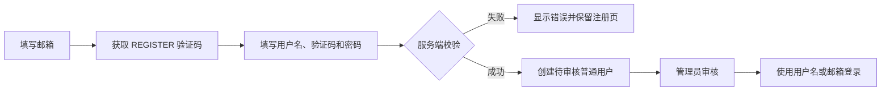

# 用户认证与邮箱验证码使用指南

## 1. 功能范围

当前认证模块提供以下能力：

- 登录支持用户名或注册邮箱，密码使用 Spring Security Crypto 的 BCrypt 校验。
- 新用户必须通过邮箱验证码注册；注册成功后状态为“待审核”，管理员审核通过后才能登录。
- 登录页提供“忘记密码”，用户可通过注册邮箱验证码设置新密码。
- 已登录用户修改密码时必须提供原密码；修改成功后前端立即清除登录状态并跳转登录页。
- 管理员可以在用户管理页直接重置指定用户密码，该能力受 `admin.users` 权限保护。

密码修改、邮箱重置和管理员重置都会递增 `password_version`。JWT 中保存签发时的密码版本，后端发现版本不一致时会拒绝旧 Token，从而使其他浏览器或设备上的旧会话失效。

## 2. 技术方案

优先使用成熟开源组件，不自行实现邮件协议、密码哈希或缓存客户端：

| 能力 | 开源组件 | 用途 |
| --- | --- | --- |
| 邮件发送 | Spring Boot Mail / Jakarta Mail | 通过 SMTP 发送纯文本验证码邮件 |
| 验证码存储 | Spring Data Redis | 保存验证码、有效期、重发冷却、发送次数和失败次数 |
| 密码哈希 | Spring Security Crypto | 使用 BCrypt 单向哈希保存密码 |
| 登录凭证 | JJWT | 生成和校验携带密码版本的 JWT |

验证码默认为 6 位数字、5 分钟有效、60 秒内不可重发、每个邮箱每种用途每小时最多发送 10 次，连续输错 5 次后验证码作废。注册和重置密码使用不同用途标识，验证码不能跨场景使用。

Redis 键不直接包含明文邮箱，而是使用邮箱小写规范化后的 SHA-256 摘要。验证码校验、错误次数递增和成功后消费由 Lua 脚本原子执行；验证码校验成功后立即删除，不能重复使用。

## 3. 部署前配置

### 3.1 数据库升级

新建数据库直接执行：

```text
backend/src/main/resources/sql/init_database_complete.sql
```

已有数据库必须在启动新版后端前执行：

```text
backend/src/main/resources/sql/migration_add_user_email.sql
```

也可以执行包含该变更的汇总迁移脚本：

```text
backend/src/main/resources/sql/migration_all.sql
```

迁移会为用户表增加：

- `email VARCHAR(254)`：注册邮箱，使用忽略大小写的唯一索引。
- `password_version INTEGER NOT NULL DEFAULT 0`：密码版本，用于废止旧 JWT。

若应用启动时报 `column ... password_version does not exist`，说明当前连接的数据库尚未执行上述迁移，或脚本执行到了其他数据库/Schema。应先确认 `spring.datasource.url` 指向的数据库，再执行迁移。

历史用户的邮箱允许为空，不影响用户名登录、原密码修改或管理员重置。历史账号若要使用“邮箱登录”或“忘记密码”，管理员需要先为其补录唯一邮箱。

### 3.2 Redis 配置

验证码必须依赖 Redis，Redis 不可用时发送和校验都会返回“验证码服务暂不可用”。本地直接运行后端时默认连接 `localhost:6379`；使用根目录 `docker-compose.yml` 时，后端连接服务名 `redis:6379`。

```dotenv
SPRING_DATA_REDIS_HOST=redis
SPRING_DATA_REDIS_PORT=6379
SPRING_DATA_REDIS_PASSWORD=
```

### 3.3 SMTP 配置

复制根目录 `.env.example` 为 `.env`，填写真实邮箱服务商提供的 SMTP 参数：

```dotenv
MAIL_HOST=smtp.example.com
MAIL_PORT=587
MAIL_USERNAME=noreply@example.com
MAIL_PASSWORD=replace-with-smtp-password
MAIL_FROM=noreply@example.com
MAIL_SMTP_AUTH=true
MAIL_SMTP_STARTTLS_ENABLE=true
MAIL_SMTP_STARTTLS_REQUIRED=false
```

配置说明：

| 变量 | 说明 |
| --- | --- |
| `MAIL_HOST` | SMTP 服务器地址；为空时系统会提示邮件服务尚未配置 |
| `MAIL_PORT` | SMTP 端口，STARTTLS 常用 587，具体以服务商说明为准 |
| `MAIL_USERNAME` | SMTP 登录账号，通常是完整邮箱地址 |
| `MAIL_PASSWORD` | SMTP 密码或服务商生成的客户端授权码，不一定是网页登录密码 |
| `MAIL_FROM` | 发件人地址，应使用服务商允许且与账号匹配的地址 |
| `MAIL_SMTP_AUTH` | 是否启用 SMTP 身份认证 |
| `MAIL_SMTP_STARTTLS_ENABLE` | 是否启用 STARTTLS |
| `MAIL_SMTP_STARTTLS_REQUIRED` | 是否强制要求 STARTTLS |

可选验证码策略：

```dotenv
EMAIL_CODE_TTL_MINUTES=5
EMAIL_CODE_COOLDOWN_SECONDS=60
EMAIL_CODE_HOURLY_LIMIT=10
EMAIL_CODE_MAX_ATTEMPTS=5
```

修改 `.env` 后需要重启后端容器或后端进程，配置才会生效。生产环境不要把真实 SMTP 密码提交到 Git。

### 3.4 启动与检查

Docker 部署：

```bash
docker compose up -d
docker compose logs -f backend
```

直接运行后端时，应确保 PostgreSQL、Redis 可访问，并在进程环境变量中提供 SMTP 配置：

```bash
cd backend
mvn spring-boot:run
```

启动后可访问 `http://localhost:9090/swagger-ui.html` 检查认证接口。

## 4. 邮件注册使用流程

### 4.1 最终用户操作

1. 打开登录页，点击“立即注册”进入注册页。
2. 输入用户名和邮箱。用户名为 3～64 个字符，只能包含字母、数字、点、下划线和连字符；邮箱最长 254 个字符。
3. 点击“获取验证码”。前端调用 `POST /api/auth/verification-code`，用途固定为 `REGISTER`。
4. 打开邮箱，查找主题为“DifyApp 注册账号验证码”的邮件，将其中 6 位数字填写到注册页。验证码默认 5 分钟内有效。
5. 输入密码和确认密码。密码为 8～64 个字符，并且必须同时包含字母和数字。
6. 点击“注册”。系统校验用户名、邮箱唯一性及验证码，验证码成功后会被立即消费。
7. 页面提示“注册成功，请等待管理员审核”，约 1.5 秒后返回登录页。
8. 管理员在用户管理页审核通过该账号。
9. 用户使用用户名或注册邮箱加密码登录。

注册状态流转如下：



### 4.2 后端处理顺序

发送验证码时：

1. 将邮箱去除首尾空格并转换为小写。
2. 检查邮箱是否已经注册；已注册时拒绝发送注册验证码。
3. 检查 60 秒重发冷却和每小时发送上限。
4. 生成随机 6 位数字并写入 Redis。
5. 通过 SMTP 发送邮件；若发送失败，清除本次验证码和冷却键，避免用户无法重试。

提交注册时：

1. 再次检查请求字段格式、用户名唯一性和邮箱唯一性。
2. 以 `REGISTER` 用途校验并消费验证码。
3. 使用 BCrypt 哈希密码，不保存明文密码。
4. 创建 `role=2`、`status=0`、`password_version=0` 的普通用户。
5. 返回用户 ID、用户名、邮箱、状态和待审核提示。

如果验证码正确但保存用户失败，验证码已被消费，用户需要重新获取验证码再注册。因此，用户不应重复点击注册按钮。

## 5. 密码相关使用流程

### 5.1 忘记密码

1. 在登录页点击“忘记密码”。
2. 输入注册邮箱并获取验证码，接口用途为 `RESET_PASSWORD`。
3. 输入验证码和新密码后提交。
4. 重置成功后关闭弹窗，使用新密码重新登录。

为避免泄露邮箱是否注册，发送重置验证码接口对不存在的邮箱也返回成功提示，但不会实际发送邮件。新密码不能与当前密码相同。

### 5.2 已登录用户修改密码

1. 在已登录页面打开“修改密码”。
2. 输入原密码、新密码和确认密码。
3. 后端校验原密码并更新密码版本。
4. 修改成功后，前端立即清除 Token、用户信息和认证缓存，并使用路由替换跳转到登录页，不提供“稍后登录”选项。
5. 旧 Token 因密码版本不一致而失效，用户必须使用新密码重新登录。

### 5.3 管理员重置密码

管理员可以在用户管理页为指定用户设置新密码，无需知道原密码。该接口仅用于受权限保护的管理操作，不是用户自助找回密码入口。重置后该用户的旧 Token 同样失效。

## 6. 接口说明

### 6.1 公开接口

| 方法 | 路径 | 用途 |
| --- | --- | --- |
| `POST` | `/api/auth/verification-code` | 发送 `REGISTER` 或 `RESET_PASSWORD` 验证码 |
| `POST` | `/api/auth/register` | 使用邮箱验证码注册 |
| `POST` | `/api/auth/login` | 使用用户名或邮箱登录 |
| `POST` | `/api/auth/forgot-password` | 使用注册邮箱验证码重置密码 |

发送注册验证码：

```json
{
  "email": "user@example.com",
  "purpose": "REGISTER"
}
```

提交注册：

```json
{
  "username": "testuser",
  "email": "user@example.com",
  "verificationCode": "123456",
  "password": "password123"
}
```

注册成功响应：

```json
{
  "userId": 1,
  "username": "testuser",
  "email": "user@example.com",
  "status": 0,
  "message": "注册成功，请等待管理员审核"
}
```

### 6.2 受保护接口

| 方法 | 路径 | 校验方式 |
| --- | --- | --- |
| `POST` | `/api/auth/change-password` | 当前 JWT + 原密码 |
| `POST` | `/api/auth/reset-password/{userId}` | 当前 JWT + `admin.users` 权限 |

## 7. 常见问题排查

### 7.1 点击“获取验证码”提示邮件服务尚未配置

检查 `MAIL_HOST` 是否为空，并确认修改配置后已重启后端。Docker 环境可使用 `docker compose exec backend printenv MAIL_HOST` 检查变量是否传入容器，但不要输出 `MAIL_PASSWORD`。

### 7.2 提示邮件发送失败或一直收不到邮件

- 检查 SMTP 地址、端口、账号和授权码。
- 检查 `MAIL_FROM` 是否被邮件服务商允许。
- 检查服务商要求 STARTTLS 还是 SSL 直连；当前默认配置面向 STARTTLS。
- 查看垃圾邮件、广告邮件和企业邮箱隔离区。
- 查看后端日志中的邮件发送异常；日志只记录脱敏邮箱，不记录验证码。

### 7.3 提示验证码发送过于频繁

同一邮箱、同一用途默认 60 秒只能发送一次。等待倒计时结束后重试；刷新页面不会绕过后端冷却时间。

### 7.4 提示验证码已过期或错误次数过多

验证码默认 5 分钟过期，连续输错 5 次后作废。重新获取后应使用最新邮件中的验证码。

### 7.5 注册成功后仍然不能登录

新账号默认是待审核状态。管理员需要在用户管理页面审核通过，用户才能登录。

### 7.6 历史账号无法收到忘记密码邮件

历史账号可能没有邮箱。管理员需先在数据库或后续提供的用户资料维护入口中补录唯一邮箱；补录前只能使用原密码修改或由管理员重置。

### 7.7 应用启动提示 `password_version` 字段不存在

确认应用实际连接的数据库和 Schema，然后执行 `migration_add_user_email.sql` 或 `migration_all.sql`。新功能依赖该字段，不能只重启应用而不升级旧数据库。
