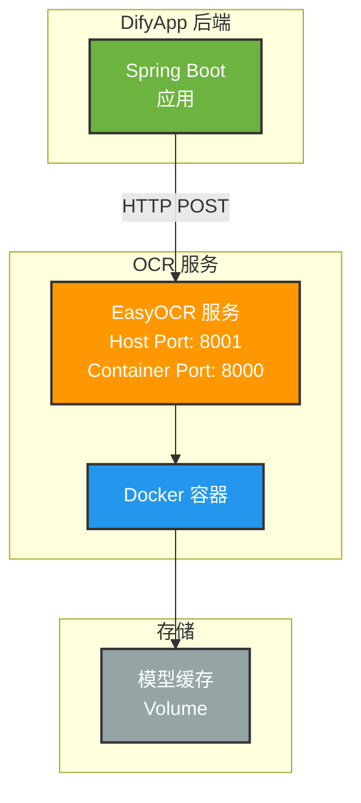
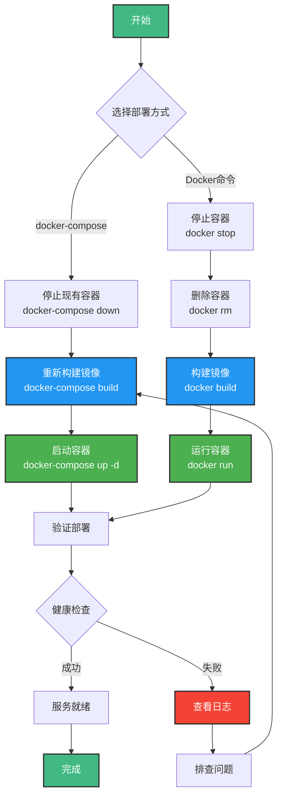

# EasyOCR Docker 重新部署说明

## 文档同步状态（2026-03）

- 已完成部署文档校准，与当前 OCR 服务接入方式一致。
- 该模块与本轮可观测性核心逻辑无直接耦合，现有部署流程保持有效。

## 部署架构



## 部署流程



## 重新部署步骤

由于已修复 `app.py` 文件（添加了 numpy 支持），需要重新构建并部署 Docker 容器。

## 配置文件

OCR 服务现在支持通过 `config.ini` 管理运行参数，模板见 `config.example.ini`。

默认读取顺序：

1. `EASY_OCR_CONFIG` 环境变量指定的配置文件路径
2. 当前目录下的 `config.ini`
3. 代码内置默认值

常用配置：

```ini
[server]
host = 0.0.0.0
port = 8000
debug = false
cors_origins = *

[ocr]
languages = ch_sim,en
gpu = false
max_content_length = 52428800
max_pdf_pages = 10
pdf_dpi = 200
max_batch_size = 10
max_image_pixels = 25000000
supported_image_extensions = .png,.jpg,.jpeg,.bmp,.webp,.tif,.tiff
```

所有配置仍支持环境变量覆盖，例如 `OCR_LANGUAGES`、`OCR_GPU`、`MAX_PDF_PAGES`、`PDF_DPI`、`MAX_BATCH_SIZE`、`MAX_IMAGE_PIXELS`、`HOST`、`PORT`。

### 方式一：使用 docker-compose（推荐）

```bash
# 1. 进入 easy_ocr 目录
cd easy_ocr

# 2. 停止并删除现有容器
docker-compose down

# 3. 重新构建镜像（包含最新的 app.py 修复）
docker-compose build

# 4. 启动新容器
docker-compose up -d

# 5. 查看日志，确认服务正常启动
docker-compose logs -f easyocr
```

### 方式二：使用 Docker 命令

```bash
# 1. 停止并删除现有容器
docker stop easyocr-service
docker rm easyocr-service

# 2. 进入 easy_ocr 目录
cd easy_ocr

# 3. 重新构建镜像
docker build -t difyapp/easyocr:latest .

# 4. 启动新容器
docker run -d \
  --name easyocr-service \
  -p 8001:8000 \
  --restart unless-stopped \
  difyapp/easyocr:latest

# 5. 查看日志
docker logs -f easyocr-service
```

## 验证部署

### 1. 检查容器状态

```bash
docker ps | grep easyocr
```

应该看到容器正在运行。

### 2. 检查健康状态

```bash
curl http://localhost:8001/health
```

预期响应：
```json
{
  "status": "healthy",
  "service": "EasyOCR",
  "reader_ready": true
}
```

### 3. 测试 OCR 识别

```bash
# 使用测试图片（如果有）
curl -X POST http://localhost:8001/ocr \
  -F "file=@test_image.png"
```

## 注意事项

1. **首次启动时间**：EasyOCR 首次启动需要下载模型，可能需要 1-2 分钟
2. **模型缓存**：如果使用 docker-compose，模型会保存在 volume `easyocr-models` 中，下次启动会更快
3. **端口占用**：确保 8001 端口未被其他服务占用（容器内为8000）
4. **资源限制**：根据 docker-compose.yml，容器限制为 2 CPU 和 4GB 内存

## 故障排查

### 如果容器无法启动

```bash
# 查看详细日志
docker-compose logs easyocr
# 或
docker logs easyocr-service
```

### 如果健康检查失败

```bash
# 进入容器检查
docker exec -it easyocr-service bash

# 在容器内测试
curl http://localhost:8000/health
python app.py
```

### 如果遇到网络问题

如果构建时遇到网络问题，可以使用国内镜像源：

```bash
# 使用国内镜像源构建
docker build --build-arg USE_CHINA_MIRROR=true -t difyapp/easyocr:latest .
```

## 本次修复内容

- ✅ 添加了 `numpy` 导入
- ✅ 修复了 PIL Image 到 numpy array 的转换
- ✅ 修复了单张图片和批量图片 OCR 接口

修复后，EasyOCR 可以正确识别图片中的文字内容。
