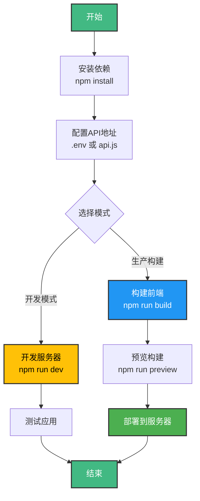

# 前端构建指南

## 文档同步状态（2026-03）

- 已完成构建文档校准，构建流程与当前前端项目结构一致。
- 已确认可观测性前端页面所需依赖与构建产物路径说明可直接复用本指南。

本文档说明如何构建和部署前端应用。

## 前置要求

### 安装 Node.js 和包管理器

确保已安装 Node.js 16+ 和 npm/yarn。

## 构建流程



## 构建步骤

### 1. 安装依赖

```bash
cd frontend
npm install
# 或
yarn install
```

### 2. 配置后端 API 地址

在构建前，需要配置后端 API 地址。有两种方式：

**方式一：使用环境变量（推荐）**

在 `frontend` 目录下创建 `.env` 文件：

```env
# 后端 API 地址
# 例如：http://localhost:9090 或 http://192.168.1.100:9090
VITE_API_BASE_URL=http://localhost:9090
```

**方式二：直接修改配置文件**

编辑 `frontend/src/config/api.js`，修改 `defaultBaseURL` 的值：

```javascript
const defaultBaseURL = 'http://your-backend-ip:port'
```

### 3. 开发模式

启动开发服务器：

```bash
npm run dev
# 或
yarn dev
```

开发服务器默认运行在 `http://localhost:3000`，支持热重载。

### 4. 构建生产版本

```bash
npm run build
# 或
yarn build
```

构建产物将输出到 `dist/` 目录。

### 5. 预览构建

构建完成后，可以预览生产构建：

```bash
npm run preview
# 或
yarn preview
```

## 部署

### 静态文件部署

构建后的 `dist/` 目录包含所有静态文件，可以部署到任何静态文件服务器：

- **Nginx**: 将 `dist/` 目录内容复制到 Nginx 的网站根目录
- **Apache**: 将 `dist/` 目录内容复制到 Apache 的网站根目录
- **CDN**: 将 `dist/` 目录内容上传到 CDN
- **对象存储**: 将 `dist/` 目录内容上传到 OSS/S3 等对象存储服务

### Nginx 配置示例

```nginx
server {
    listen 80;
    server_name your-domain.com;
    root /path/to/dist;
    index index.html;

    # 支持 Vue Router 的 history 模式
    location / {
        try_files $uri $uri/ /index.html;
    }

    # API 代理（可选，如果前端和后端在同一域名下）
    location /api {
        proxy_pass http://localhost:9090;
        proxy_set_header Host $host;
        proxy_set_header X-Real-IP $remote_addr;
        proxy_set_header X-Forwarded-For $proxy_add_x_forwarded_for;
    }
}
```

### 环境变量配置

生产环境可以通过环境变量配置 API 地址：

1. 在构建时设置环境变量：
   ```bash
   VITE_API_BASE_URL=http://your-backend-api:9090 npm run build
   ```

2. 或在 `.env.production` 文件中配置：
   ```env
   VITE_API_BASE_URL=http://your-backend-api:9090
   ```

## 常见问题

### 1. 构建文件过大

如果构建文件过大，可以：
- 检查是否有不必要的依赖
- 使用代码分割（已在 vite.config.js 中配置）
- 压缩资源文件
- 启用 gzip 压缩

### 2. 后端连接失败

确保：
- 后端 API 地址配置正确
- 后端服务正在运行
- 防火墙允许连接
- 如果是远程服务器，确保服务器地址可访问
- 检查 CORS 配置（如果前端和后端不在同一域名）

### 3. 路由刷新 404

如果使用 Vue Router 的 history 模式，需要配置服务器支持：

**Nginx:**
```nginx
location / {
    try_files $uri $uri/ /index.html;
}
```

**Apache (.htaccess):**
```apache
<IfModule mod_rewrite.c>
  RewriteEngine On
  RewriteBase /
  RewriteRule ^index\.html$ - [L]
  RewriteCond %{REQUEST_FILENAME} !-f
  RewriteCond %{REQUEST_FILENAME} !-d
  RewriteRule . /index.html [L]
</IfModule>
```

## 更新应用

更新应用版本：
1. 修改 `package.json` 中的 `version`
2. 重新构建
3. 部署新的构建文件

## 更多信息

- [Vite 官方文档](https://vitejs.dev/)
- [Vue 3 官方文档](https://vuejs.org/)
- [Vue Router 官方文档](https://router.vuejs.org/)
