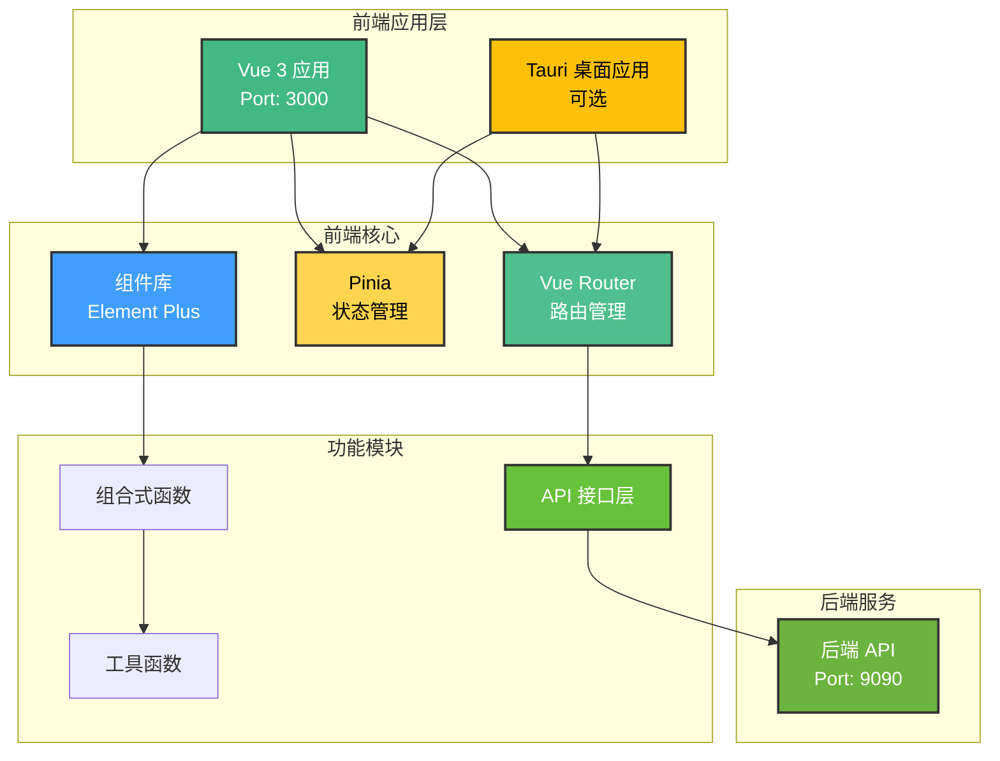
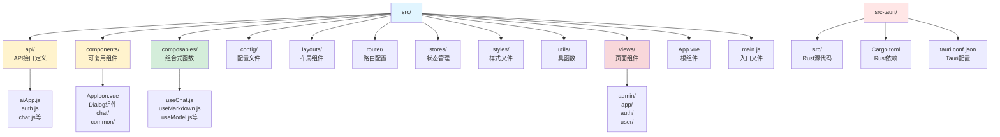
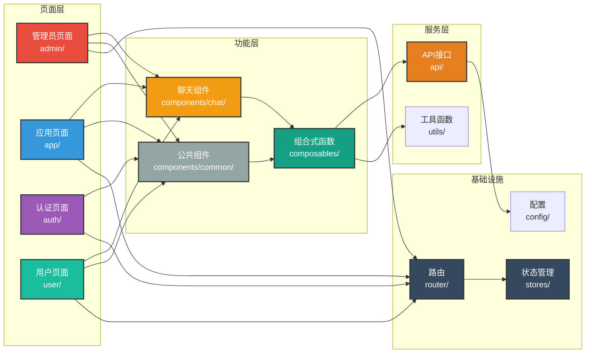

# DifyApp 前端项目

## 项目概述

DifyApp 前端是一个基于 Vue 3 构建的现代化单页应用（SPA），用于与后端 API 进行交互，提供用户认证、智能对话、知识库管理、AI 应用管理、Text2SQL、AI 绘图等功能。该项目采用响应式设计，支持多种设备访问，并集成了 Tauri 框架支持桌面应用开发。

### 技术特点

- **现代化框架**：Vue 3.3.4、Vite 5.0.8、Composition API
- **状态管理**：Pinia 2.1.7 进行状态管理，支持持久化
- **UI 组件库**：Element Plus 2.4.2，提供丰富的组件
- **Markdown 渲染**：支持代码高亮、数学公式、Mermaid 图表
- **流式响应**：支持 Server-Sent Events (SSE) 流式显示
- **主题系统**：支持深色/浅色主题切换，VS Code 风格
- **响应式设计**：适配不同屏幕尺寸，移动端友好
- **桌面应用**：基于 Tauri 2.9.6 的跨平台桌面应用
- **性能优化**：代码分割、懒加载、API 缓存

## 技术栈

### 核心框架
- **前端框架**: Vue 3.3.4
- **构建工具**: Vite 5.0.8
- **状态管理**: Pinia 2.1.7
- **路由**: Vue Router 4.2.5

### UI框架
- **组件库**: Element Plus 2.4.2
- **图标**: @element-plus/icons-vue 2.3.1
- **主题**: 支持深色/浅色主题切换

### 功能库
- **HTTP客户端**: Axios 1.6.2
- **Markdown渲染**: 
  - marked 17.0.0 (Markdown解析)
  - marked-highlight 2.2.3 (代码高亮)
  - highlight.js 11.11.1 (语法高亮)
  - katex 0.16.9 (数学公式渲染)
  - mermaid 10.6.1 (图表渲染)

### 桌面应用
- **Tauri**: 2.9.6 (跨平台桌面应用框架)

### 开发工具
- **代码压缩**: Terser 5.44.1

## 系统架构



## 项目结构



## 模块关系图



## 模块说明

### 1. 用户认证模块 (auth)

**页面组件：**
- **登录页面** (`views/auth/Login.vue`)：
  - 用户名/邮箱和密码登录
  - 记住登录状态
  - 登录错误提示
  - 跳转到注册页面
- **注册页面** (`views/auth/Register.vue`)：
  - 用户注册表单（用户名、邮箱、密码）
  - 表单验证
  - 注册成功提示
  - 跳转到登录页面

**功能组件：**
- **修改密码对话框** (`components/ChangePasswordDialog.vue`)：
  - 修改当前用户密码
  - 密码强度验证
- **重置密码对话框** (`components/ResetPasswordDialog.vue`)：
  - 通过邮箱重置密码
  - 验证码验证
- **JWT 令牌管理**：
  - 自动存储和刷新令牌
  - 令牌过期处理
  - 请求拦截器自动添加令牌

**状态管理：**
- 用户信息存储（Pinia store）
- 登录状态管理
- 用户权限信息

### 2. 聊天对话模块 (chat)

**页面组件：**
- **聊天界面** (`views/app/Chat.vue`)：
  - 实时聊天界面
  - 消息发送和接收
  - 流式消息显示
  - 消息重试功能
  - AI 应用选择下拉框

**功能组件：**
- **聊天消息组件** (`components/chat/`)：
  - 用户消息显示
  - AI 回复消息显示
  - Markdown 渲染
  - 代码高亮
  - 数学公式渲染
  - Mermaid 图表渲染
- **对话历史组件**：
  - 会话列表显示
  - 会话切换
  - 会话删除
  - 消息历史查看

**组合式函数：**
- **useChat.js**：聊天功能封装
  - 发送消息
  - 接收流式响应
  - 消息管理
- **useChatHistory.js**：对话历史管理
  - 会话列表获取
  - 会话创建和删除
  - 消息历史获取
- **useMarkdown.js**：Markdown 处理
  - Markdown 解析
  - 代码高亮处理
  - 数学公式处理
  - Mermaid 图表处理

**功能特性：**
- 支持 Chat Flow 和 Workflow 两种模式
- 流式响应实时显示
- Markdown 完整渲染支持
- 对话上下文管理
- 消息发送状态提示

### 3. 知识库模块 (knowledgebase)

**页面组件：**
- **知识库列表** (`views/user/KnowledgeBase.vue`)：
  - 知识库列表展示
  - 知识库搜索和筛选
  - 知识库创建按钮
- **知识库详情** (`views/user/KnowledgeBaseDetail.vue`)：
  - 知识库信息展示
  - 文档列表和管理
  - 文档上传功能
  - 文档处理状态显示
- **知识库问答** (`views/user/KnowledgeBaseQA.vue`)：
  - 问题输入框
  - 答案显示区域
  - 引用来源显示
  - 问答历史记录

**功能组件：**
- **文档上传组件**：
  - 拖拽上传
  - 批量文件选择
  - 上传进度显示
  - 文件格式验证
- **文档列表组件**：
  - 文档列表展示
  - 文档删除功能
  - 文档重新处理功能
  - 文档处理状态显示
- **向量数据库配置组件**：
  - 向量数据库选择
  - 连接配置表单
  - 配置测试功能

**组合式函数：**
- **useKnowledgeBaseQA.js**：知识库问答功能
  - 发送问题
  - 接收答案
  - 引用来源处理

**功能特性：**
- 支持多种文档格式上传
- 文档处理状态实时更新
- 知识库问答支持流式响应
- 引用来源可追溯
- 批量文档处理

### 4. AI应用管理模块

**页面组件：**
- **应用列表** (`views/app/AiApp.vue`)：
  - AI 应用列表展示
  - 应用搜索和筛选
  - 应用创建按钮
- **应用详情** (`views/app/AiAppDetail.vue`)：
  - 应用信息展示
  - 应用配置编辑
  - 应用可见性设置
  - 应用使用统计

**功能组件：**
- **应用创建/编辑表单**：
  - 应用基本信息输入
  - 应用配置表单
  - 表单验证
  - 应用类型选择（Chat/Workflow）

**功能特性：**
- 应用快速创建
- 应用配置可视化编辑
- 应用可见性控制
- 应用使用统计展示

### 5. 系统管理模块 (admin)

**页面组件：**
- **系统配置** (`views/admin/SystemConfig.vue`)：
  - 系统参数配置界面
  - 配置项编辑和保存
- **数据源管理** (`views/admin/DataSource.vue`)：
  - 数据源列表
  - 数据源添加、编辑、删除
  - 连接测试功能
- **模型管理** (`views/admin/Model.vue`)：
  - 模型列表
  - 模型添加、编辑、删除
  - 模型测试功能
- **向量数据库配置** (`views/admin/VectorDatabase.vue`)：
  - 向量数据库配置列表
  - 配置添加、编辑、删除
  - 配置测试功能
- **Prompt 模板管理** (`views/admin/Prompt.vue`)：
  - 模板列表
  - 模板创建、编辑、删除
  - 模板预览功能
- **Text2SQL** (`views/admin/Text2SQL.vue`)：
  - 自然语言输入框
  - SQL 显示区域
  - 查询执行按钮
  - 查询结果表格展示
- **用户管理** (`views/admin/User.vue`)：
  - 用户列表（支持分页、搜索）
  - 用户审核功能（激活、禁用）
  - 用户信息编辑
  - 用户权限管理

**功能特性：**
- 管理员权限控制
- 配置项实时保存
- 连接测试即时反馈
- 用户审核工作流

### 6. 其他功能

**主题系统：**
- **主题切换**：
  - 深色/浅色主题切换
  - VS Code 风格深色主题
  - 主题持久化存储
  - 自动主题检测（跟随系统）

**Markdown 渲染：**
- **完整 Markdown 支持**：
  - 标准 Markdown 语法
  - 代码高亮（highlight.js，支持 100+ 种语言）
  - 数学公式渲染（KaTeX）
  - 流程图和图表（Mermaid）
  - 自定义样式主题
  - 响应式代码块

**帮助系统：**
- **帮助对话框** (`components/HelpDialog.vue`)：
  - 使用指南
  - 功能说明
  - 快捷键提示
- **帮助浮动按钮** (`components/HelpFloatingButton.vue`)：
  - 快速访问帮助
  - 上下文相关帮助

**响应式设计：**
- 适配不同屏幕尺寸
- 移动端友好界面
- 自适应布局
- 触摸操作支持

**桌面应用支持：**
- 基于 Tauri 的跨平台桌面应用
- Windows、macOS、Linux 支持
- 原生窗口体验
- 系统集成（通知、托盘等）

**性能优化：**
- API 缓存机制（useApiCache.js）
- 代码分割和懒加载
- 资源文件优化
- 防抖和节流处理

## 开发环境要求

- **Node.js**: 16 或更高版本
- **包管理器**: npm 8+ 或 yarn 1.22+
- **Git**: 最新版本

### Tauri开发（可选）
- **Rust**: 1.70+ (仅用于桌面应用开发)
- **系统依赖**: 根据平台不同需要不同的系统依赖

## 快速开始

### 1. 克隆项目
```bash
git clone https://github.com/Yarao-Liu/DifyApp.git
cd DifyApp/frontend
```

### 2. 安装依赖
```bash
npm install
# 或者
yarn install
```

### 3. 配置API地址
默认API地址为 `http://localhost:9090`，如需修改，请编辑 `src/config/api.js` 文件。

### 4. 启动开发服务器
```bash
npm run dev
# 或者
yarn dev
```

开发服务器默认运行在 `http://localhost:3000`

### 5. 构建生产版本
```bash
npm run build
# 或者
yarn build
```

构建产物将输出到 `dist/` 目录。

### 6. 预览生产构建
```bash
npm run preview
# 或者
yarn preview
```

## Tauri桌面应用（可选）

### 开发模式
```bash
npm run tauri:dev
# 或者
yarn tauri:dev
```

### 构建桌面应用
```bash
npm run tauri:build
# 或者
yarn tauri:build
```

构建产物将输出到 `src-tauri/target/release/` 目录。

## 配置说明

### Vite配置
主要配置项在 `vite.config.js` 中：
- **开发服务器端口**: 3000
- **API代理**: `/api` 代理到 `http://localhost:9090`
- **代码分割**: 自动分割Vue、Element Plus、Markdown等库
- **构建优化**: 生产环境自动移除console和debugger

### API配置
API基础配置在 `src/config/api.js` 中，可以修改：
- API基础URL
- 请求超时时间
- 其他请求配置

## 功能特性

### Markdown渲染
- 支持标准Markdown语法
- 代码高亮（highlight.js）
- 数学公式渲染（KaTeX）
- 流程图和图表（Mermaid）
- 自定义样式主题

### 主题系统
- 支持深色/浅色主题切换
- VS Code风格深色主题
- 响应式设计

### 状态管理
- 使用Pinia进行状态管理
- 用户状态持久化
- 应用配置管理

## 开发规范

- 遵循Vue 3 Composition API最佳实践
- 使用组合式函数（Composables）封装可复用逻辑
- 组件化开发，保持组件单一职责
- 统一的代码风格和规范
- 使用Element Plus组件库保持UI一致性
- API调用统一通过 `src/api/` 目录下的文件
- 工具函数统一放在 `src/utils/` 目录

## 项目构建优化

### 代码分割
- Vue相关库单独打包
- Element Plus单独打包
- Markdown相关库单独打包
- 工具库单独打包

### 性能优化
- 依赖预构建
- 代码压缩（Terser）
- CSS代码分割
- 资源文件优化

## 常见问题

### 1. API请求失败
检查后端服务是否正常运行，以及API地址配置是否正确。

### 2. 主题切换不生效
清除浏览器缓存或检查主题配置文件。

### 3. Markdown渲染异常
检查相关依赖是否正确安装。

## 贡献指南

欢迎提交Issue和Pull Request来帮助我们改进项目。请确保你的代码符合项目规范。

提交代码前请确保：
- 代码通过ESLint检查
- 遵循Vue 3最佳实践
- 添加必要的注释
- 更新相关文档

## 许可证

本项目采用MIT许可证，详情请见 [LICENSE](LICENSE) 文件。

## 联系方式

如有问题，请通过GitHub Issues与我们联系。
