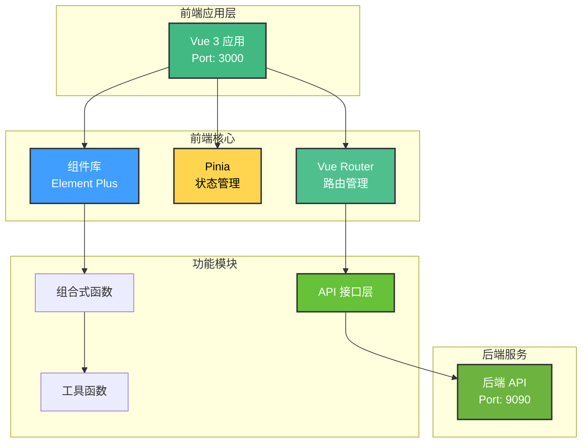
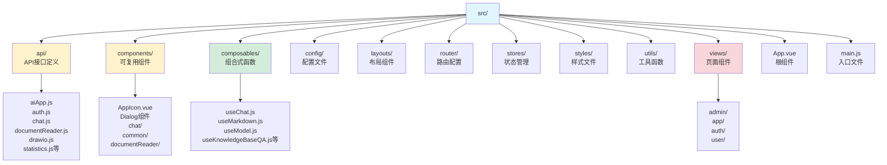
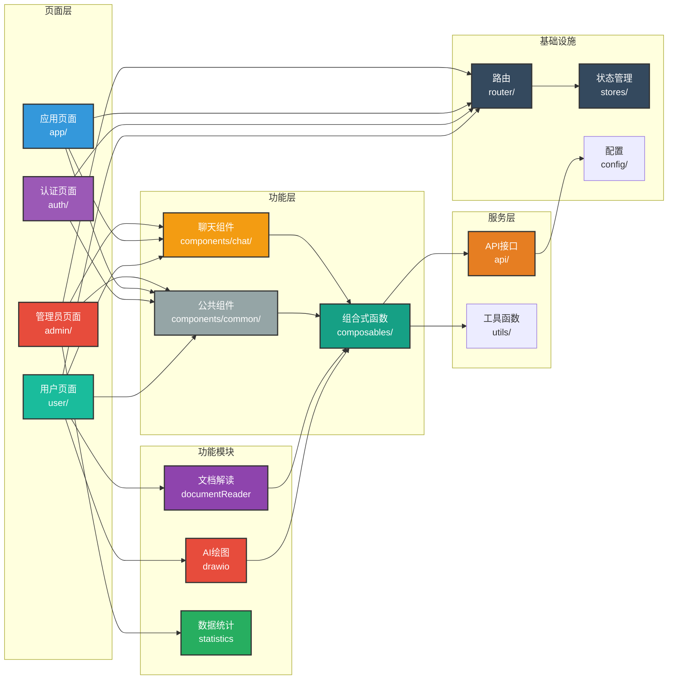

# DifyApp 前端项目

## 项目概述

DifyApp 前端是一个基于 Vue 3 构建的现代化单页应用（SPA），用于与后端 API 进行交互，提供用户认证、智能对话、知识库管理、AI 应用管理、AI 绘图等功能。该项目采用响应式设计，支持多种设备访问。

### 技术特点

- **现代化框架**：Vue 3.3.4、Vite 5.0.8、Composition API
- **状态管理**：Pinia 2.1.7 进行状态管理，支持持久化
- **UI 组件库**：Element Plus 2.4.2，提供丰富的组件
- **Markdown 渲染**：支持代码高亮、数学公式、Mermaid 图表
- **流式响应**：支持 Server-Sent Events (SSE) 流式显示
- **视觉模型支持**：支持图片输入和分析
- **浏览器检索**：支持实时网络信息获取
- **主题系统**：支持深色/浅色主题切换
- **响应式设计**：适配不同屏幕尺寸，移动端友好
- **性能优化**：代码分割、懒加载、API 缓存
- **交互优化**：全局路由切换过渡动画、门户布局优化
- **文档能力增强**：分页翻译、强制重译、状态提示与高亮
- **知识库问答增强**：文档选择与管理、快速切换体验优化

## 技术栈

### 核心框架

- **前端框架**: Vue 3.3.4
- **构建工具**: Vite 5.0.8
- **状态管理**: Pinia 2.1.7
- **路由**: Vue Router 4.2.5

### UI框架

- **组件库**: Element Plus 2.4.2
- **图标**: @element-plus/icons-vue 2.3.1
- **主题**: 支持深色/浅色主题切换

### 功能库

- **HTTP客户端**: Axios 1.6.2
- **Markdown渲染**: 
  - marked 17.0.0 (Markdown解析)
  - marked-highlight 2.2.3 (代码高亮)
  - highlight.js 11.11.1 (语法高亮)
  - katex 0.16.9 (数学公式渲染)
  - mermaid 10.6.1 (图表渲染)
- **文档处理**:
  - pdfjs-dist 5.4.449 (PDF预览)
  - mammoth 1.11.0 (Word文档解析)
  - vue-pdf-embed 2.1.3 (Vue PDF组件)
- **数据可视化**:
  - echarts 6.0.0 (图表库)
  - vue-echarts 8.0.1 (Vue ECharts组件)
  - jsmind 0.9.1 (思维导图)
- **其他工具**:
  - html2canvas 1.4.1 (截图功能)

### 开发工具

- **代码压缩**: Terser 5.44.1

## 系统架构



## 项目结构



## 模块关系图



## 模块说明

### 1. 用户认证模块 (auth)

**页面组件：**

- **登录页面** (`views/auth/Login.vue`)：
  - 用户名/邮箱和密码登录
  - 记住登录状态
  - 登录错误提示
  - 跳转到注册页面
- **注册页面** (`views/auth/Register.vue`)：
  - 用户注册表单（用户名、邮箱、密码）
  - 表单验证
  - 注册成功提示
  - 跳转到登录页面

**功能组件：**

- **修改密码对话框** (`components/ChangePasswordDialog.vue`)：
  - 修改当前用户密码
  - 密码强度验证
- **重置密码对话框** (`components/ResetPasswordDialog.vue`)：
  - 通过邮箱重置密码
  - 验证码验证
- **JWT 令牌管理**：
  - 自动存储和刷新令牌
  - 令牌过期处理
  - 请求拦截器自动添加令牌

**状态管理：**

- 用户信息存储（Pinia store）
- 登录状态管理
- 用户权限信息

### 2. 聊天对话模块 (chat)

**页面组件：**

- **门户智能问答** (`views/Portal.vue`)：
  - 用户端入口：`/user/chat`
  - 管理端入口：`/admin/chat`
  - 实时聊天与流式消息显示（SSE）
  - 消息发送、重试与状态提示
  - AI 应用选择与快速跳转
- **应用对话** (`views/app/ChatApp.vue`)：
  - 应用入口：`/app/chat/:id`
  - 面向具体 Chat Flow 应用的对话页
- **工作流应用** (`views/app/WorkflowApp.vue`)：
  - 应用入口：`/app/workflow/:id`
  - 面向具体 Workflow 应用的运行页
- **会话历史** (`views/user/ChatHistory.vue` / `views/admin/ChatHistory.vue`)：
  - 会话列表与切换
  - 会话删除与消息回看

**功能组件：**

- **聊天消息组件** (`components/chat/`)：
  - 用户消息显示
  - AI 回复消息显示
  - Markdown 渲染
  - 代码高亮
  - 数学公式渲染
  - Mermaid 图表渲染
- **对话历史组件**：
  - 会话列表显示
  - 会话切换
  - 会话删除
  - 消息历史查看

**组合式函数：**

- **useChat.js**：聊天功能封装
  - 发送消息
  - 接收流式响应
  - 消息管理
- **useChatHistory.js**：对话历史管理
  - 会话列表获取
  - 会话创建和删除
  - 消息历史获取
- **useMarkdown.js**：Markdown 处理
  - Markdown 解析
  - 代码高亮处理
  - 数学公式处理
  - Mermaid 图表处理

**功能特性：**

- 支持 Chat Flow 和 Workflow 两种模式
- 流式响应实时显示
- Markdown 完整渲染支持
- 对话上下文管理
- 消息发送状态提示
- 支持图片上传和分析（视觉模型）
- 支持浏览器检索功能

### 3. 知识库模块 (knowledgebase)

**页面组件：**

- **知识管理** (`views/user/KnowledgeBaseManagement.vue` / `views/admin/KnowledgeBaseManagement.vue`)：
  - 知识库列表展示、搜索与筛选
  - 知识库创建、编辑、删除
  - 知识库公开/私有与可见性相关提示
- **文档管理** (`views/user/DocumentManagement.vue` / `views/admin/DocumentManagement.vue`)：
  - 路由：`/user/knowledge-base/:kbId/documents`、`/admin/knowledge-base/:kbId/documents`
  - 文档上传、删除、重新处理
  - 文档处理状态与结果查看
  - 智能分块策略提示（上传成功后显示系统选择的分块方式）
- **知识库问答** (`views/user/KnowledgeBaseQA.vue` / `views/admin/KnowledgeBaseQA.vue`)：
  - 问题输入框
  - 答案显示区域
  - 引用来源显示
  - 问答历史记录

**功能组件：**

- **文档上传组件**：
  - 拖拽上传
  - 批量文件选择
  - 上传进度显示
  - 文件格式验证
- **文档列表组件**：
  - 文档列表展示
  - 文档删除功能
  - 文档重新处理功能
  - 文档处理状态显示
- **向量数据库配置组件**：
  - 向量数据库选择
  - 连接配置表单
  - 配置测试功能

**组合式函数：**

- **useKnowledgeBaseQA.js**：知识库问答功能
  - 发送问题
  - 接收答案
  - 引用来源处理

**功能特性：**

- 支持多种文档格式上传（包括图片文件）
- OCR 识别支持（图片和PDF文字识别）
- 文档处理状态实时更新
- 知识库问答支持流式响应
- 引用来源可追溯
- 批量文档处理

### 4. AI应用管理模块

**页面组件：**

- **应用列表** (`views/user/AppList.vue` / `views/admin/AppList.vue`)：
  - AI 应用列表展示、搜索与筛选
  - 管理端支持创建、编辑、查看详情
- **应用创建/编辑** (`views/admin/AppForm.vue`)：
  - 路由：`/admin/apps/create`、`/admin/apps/edit/:id`
  - 应用类型选择（Chat Flow / Workflow）
  - 应用参数与可见性配置
- **应用详情** (`views/admin/AppDetail.vue`)：
  - 路由：`/admin/apps/detail/:id`
  - 应用信息展示与运行入口

**功能组件：**

- **应用创建/编辑表单**：
  - 应用基本信息输入
  - 应用配置表单
  - 表单验证
  - 应用类型选择（Chat/Workflow）

**功能特性：**

- 应用快速创建
- 应用配置可视化编辑
- 应用可见性控制
- 应用使用统计展示

### 5. 文档解读模块 (documentReader)

**页面组件：**

- **文档解读管理** (`views/user/DocumentReaderManagement.vue` / `views/admin/DocumentReaderManagement.vue`)：
  - 文档列表展示
  - 文档上传功能
  - 文档删除和管理
- **文档解读详情** (`views/user/DocumentReader.vue` / `views/admin/DocumentReader.vue`)：
  - 文档查看器（支持 PDF、Word 等格式）
  - 文档问答功能
  - 文档翻译功能
  - 思维导图展示
  - 笔记编辑和管理
  - 导读展示

**功能组件：**

- **文档查看器** (`components/documentReader/DocumentViewer.vue`)：
  - PDF 文档预览（pdfjs-dist）
  - Word 文档解析和显示（mammoth）
  - 文档内容提取
- **文档问答** (`components/documentReader/DocumentQA.vue`)：
  - 问题输入和提交
  - 答案显示（支持 Markdown）
  - 引用来源展示
- **思维导图** (`components/documentReader/MindMapTab.vue`)：
  - 思维导图可视化（jsMind）
  - 思维导图交互操作
- **笔记管理** (`components/documentReader/NotesTab.vue`)：
  - 笔记编辑（支持 Markdown）
  - 笔记保存和管理
- **翻译功能** (`components/documentReader/TranslateTab.vue`)：
  - 文档翻译界面
  - 翻译结果展示
- **导读功能** (`components/documentReader/GuideTab.vue`)：
  - 导读内容展示
  - 导读格式化显示

**功能特性：**

- 支持多种文档格式
- 文档内容实时预览
- 基于 RAG 的文档问答
- 思维导图可视化
- 笔记 Markdown 编辑

### 6. AI 绘图模块 (drawio)

**页面组件：**

- **AI 绘图** (`views/user/AIDrawIO.vue` / `views/admin/AIDrawIO.vue`)：
  - 自然语言输入
  - 图表代码生成
  - 图表预览（Mermaid）
  - 图表导出功能

**功能特性：**

- 基于 Mermaid 的图表生成
- 支持流程图、时序图、类图、架构图、思维导图等
- 图表实时预览
- 图表代码编辑
- 图表修改和编辑功能
- 图表保存和管理

### 7. 数据统计模块 (statistics)

**页面组件：**

- **数据统计** (`views/admin/Statistics.vue`)：
  - 对话历史统计图表
  - 应用使用统计
  - 知识库使用统计
  - 用户活跃度统计
  - 数据可视化展示（ECharts）

**功能特性：**

- 多维度数据统计
- 图表可视化（ECharts）
- 实时数据更新
- 统计报表导出

### 8. 系统管理模块 (admin)

**页面组件：**

- **系统配置** (`views/admin/SystemConfig.vue`)：
  - 系统参数配置界面
  - 配置项编辑和保存
- **数据源管理** (`views/admin/DataSourceManagement.vue`)：
  - 数据源列表
  - 数据源添加、编辑、删除
  - 连接测试功能
  - 表结构查看
- **模型管理** (`views/admin/ModelManagement.vue`)：
  - 模型列表
  - 模型添加、编辑、删除
  - 模型测试功能
- **向量数据库配置** (`views/admin/VectorDatabaseManagement.vue`)：
  - 向量数据库配置列表
  - 配置添加、编辑、删除
  - 配置测试功能
- **Prompt 模板管理** (`views/admin/PromptManagement.vue`)：
  - 模板列表
  - 模板创建、编辑、删除
  - 模板预览功能
- **用户管理** (`views/admin/UserList.vue`)：
  - 用户列表（支持分页、搜索）
  - 用户审核功能（激活、禁用）
  - 用户信息编辑
  - 用户权限管理
  - 用户记忆管理
- **用户行为日志** (`views/admin/UserActionLog.vue`)：
  - 行为日志查询与筛选
  - 日志明细查看

### 9. 记忆管理模块 (memory)

**页面组件：**

- **用户端记忆管理** (`components/UserMemoryDialog.vue`)：
  - 个人记忆查看与管理
  - 记忆内容搜索与筛选
  - 记忆分类（短期/长期记忆）
  - 记忆清空功能（区分清空查询条件和清空记忆）
- **管理端记忆管理** (`views/admin/UserList.vue`)：
  - 用户记忆查看与管理
  - 记忆内容搜索与筛选
  - 批量记忆清空操作
  - 记忆审计功能

**功能特性：**

- **记忆分类管理**：
  - 短期记忆（会话级别）
  - 长期记忆（用户级别）
  - 记忆类型筛选
- **记忆搜索与筛选**：
  - 关键词搜索
  - 记忆类型筛选
  - 时间范围筛选
  - 分页显示
- **记忆清空功能**：
  - 重置查询条件（重置搜索条件）
  - 清空记忆（删除所有记忆内容）
  - 批量清空支持
  - 操作确认提示
- **记忆可视化**：
  - 记忆内容展示
  - 记忆元信息显示
  - 记忆关联关系
- **隐私保护**：
  - 用户只能管理自己的记忆
  - 管理员可以管理所有用户记忆
  - 记忆清空操作需要确认

**功能特性：**

- 管理员权限控制
- 配置项实时保存
- 连接测试即时反馈
- 用户审核工作流
- 数据可视化展示

### 9. 其他功能

**主题系统：**

- **主题切换**：
  - 深色/浅色主题切换
  - VS Code 风格深色主题
  - 主题持久化存储
  - 自动主题检测（跟随系统）

**Markdown 渲染：**

- **完整 Markdown 支持**：
  - 标准 Markdown 语法
  - 代码高亮（highlight.js，支持 100+ 种语言）
  - 数学公式渲染（KaTeX）
  - 流程图和图表（Mermaid）
  - 自定义样式主题
  - 响应式代码块

**文档处理：**

- **PDF 预览**：
  - 基于 pdfjs-dist 的 PDF 预览
  - 支持多页文档
  - 文档缩放和导航
- **Word 文档解析**：
  - 基于 mammoth 的 Word 文档解析
  - 文档内容提取和显示
  - 支持格式保留

**帮助系统：**

- **帮助对话框** (`components/HelpDialog.vue`)：
  - 使用指南
  - 功能说明
  - 快捷键提示
- **帮助浮动按钮** (`components/HelpFloatingButton.vue`)：
  - 快速访问帮助
  - 上下文相关帮助

**响应式设计：**

- 适配不同屏幕尺寸
- 移动端友好界面
- 自适应布局
- 触摸操作支持

**桌面应用支持：**

- 基于 Tauri 的跨平台桌面应用
- Windows、macOS、Linux 支持
- 原生窗口体验
- 系统集成（通知、托盘等）

**性能优化：**

- API 缓存机制（useApiCache.js）
- 代码分割和懒加载
- 资源文件优化
- 防抖和节流处理

**数据可视化：**

- **ECharts 集成**：
  - 统计图表展示
  - 多种图表类型支持
  - 响应式图表设计
- **思维导图**：
  - 基于 jsMind 的思维导图
  - 交互式操作
  - 思维导图数据管理

## 开发环境要求

- **Node.js**: 16 或更高版本
- **包管理器**: npm 8+ 或 yarn 1.22+
- **Git**: 最新版本

## 快速开始

### 1. 克隆项目

```bash
git clone https://github.com/Yarao-Liu/DifyApp.git
cd DifyApp/frontend
```

### 2. 安装依赖

```bash
npm install
# 或者
yarn install
```

### 3. 配置API地址

默认API地址为 `http://localhost:9090`，如需修改，请编辑 `src/config/api.js` 文件。

### 4. 启动开发服务器

```bash
npm run dev
# 或者
yarn dev
```

开发服务器默认运行在 `http://localhost:3000`

### 5. 构建生产版本

```bash
npm run build
# 或者
yarn build
```

构建产物将输出到 `dist/` 目录。

### 6. 预览生产构建

```bash
npm run preview
# 或者
yarn preview
```

## 配置说明

### Vite配置

主要配置项在 `vite.config.js` 中：

- **开发服务器端口**: 3000
- **API代理**: `/api` 代理到 `http://localhost:9090`
- **代码分割**: 自动分割Vue、Element Plus、Markdown等库
- **构建优化**: 生产环境自动移除console和debugger

### API配置

API基础配置在 `src/config/api.js` 中，可以修改：

- API基础URL
- 请求超时时间
- 其他请求配置

## 功能特性

### Markdown渲染

- 支持标准Markdown语法
- 代码高亮（highlight.js）
- 数学公式渲染（KaTeX）
- 流程图和图表（Mermaid）
- 自定义样式主题

### 主题系统

- 支持深色/浅色主题切换
- VS Code风格深色主题
- 响应式设计

### 状态管理

- 使用Pinia进行状态管理
- 用户状态持久化
- 应用配置管理

## 开发规范

- 遵循Vue 3 Composition API最佳实践
- 使用组合式函数（Composables）封装可复用逻辑
- 组件化开发，保持组件单一职责
- 统一的代码风格和规范
- 使用Element Plus组件库保持UI一致性
- API调用统一通过 `src/api/` 目录下的文件
- 工具函数统一放在 `src/utils/` 目录

## 项目构建优化

### 代码分割

- Vue相关库单独打包
- Element Plus单独打包
- Markdown相关库单独打包
- 工具库单独打包

### 性能优化

- 依赖预构建
- 代码压缩（Terser）
- CSS代码分割
- 资源文件优化

## 常见问题

### 1. API请求失败

检查后端服务是否正常运行，以及API地址配置是否正确。

### 2. 主题切换不生效

清除浏览器缓存或检查主题配置文件。

### 3. Markdown渲染异常

检查相关依赖是否正确安装。

## 贡献指南

欢迎提交Issue和Pull Request来帮助我们改进项目。请确保你的代码符合项目规范。

提交代码前请确保：

- 代码通过ESLint检查
- 遵循Vue 3最佳实践
- 添加必要的注释
- 更新相关文档

## 许可证

本项目采用MIT许可证，详情请见 [LICENSE](LICENSE) 文件。

## 联系方式

如有问题，请通过GitHub Issues与我们联系。
